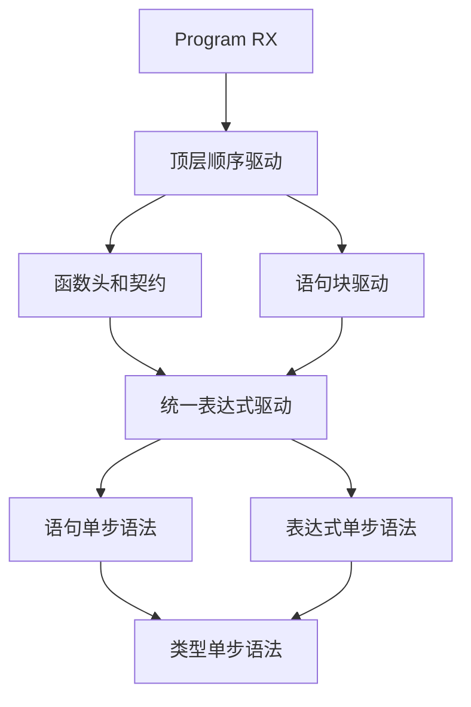
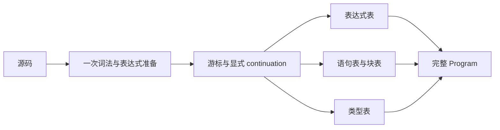

# 语句块与程序驱动迁移

## Intent

将旧 Zig Parser 的 Statement、Block、Program 和 loop 状态块迁移到 RX 编排、ZX 状态机，保留语法、AST、位置和诊断时机。正式替换必须在现有源码差分核对后进行。

## Data

- 已提交的 imports、declarations、header、expressions、types 状态机。
- `parser_statements.zig`、`parser_iteration.zig`、`parser_top.zig` 与 `parser.zig` 的实际行为。
- 旧 Parser 中表达式和语句块相互递归；模块不能按旧函数调用边机械分割。

## Edges

- 不新增语言语法，不改变 Store 优先级，不提前增加赋值左值检查。
- 不新增测试用例，不执行全量测试；使用既有源码进行定向构建与差分。
- 生产入口保持旧 Parser，直到完整 Program 对照通过。
- 普通表达式、契约谓词和模板插值必须经过相同的状态块承接机制，不能留下等待 phase 自旋。
- 表达式表和类型表持续累积；嵌套状态块只保存控制信息与 continuation，不复制全部 AST。

## Answer

按三个实施边界推进：语句/块状态机；表达式状态块请求与统一驱动；Program 编排及生产入口接入。每个边界以实际构建和现有源码对照记录为准，不把内部模块构建成功称为完整自举。





## 实施边界

语句表采用节点索引，块中的语句和 switch 分支使用反向链接保持原始顺序。可选表达式、类型和分支采用零表示缺失、索引加一表示存在；必需表达式和块保留原始索引。

每条语句和显式块分别检查 syntax depth。else-if 与 switch case 的合成块不增加 depth。普通 evaluation 只允许 call；状态块中使用 minimum=8 解析更新目标。Store 与 `$` 入口始终优先。

本文件记录实施中的边界；尚无完整 Program 接入或差分通过的结论。

## 本轮实现与验证

新增 `parser/body.rx`，由 RX 复用 prepare，再交给 `body/parse.zx` 驱动。语句与块采用显式栈，表达式与类型复用现有单步解析。`expressions/state/restart.zx` 在当前 stream 与游标上开始下一表达式，保留共享表；没有重新词法，也不假定当前 stream 是根源码。

已实现 const（含类型注解和解构）、return、if/else-if/else、switch、Store setter、独立调用，以及显式 state-block 入口内的赋值与复合更新。else-if 和 case 的合成块、Store 优先级、语句换行检查与深度计数保持旧行为。

[语句块核对](语句块核对.json)重放 267 份既有源码，核对 773 个入口：253 个成功块解析与 520 个 depth=254/256 等边界诊断，零差异。成功结果包含 1,418 条语句、577 个块和 103 个 switch 分支。重建并比较完整 AST、表达式 depth、源码 span、类型注解、名称、消费位置和 last_end。

其中 246 个普通函数体完整核对通过，另外直接从既有 AST 提取 7 个更新回调块，核对块内状态更新、列表下标更新、分支和 switch。没有编写新的源码用例。14 份源单独跳过（12 份纯类型、2 份旧 Parser 已拒绝的程序）。

**另有 7 个完整函数体包含 loop 状态块，仍列为 pending，未算入通过数。** 当前表达式单步模块尚不能解析 loop options 的 `while` 关键字和更新回调块；直接验证回调块不等于已经验证外层 loop。下一步需要统一驱动器处理暂停的表达式，隔离普通 lambda 和模板插值的状态更新语境，并覆盖 header predicates。

本轮已生成 Zig、构建独立 body 应用与最终对照程序、运行上述差分。格式化后重新生成的 Zig 与差分使用的源码逐字相同。生产 Parser.program 未替换；未运行全量测试，也未修改测试会话文件。

## 自我复核

- 普通块迁移与 loop 的表达式承接是两个独立完成条件；不能用已通过的直接块核对替代完整 loop 核对。
- 当前成功入口覆盖 const、分支、switch、Store 和状态更新；未证明所有错误分隔符、所有复合运算符或任意恶意输入诊断。
- 深度边界是对既有源码以不同入口 depth 重放，不是形式化证明。
- AST 表只保存索引和 span，生成普通 Zig；仍需在完整 Program 接入时继续核对所有权与中间分配，不能把静态链接直接等同于所有操作均无分配。

## 复现

```sh
zig-out/bin/zxc packages/compiler/src/zx/frontend/parser/body.rx --out /tmp/zxc_body.zig --no-cache
zig build-exe -O ReleaseSafe --dep zx --dep imports --dep lexer --dep generated -Mroot=docs/2026-10-06/语句块迁移/body_reference.zig -Mzx=packages/core/src/root.zig --dep zx --dep lexer --dep dsl -Mimports=packages/compiler/src/zx/frontend/parser_imports.zig --dep zx -Mlexer=packages/compiler/bootstrap/lexer/lex.zig -Mdsl=packages/dsl/src/root.zig -Mgenerated=/tmp/zxc_body.zig -femit-bin=/tmp/zxc_body_reference
python3 docs/2026-10-06/语句块迁移/verify_body.py
```

## 状态块承接实施

表达式单步语法新增 StateBlock 请求，body 驱动保存 ExprControl/ExprFrame 与父语句控制栈，块完成后恢复并写入 StateBlock 索引；所有 expression/type/body 表继续累积，不复制表。独立表达式与 header predicate 通过同一 body 表达式入口完成请求。header 仍保留共享表达式表，额外保存块表。

词法识别器为 loop/next/do 增加完整名称终态，但 is_keyword 不增加它们。只有 AST callee 为 loop 标识符的第二个实参且以左花括号开始时使用 options 语法；仅 next/do 的冒号值在入口直接是 lambda 时允许状态块。普通 lambda 与模板插值没有继承可更新语句语境的入口。

Grit 当前 CLI 支持的语言列表不包含 ZX；此次多文件 State 字段迁移使用受路径与原文匹配约束的脚本，并通过编译和差分检查结果。

### 承接完成与证据

body/expression 统一驱动独立表达式、共享表请求和 header predicate。表达式内部的 StateBlock 请求由 body 接管；显式暂停栈保留父表达式和父语句状态，完成后生成 depth=1 的 StateBlock 节点，再恢复 lambda 与 options 的 continuation。源码依赖仍无环。

暂停仅发生于无诊断的活动状态。控制快照复制游标、前瞻、模板与深度等标量元数据，当前执行副本使用空诊断；错误状态不会进入暂停。这样无需让借用的诊断字符串使整个状态被推断为 borrowed，也没有放宽编译器所有权规则。AST、类型和块表持续传递，没有复制整个表作为暂停快照。

之前的 7 个完整 loop 函数体现已正常参与比较，核对脚本已删除 pending 跳过分支。加入已有状态迭代示例后的结果：

- 语句块：283 份源码，852 个入口，其中 284 次成功解析、568 次诊断，零差异；成功结果含 1,574 条语句、641 个块、115 个 switch 分支。14 份纯类型或旧 Parser 已拒绝的程序仍单独记录。
- 独立表达式：8 份源码的全部 1,173 个 token 起点，零差异，包含 StateBlock AST。
- minimum=8、depth=252、depth=254：各重放 4 份既有迭代 fixture 的 538 个起点，均零差异。
- 共享节点表：4 份源码，2,400 次请求、1,191 次成功，零差异；增加已有 snapshot fixture 后也核对了先前 StateBlock 节点及其块索引持续可读。
- 函数头：268 份源码，254 个有效函数头，15 个 requires、80 个 ensures，零差异。

独立表达式和 header 返回的 body 表保存 StateBlock 节点引用；旧表达式树和类型表字段保持原有含义。共享请求重用同一 body 表。下层 expressions/step 若被绕过驱动器直接要求执行 StateBlock，会返回内部 contract 诊断，不会保持原 phase 自旋。

本轮生成并编译三个解析入口的对照模块，构建共享请求应用，并完成 `zig build dist -j2`。新 CLI 重新生成 body、expression、header 后，与已运行差分的 Zig 源码逐字相同。测试会话反馈的 RX void 结果问题已另行修复、定向回归并提交，不与本次前端迁移混作同一证据。

### 当前限制与下一步

现有材料没有提供“状态块中再次嵌套 loop”“模板插值内部的 loop”及“契约谓词内部的 loop”的直接组合样例；这些入口已共用驱动机制，但不把结构分析当作组合用例通过。未新增源码用例，也未执行全量测试。

尚需整合 imports、declarations、header、body 的统一 Program 与 AST 适配，之后才能切换生产 Parser 并进行完整自举固定点核对。本阶段完成不代表 Program 或编译器自举已经完成。
