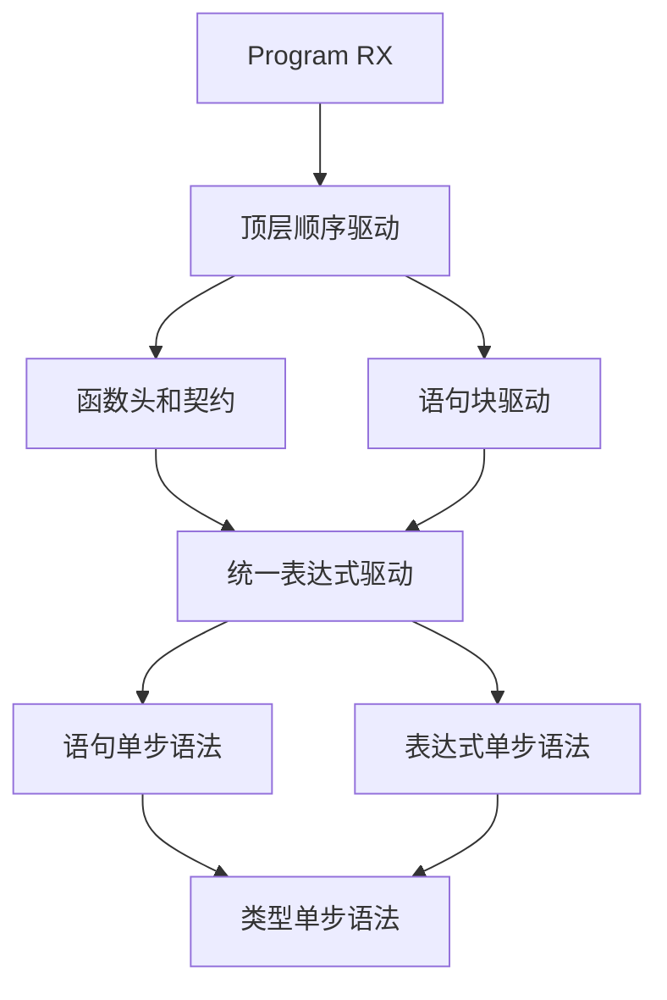
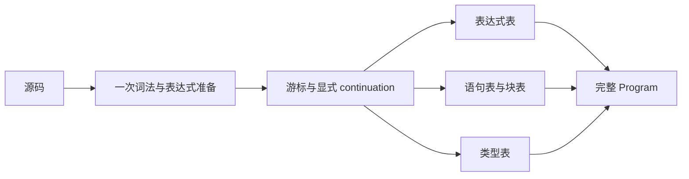

# 语句块与程序驱动迁移

## Intent

将旧 Zig Parser 的 Statement、Block、Program 和 loop 状态块迁移到 RX 编排、ZX 状态机，保留语法、AST、位置和诊断时机。正式替换必须在现有源码差分核对后进行。

## Data

- 已提交的 imports、declarations、header、expressions、types 状态机。
- `parser_statements.zig`、`parser_iteration.zig`、`parser_top.zig` 与 `parser.zig` 的实际行为。
- 旧 Parser 中表达式和语句块相互递归；模块不能按旧函数调用边机械分割。

## Edges

- 不新增语言语法，不改变 Store 优先级，不提前增加赋值左值检查。
- 不新增测试用例，不执行全量测试；使用既有源码进行定向构建与差分。
- 生产入口保持旧 Parser，直到完整 Program 对照通过。
- 普通表达式、契约谓词和模板插值必须经过相同的状态块承接机制，不能留下等待 phase 自旋。
- 表达式表和类型表持续累积；嵌套状态块只保存控制信息与 continuation，不复制全部 AST。

## Answer

按三个实施边界推进：语句/块状态机；表达式状态块请求与统一驱动；Program 编排及生产入口接入。每个边界以实际构建和现有源码对照记录为准，不把内部模块构建成功称为完整自举。





## 实施边界

语句表采用节点索引，块中的语句和 switch 分支使用反向链接保持原始顺序。可选表达式、类型和分支采用零表示缺失、索引加一表示存在；必需表达式和块保留原始索引。

每条语句和显式块分别检查 syntax depth。else-if 与 switch case 的合成块不增加 depth。普通 evaluation 只允许 call；状态块中使用 minimum=8 解析更新目标。Store 与 `$` 入口始终优先。

本文件记录实施中的边界；尚无完整 Program 接入或差分通过的结论。

## 本轮实现与验证

新增 `parser/body.rx`，由 RX 复用 prepare，再交给 `body/parse.zx` 驱动。语句与块采用显式栈，表达式与类型复用现有单步解析。`expressions/state/restart.zx` 在当前 stream 与游标上开始下一表达式，保留共享表；没有重新词法，也不假定当前 stream 是根源码。

已实现 const（含类型注解和解构）、return、if/else-if/else、switch、Store setter、独立调用，以及显式 state-block 入口内的赋值与复合更新。else-if 和 case 的合成块、Store 优先级、语句换行检查与深度计数保持旧行为。

[语句块核对](语句块核对.json)重放 267 份既有源码，核对 773 个入口：253 个成功块解析与 520 个 depth=254/256 等边界诊断，零差异。成功结果包含 1,418 条语句、577 个块和 103 个 switch 分支。重建并比较完整 AST、表达式 depth、源码 span、类型注解、名称、消费位置和 last_end。

其中 246 个普通函数体完整核对通过，另外直接从既有 AST 提取 7 个更新回调块，核对块内状态更新、列表下标更新、分支和 switch。没有编写新的源码用例。14 份源单独跳过（12 份纯类型、2 份旧 Parser 已拒绝的程序）。

**另有 7 个完整函数体包含 loop 状态块，仍列为 pending，未算入通过数。** 当前表达式单步模块尚不能解析 loop options 的 `while` 关键字和更新回调块；直接验证回调块不等于已经验证外层 loop。下一步需要统一驱动器处理暂停的表达式，隔离普通 lambda 和模板插值的状态更新语境，并覆盖 header predicates。

本轮已生成 Zig、构建独立 body 应用与最终对照程序、运行上述差分。格式化后重新生成的 Zig 与差分使用的源码逐字相同。生产 Parser.program 未替换；未运行全量测试，也未修改测试会话文件。

## 自我复核

- 普通块迁移与 loop 的表达式承接是两个独立完成条件；不能用已通过的直接块核对替代完整 loop 核对。
- 当前成功入口覆盖 const、分支、switch、Store 和状态更新；未证明所有错误分隔符、所有复合运算符或任意恶意输入诊断。
- 深度边界是对既有源码以不同入口 depth 重放，不是形式化证明。
- AST 表只保存索引和 span，生成普通 Zig；仍需在完整 Program 接入时继续核对所有权与中间分配，不能把静态链接直接等同于所有操作均无分配。

## 复现

```sh
zig-out/bin/zxc packages/compiler/src/zx/frontend/parser/body.rx --out /tmp/zxc_body.zig --no-cache
zig build-exe -O ReleaseSafe --dep zx --dep imports --dep lexer --dep generated -Mroot=docs/2026-10-06/语句块迁移/body_reference.zig -Mzx=packages/core/src/root.zig --dep zx --dep lexer --dep dsl -Mimports=packages/compiler/src/zx/frontend/parser_imports.zig --dep zx -Mlexer=packages/compiler/bootstrap/lexer/lex.zig -Mdsl=packages/dsl/src/root.zig -Mgenerated=/tmp/zxc_body.zig -femit-bin=/tmp/zxc_body_reference
python3 docs/2026-10-06/语句块迁移/verify_body.py
```
