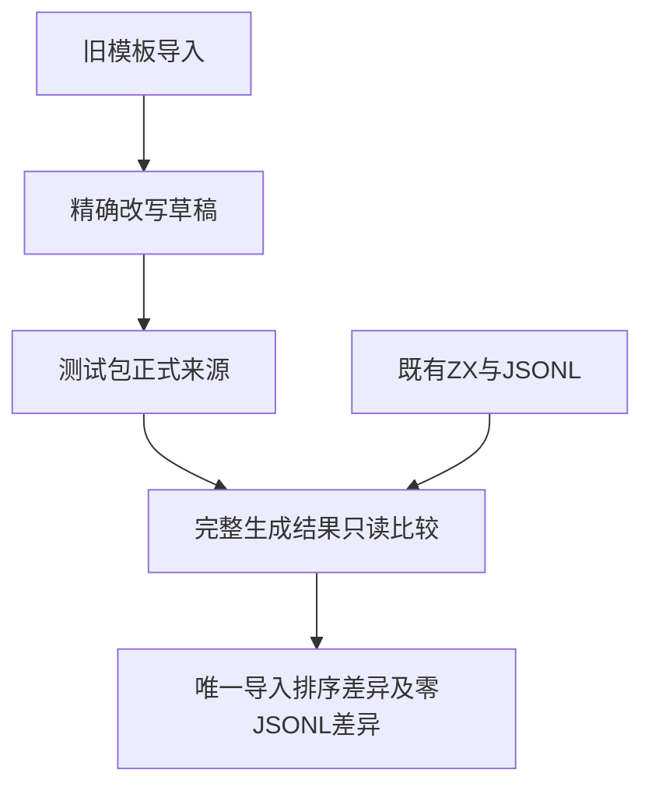

# 调用与字符串生成器同步计划

## Intent：最终目标

让调用空白、模板调用、跨模块匹配所有权、字符串所有权及调用对象展开的五项正式生成器与当前无后缀导入契约一致，恢复既有完整目录核验。

## Data：可用证据

固定 bd5b60f5 的根 ReleaseSafe 日志分别在五项 node --check 报告 outdated catalog。逐份核对生成来源与 dd1cfb53 后的正式夹具，发现生成器仍写入旧 .zx 导入后缀；generate_strings 的具体旧来源是 owned_strings.ts。mixed_read 正常执行夹具还将 make 放在 borrow 前，违背按路径排序的既有门禁。物理文件名仍应保留 .zx。

## Edges：边界与限制

只同步五项来源中的模块导入字符串，并按路径排序 mixed_read 的两个值导入；同时更新该生成模板。保留所有输入、断言、诊断样例、case id 与上游关联。旧历史草稿保持原始证据，新草稿存放本目录。未发现 grit 可执行文件，故使用带精确匹配数量断言的定点替换，不扩展到所有 .zx 文本。正式生产生成器 generate_types 的导入顺序问题已发给实现会话，由其修正。

## Answer：交付格式与成功标准

先保存输出指纹，制作五项来源及一项夹具的草稿，再同步已授权测试包。五项完整 node --check 必须均退出 0；前后核对输出指纹，夹具差异限于 mixed_read 导入排序及恢复调用空白 case 5 的 CR 原字节，JSONL 必须完全相同。记录日志、正式来源和草稿 SHA256，并单独提交 push。本部分不增加用例数量或上游审阅数量。

## 自我批判

生成器第一次报错不代表只有一个输出失配，因此必须完整执行每个 --check。字符串 literal 的物理输出路径与导入字符串同含 .zx，盲目替换会破坏文件命名；本次只改 from 字符串。排序修正只恢复规范入口，不能宣称新增所有权或解析能力。

## 首轮发现：CR 原字节被旧迁移规范化

四项 --check 首轮通过；call_basics 仍在 cases.zx 失配。逐字节核对发现第 5 分支原本覆盖回车 CR，但现有夹具变为换行 LF。五项生成器内的 gaps 明确保留 tab、VT、FF、空格、LF、CR 六种空白，因此不能把生成器改成两个 LF 来追求通过。恢复该夹具唯一 CR 字节，并保存首轮失败日志；由完整 --check 复核恢复后全部输出。这是对预期覆盖语义的恢复，不增加用例或修改 JSONL。

## 最终执行记录

五项完整 --check 均退出 0。185 份既有输出前后核对，差异只有 mixed_read 的两个导入换序与调用空白 case 5 恢复 CR 字节；JSONL 差异为 0，新增用例和上游审阅均为 0。七份正式来源与本轮草稿逐字节一致。结果收录完整命令、日志指纹、来源指纹及差异清单。本部分不等于根全量回归通过，根回归仍需新固定版本完整总结。
