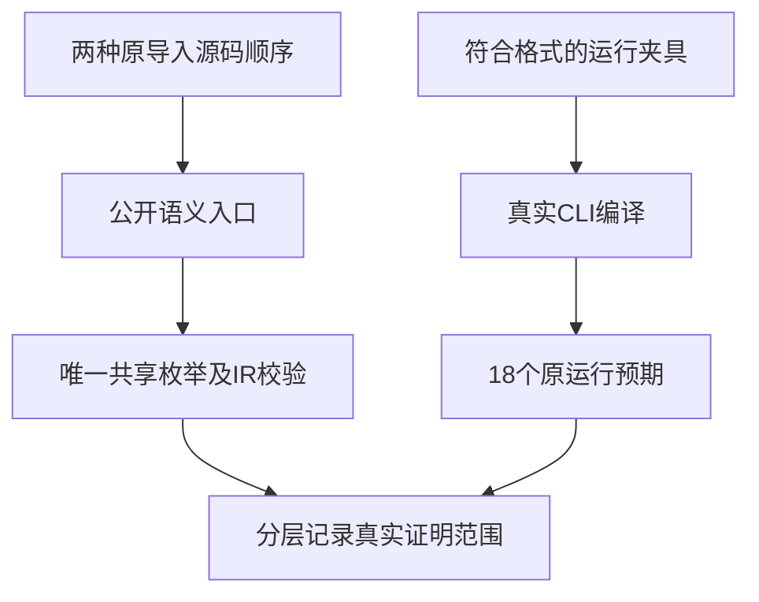

# 跨模块匹配导入换序迁移计划

## Intent：最终目标

修复跨模块匹配的正常运行夹具格式，保留原来针对导入换序、共享枚举身份及惰性模式的验证意图。

## Data：可用证据

固定 bd5b60f5 根 ReleaseSafe 日志中 lazy、shared_pattern、reordered 被 import spacing 门禁拒绝。正式生成模板的 canonical 与 nested/choose 同样未按值导入路径排序或分隔 type import。reordered 原目录四条都是正常执行预期；旧记录《跨模块匹配身份与惰性验证》明确将不同导入顺序作为成功标准，因此不能把它悄悄规范化后仍沿用旧证明。

当前 compiler.project.analyze 为公开语义入口，不带编译格式门禁；modules/import_paths/project_test.zig 已用它检查跨路径枚举名义身份。此入口适合观察源码导入顺序的语义，实际 CLI 运行仍必须遵守格式要求。

## Edges：边界与限制

运行夹具规范化后，canonical 与 reordered 的源码相同，保留原目录案例 ID 及数值预期，但明确不计为两种不同源码顺序的执行证据。新增独立 match_import_order_test.zig 两个语义声明，分别分析原 State/type/choose 顺序与 choose/type/State 顺序：真实三模块解析、共享枚举恰好一种、输入 u8 / 输出 u64、一个导入函数及 IR 校验。它们不关闭、绕过或修改 CLI 格式门禁，只验证独立的语义入口。

用户已收到保留意图的可选方案询问；继续按保留语义覆盖的建议方案推进。若用户后续另选，按其选择调整本部分。生成器修改仅收口 imports 排序与分组，原 18 个 JSONL 运行案例、惰性 IndexOutOfBounds 断言及所有权部分不变。已在本地已知路径找到 grit；相邻格式契约部分对 31 份 ZX 源 dry-run 没有匹配，并报 2 处 JavaScript 文法解析错误，不能替代 ZX 语义与生成器核验。本部分包含两种语义声明及模板的上下文插入，按精确匹配生成并逐字节核验。

## Answer：交付格式与成功标准

正式九份来源及同路径草稿、完整生成器 --check、JSONL 零差异、固定生产版本上的 test-match-module-types 两种优化及新增命名门禁 test-match-modules 执行原 18 个匹配运行案例。新增声明明确为 2，新增目录运行案例为 0，Test262 原文审阅增量为 0。全部通过再独立提交 push，并保存来源、资源和固定版本指纹。

## 自我批判

规范化运行源码会消除原“不同顺序”的差异，因此必须增加明确语义检查并修正证据描述。两个语义声明证明解析和类型/IR身份，不证明不同顺序生成产物的完整逐字节一致或所有运行语义；规范化源码的运行门禁另行负责值和惰性。不能把相同源码运行两次夸大为新增独立特性覆盖。

## 门禁收口

现有 18 个匹配运行案例只属于大范围 test-runtime，没有独立命名入口。在 build/runtime.zig 按同职责的 URL/querystring 聚合方式新增 test-match-modules，依套件路径聚合既有 run.step；不新增运行案例或修改其内容。这样本部分可以完整验证匹配组，后续回归也有稳定单门禁，无需把全运行目录重复执行充当本部分证据。

## 最终执行记录

完整生成器 --check 退出 0；仅五份 ZX 导入排序及分组变化，全部四份 JSONL 的 18 个目录案例逐字节不变。Debug 语义门禁 26/26 步骤、7/7 声明实际通过；ReleaseSafe 语义与运行门禁 51/51 步骤、25/25 实际通过，无运行缓存。新增语义声明 2，原前端声明 5、原目录运行声明 18；没有新增 Test262 审阅或目录案例。

固定 fd6364da 已包含 RX XML 自举 153232cb，九份最终正式来源、草稿及固定检出字节一致。Debug 在新增命名聚合之前运行，验证相同的七份语义声明；聚合只接既有 run.step，最终 ReleaseSafe 已执行所有 18 个原匹配运行案例。canonical/reordered 当前同源的事实明确保留，不声称两种源导入顺序的实际运行对照；两种原顺序分别由新增语义声明负责。
