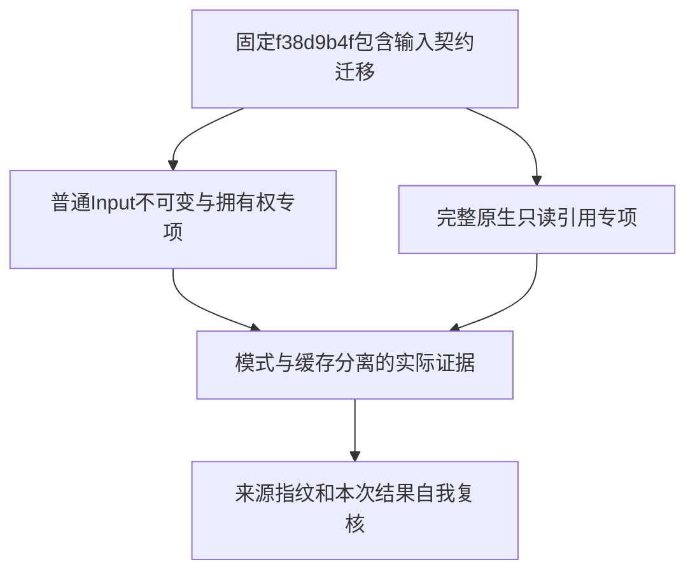
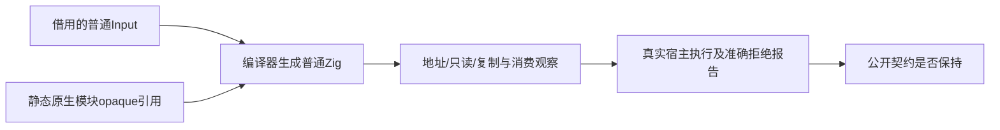

# 输入不可变与原生引用回归计划

## IDEA

- Intent：在ac024c3a移除owned Input后的已提交实现上，验证普通Input不可变、拥有权生成与原生只读引用完整边界。
- Data：当前已提交f38d9b4f包含ac024c3a和此前正式测试；根ebe3d605完整Debug已通过，ReleaseSafe仍执行，但该基线早于输入契约迁移，不能替代本部分验证。
- Edges：只使用固定提交，主检出的并行未提交源码不进入验证。复用既有正式测试，不为增加数量复制用例。构建步骤、实际声明、外部实例及缓存分别统计，不把模式或路由重复执行记为独立ID。
- Answer：保存两个模式的受影响专项退出码、完整原始日志、驱动报告、生成产物和来源指纹；发现真实生产违约才通知指定实现聊天。完成一个完整部分后单独提交push。

## 执行边界

使用已有json-output-conformance工作树。重置前已确认唯一未提交文件为object.jsonl，其内容逐字节等于已提交f38d9b4f的两条大前缀回归；没有独有工作被丢弃。根全量回归使用另一个native-reference-conformance工作树，其源码与进程均不改变。

具体门禁与声明清单先从此固定提交的build组织和正式测试核对，再执行。已有用例不因为生产迁移而自动视为通过；也不把之前root Debug实际87545条结果外推到此新提交。

固定版本已核对：test-owned-input含47个独立Zig声明，10个runtime声明复用于六条路线；test-native-references含138个独立Zig声明及9个Node应用边界声明，45个runtime声明分别通过source/library路线。两组共194个独立声明，路线与模式不增加声明数。

核心Debug门禁已启动，命令为test-owned-input test-native-references。随后补验test-rx-parallel-inference、test-rx-owned-runtime、test-object-append、test-iterate-buffer、test-module-generation五个相邻门禁；ReleaseSafe运行全部七项。RX规则此前已读取，测试组织保持正式源码现有边界，不修改RX实现或应用skills。

相邻门禁用于验证共享输入的RX并行调用、外部seed保留、历史版本隔离、缓冲资格变化后缓存失效；静态审阅未发现需要新增重复用例的明确缺口。当前名称中的owned部分是历史名称，正式源码观察已转为普通Input可复用和不可变。

## 自我复核要求

源码只读分析只能决定验证范围，不能记为实际通过。失败先区分生产契约、夹具和命令错误；所有失败日志保留。受影响专项通过不证明全仓库或所有特性已达到生产质量，整个Test262目标继续。

## 执行结果

固定f38d9b4f，核心Debug153/153步骤、190/190实际管理实例，另90个外部原生实例。相邻Debug首轮694/698，四个夹具预期遗漏已在三份测试文件中修正；最终105/105实际实例，80个缓存步骤对应首轮已通过的593个实例。ReleaseSafe全部七门禁521/521步骤、888/888实际管理实例，另90个外部原生实例；无管理测试运行缓存。

完整保存56份原生运行报告、两份九应用边界报告、24份生成输入源码及原始失败/成功日志。仅测试预期修改，无生产修改、目录ID或上游审阅增加。结果与自我复核见[执行结论](输入不可变与原生引用回归/执行结论.md)及[执行结果](输入不可变与原生引用回归/执行结果.json)。
