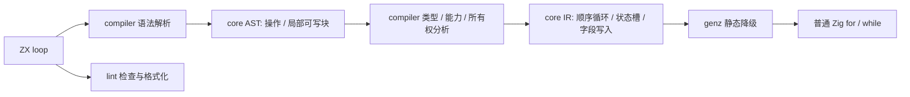
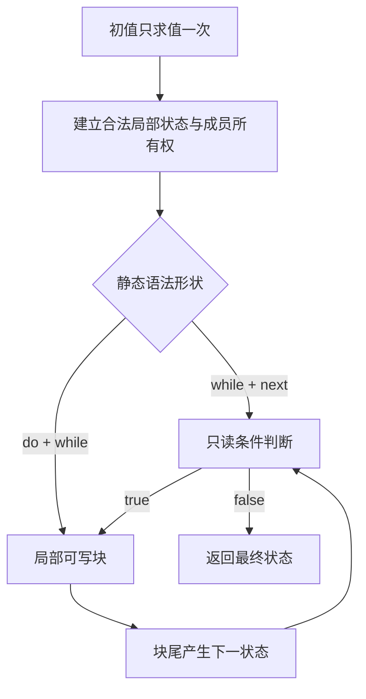
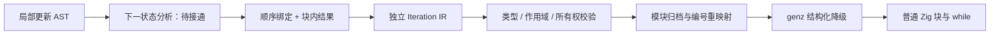
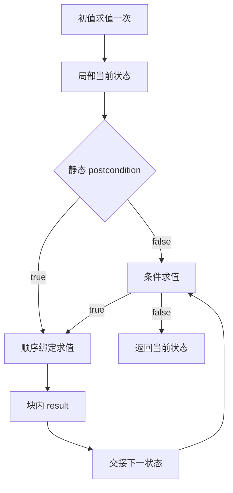
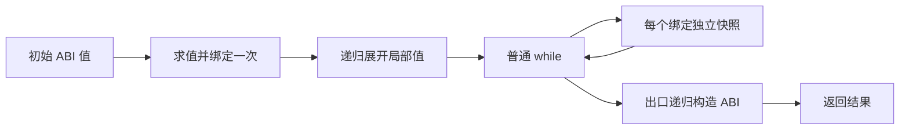

# 顺序遍历与状态迭代设计

最新 RX 分工约束：禁止在 RX 属性值中内联 loop、集合回调或其他函数/方法调用。RX 使用 Call.fn/Call.service 编排 ZX 逻辑，详见 [RX 值与 ZX 逻辑边界](RX值与ZX逻辑边界.md)。下文早期 RX 内联推导及执行记录仅保留为历史，不再代表当前能力。

当前公开调用名为 `loop`，已按用户决定替换旧名称 `iterate`；不保留旧内置入口。`while / next / do`、初值语义、所有权和生成规则不因改名而变化。

应用写法与完整规则见 [loop 使用参考](loop使用参考.md)。本文件保留分阶段的实现记录，早期未接入事项应结合后续完成记录阅读。

改名后的 ReleaseSafe dist 构建通过。ZX count 示例实际构建运行成功，RX adjust 示例和自举 expression.rx 均使用新名称成功生成 Zig；没有新增测试或执行全量测试。

## Intent：最终目标

2026-10-06 最新决定：只移除 `forEach`，其他设计保持不变。下文标为历史的 `forEach` 方案与执行记录不再代表当前语言能力。

撤销记录按 IDEA 界定：Intent 是仅移除 `forEach`；Data 来自“说明 while 的替代写法”会话及用户在本会话明确的“只移除 forEach，其他不变”；Edges 是保留 `loop` 更新块、独立 void 调用和其他集合操作；Answer 是撤除编译支持与专属测试入口，保留明确标识的历史记录。

撤除后 ReleaseSafe dist 构建与差异检查通过。原顺序遍历文档应用编译时在 `forEach` 调用处返回 `unknown list operation`；已有 nested_call.zx 的 `loop` 示例仍能生成 Zig。IR 版本同步升至 16，拒绝复用包含旧枚举布局的缓存。未新增测试用例，未执行全量测试。

为 ZX 增加条件驱动的状态迭代：

- `loop(initial_state, { while, next })` 按条件推进局部状态，返回最终状态。

`next` 支持类似 Immer 的局部可写语法，但语言语义是不可变状态转换：块内的字段赋值描述下一状态，正常到达块尾时自动产生下一状态。旧状态以及调用方的初值保持可观察不变。另提供内联 `do while` 形式，不要求用户定义辅助函数或添加“是否首轮”的业务字段。

概念上每轮都是 `Sₙ → Sₙ₊₁`。这里的“局部可写”只描述块内写法，不表示向用户开放可变对象；新状态是语义上的新值，也不意味着必须分配一份新对象。是否复用物理存储，由编译器在不可变语义约束下决定。

`loop` 是静态语言操作，编译成普通 Zig `while`。不引入专用运行库、代理对象、动态回调、闭包对象或解释执行层。引用型成员的更新依靠编译期所有权与别名分析，能够安全原地更新时不在每轮重建对象。

`forEach` 的编译支持与专属测试入口已移除；独立 void 调用和 `loop` 的现有语法、实现继续保留。`loop` 当前实现与未完成项以文末阶段记录为准。

## Data：可用证据与问题本质

当前集合接口以 `map`、`filter`、`reduce` 为主，回调只允许直接出现的无捕获表达式 lambda。现有 `packages/compiler/src/zx/analysis/transforms.zig` 已有回调参数、输入输出类型和捕获约束检查；`core` 提供语法与 IR，`genz` 负责 Zig 生成。ZX 当前不允许通用 `for` / `while` 语句、一般局部赋值及块 lambda。

缺少的不是循环执行能力，而是两种明确的表达方式：执行每个元素的操作而不产生集合；按状态条件执行未知轮数的计算。用 `map` 丢弃结果、构造调度列表或填入经验次数，会把控制流伪装成数据转换。

自举表达式解析目前使用由 token 和模板 part 数量推导的调度机会，虽然有有限步数约束，仍需创建额外的标量列表。`loop` 能直接表达“未结束就推进一步”，但迁移后仍须证明状态会推进，不能把循环语法当作终止证明。

## Edges：边界与限制

### 静态回调与调用图

回调必须直接写在操作中，其参数、捕获和调用目标在编译期确定。第一版沿用现有无捕获规则：需要的外部数据显式放入初始状态，允许调用静态导入的函数。不得以这个特性绕过 Store 能力检查、原生调用声明或无环调用图约束。

`loop` 是编译器识别的内置操作，解析到该内置符号时才适用这些规则；不能只看函数名文本改写普通用户函数。配置中的 `while`、`next`、`do` 是静态语法槽位，不构造包含运行时函数的对象。它们只在相应上下文中识别，不开放任意循环语句或任意函数值。

### 所有权与成本

“调用方初值不变”是语义要求；“原地更新”是满足该语义后的实现选择。

- 对整数等值字段，建立局部 Zig 状态值并直接更新字段即可；不存在每轮对象堆分配。
- 未修改的字符串、只读列表和聚合成员可以保留合法借用，必须满足返回值的生命周期约束。
- 若初值及其别名在循环后仍可观察，不能写入它们共享的可变存储。编译器应在进入可写区域前，为实际需要修改的共享部分建立独立所有权；不得每轮复制整份状态。
- 若所有权与后续使用分析证明没有可观察的旧别名，可以复用原有存储。不能只凭参数标有 owned 就忽略调用方后续读取。
- 当写集合可静态确定时，仅准备这些部分；通过动态索引写列表时，独立化范围可能必须覆盖对应列表。嵌套共享关系也必须检查，浅拷贝不能冒充隔离。
- 不能安全隔离的原生句柄、Store 句柄等不可复制资源，报告具体的所有权或能力诊断；禁止猜测复制方式、引入引用计数代理或偷偷修改旧值。

这个承诺不等于所有程序绝对零复制。保留共享旧值又修改同一存储，通常必须分离存储。目标是避免不必要复制、避免每轮对象分配，并在生成结果中能明确看见必要的初始化和循环成本。用户在循环体内显式创建集合，仍可能产生应用语义本身需要的分配。

### 终止与失败

`loop` 不设置隐式轮数上限，不用剩余预算代替条件。非终止循环保留其语义；形式化验证另行要求不变量与递减量，不能默认所有 while 都可静态证明终止。

错误与能力沿用现有调用规则。失败后不执行后续迭代；局部可写区不是事务，已经发生的外部副作用不自动回滚。不引入异步、并行、隐式调度或错误吞噬。

## Answer：交付格式与成功标准

### 1. forEach：已移除

功能、原示例源码及其生成产物已按用户决定移除。

### 2. loop：先判断，再推进状态

```typescript
const final_state = loop(initial_state, {
	while: state => state.remaining > 0,

	next: state => {
		state.remaining -= 1
		state.processed += 1
	}
})
```

设初值类型为 `S`，操作结果也为 `S`。初值只求值一次。每轮先以当前状态计算 `while`；结果必须是 `bool`。条件为假时返回当前状态，初始条件为假则不进入 `next`。

`while` 接收只读状态；`next` 的参数在块内表现为下一状态的草稿。草稿是编译期语义，不是调用方对象的可写别名，也不是运行时代理。块内语句按源码顺序执行，后续读取能看到前面描述的更新；这些更新不改变块入口旧状态的可观察值。正常到达块尾自动产生下一状态，随后重新判断条件，不要求 `return state`。

因此 `state.remaining -= 1` 描述的是下一状态的 remaining 比当前草稿值少一，不是修改调用方对象。同一块中的多次赋值按顺序组合成一次状态转换；编译器检查更新中产生的借用是否仍指向旧值，不能因表面写法类似赋值就省略别名分析。

局部可写语法在此范围内允许 `state.field = value`、已有类型支持的算术复合赋值，以及类型不变的整体 `state = replacement`。嵌套字段与索引写入使用同一套可写位置、边界和所有权检查。局部 `const` 仍不可重新赋值，不能给捕获变量赋值。算术溢出与除零规则沿用现有数值语义，不因复合赋值而放宽。

`next` 的块不使用函数 `return`；块结束隐式产出累加器。`if` / `switch` 可组织内部更新，所有正常分支汇合到同一块尾。第一版不增加 `break` / `continue`，提前停止通过状态和条件表达。

当前 ZX 禁止分号，因此上述示例保留仓库既有的无分号风格；用户示意中的分号不作为本功能扩大语法范围的理由。

对只包含值字段的状态，降级可直接是：

```zig
var state = initial_state;

while (state.remaining > 0) {
    state.remaining -= 1;
    state.processed += 1;
}

const final_state = state;
```

这段示意不包含引用型字段的独立化。它说明局部字段更新无需构建“下一对象”；共享成员的处理必须先通过前述所有权检查。

### 3. do while：至少执行一次，全部内联

建议采用同一 `loop` 的另一种静态配置形状：用 `do` 替代 `next`，明确表示后置判断。

```typescript
const final_state = loop(initial_state, {
	do: state => {
		state.value = advanceValue(state.value)
		state.processed += 1
	},

	while: state => state.value < state.limit
})
```

先执行一次 `do`，再对更新后的状态判断 `while`。条件为真则再次执行，条件为假则返回最终状态。无需外部辅助函数；`do` 中可以直接写完整更新逻辑。示例中的 `advanceValue` 只是已有业务函数调用，不是表达 do while 所必需的包装函数。

`do` 的可写规则与 `next` 完全相同。两种配置恰好为 `{ while, next }` 和 `{ do, while }`，不能同时声明 `do` 与 `next`，不能缺少条件，未知或重复槽位诊断。槽位在对象中的书写顺序不决定执行顺序。

`do` 是本方案建议的接口拼写，尚未实现。它避免增加首轮状态字段和运行时模式开关，也不会将 JavaScript 对象或回调传入 Zig。

```zig
var state = initial_state;

while (true) {
    state.value = advanceValue(state.value);
    state.processed += 1;

    if (!(state.value < state.limit)) break;
}

const final_state = state;
```

### 4. 编译器职责与实施顺序





实施按以下边界推进，不把职责全部塞进 compiler：

1. `core` 定义必要的语法与 IR 节点。局部写入必须有明确的可写位置，不能伪装成普通二元表达式或生成文本拼接。
2. `compiler` 接通静态内置解析、`void` 调用语句、局部可写块、类型和能力检查，以及跨迭代与退出位置的借用分析。Zig 种子 parser 与正在迁移的 RX/ZX parser 保持同一语言契约。
3. `genz` 直接生成循环、局部变量与字段写入；静态回调可以内联或降为直接调用，但不得生成动态函数指针调度。
4. `lint` 支持这几种结构的命名、缩进和语义块空行；语言约束错误仍由语法与语义分析负责。
5. 以自举解析器的实际循环为消费方，替换人工调度列表。保留终止状态检查、诊断位置和必要的不变量，不通过扩大循环次数掩盖状态机错误。

成功标准包括：顺序与执行次数准确；先判断与后判断行为明确；块尾返回正确的最终状态；调用后读取初值及其合法别名仍得到旧值；嵌套引用不会被误写；生成 Zig 没有专用运行库、代理和动态回调；可原地更新的值字段不产生每轮对象分配；必要的存储分离有可解释的所有权证据。最终以源码语义、生成结果和已有材料的执行证据共同验收，不以语法能通过或仅有标量示例判定完成。

## 自我复核

此设计有意增加了受限的局部更新语法，因此不能只加两个方法名而不处理 AST、控制流、别名和生命周期。语言层始终是不可变状态转换；编译器生成的局部 Zig 变量及字段写入是满足该语义的实现方式。“类似 Immer”只描述写法与可观察结果，不沿用 Immer 的代理与运行时机制。

`do` 的接口拼写、不可复制资源诊断和共享成员独立化策略都应在正式实现中有对应证据。当前文档没有宣称这些能力已完成，也没有新增测试用例或启动全量测试。

## forEach 历史实施记录（功能已移除）

core 的 Transform 增加 forEach，结果固定为 void。compiler 的 ZX 分析与 RX 类型推导均接入该操作；回调输入沿用借用及无捕获规则。所有权检查在检查回调之后结束此次借用，不因已经丢弃的回调返回值而永久冻结接收列表。core AST 增加 evaluate 语句，复用已有 IR evaluate；独立调用要求返回 void，避免无意忽略普通调用返回值。

genz 在普通集合 lowering 中生成 for_loop，回调为静态表达式：void 结果直接执行，其他结果显式丢弃，块最终产生 unit。既有 map/SIMD 与 reduce 缓冲优化按 kind 限定，不能将 forEach 并行化或当作 filter 构造列表。lint 对独立调用复用表达式名称检查与语句间距规则。

此处没有新增仓库测试用例或执行全量测试。loop 的解析、状态更新 IR、不可变别名分析及 while 降级仍需继续完成。

## loop 基础接入记录（进行中）

AST 已增加状态更新块与更新语句，解析器在 loop 第二参数的 next / do 直接 lambda 中识别更新块。嵌套普通 lambda 会恢复普通表达式语义；槽位标记不会传入函数调用的内部参数。更新块中的调用与赋值在同一次解析中区分，避免回退后重复分配整棵表达式。Store 写入仍由已有语法分支处理，不归入一般状态更新。

规则字面量解析保留普通对象的展开和字段简写；这些形式是否可用于内置 loop，后续由静态槽位检查诊断。这样名称解析之前不会仅因被调用者文本为 loop 就拒绝普通导入函数原本合法的对象实参。类型分析仍须明确内置符号与用户导入的优先级。

genz 的结构化节点补充 while_loop 和 break_loop，打印为普通 Zig 控制流，供前置及后置条件迭代降级使用。这不代表 ZX 到这些节点的完整链路已接通。

前一轮 ReleaseSafe dist 构建已通过，包含 RX 推导及 Store 表达式遍历对新 AST 节点的穷举适配。本轮解析边界与生成节点调整也通过 zig build dist -Doptimize=ReleaseSafe，zig fmt --check 与 git diff --check 通过；没有新增测试用例或执行全量测试。构建只证明当前接入可编译，不证明尚未接通的迭代执行语义。

下一步先定义带结果的局部作用域及 iteration IR，接通验证、符号作用域、模块重映射与所有权遍历，再实现状态更新分析与生成。更新应先表达为不可变值转换，只有证明旧别名不再可观察后才能复用存储；不能直接把输入对象指针改成可写指针。if / switch 分支应在各自作用域内产出下一状态，不能把分支局部符号直接引用到分支外。

自我复核：目前普通语义分析对状态更新仍返回明确的“不在 loop 中允许”诊断，内置操作尚未接入，因此此阶段不能提交为 loop 功能完成。动态索引、嵌套引用、循环回边借用及最终返回生命周期仍属于必要工作，不能以标量循环或构建成功替代这些要求。

### 中间表示接入（进行中）

局部块采用 Scope { bindings, result }：bindings 是按顺序求值的不可变绑定，无符号的条目表示 void 调用，result 在块内完成名称解析。if / switch 的更新分支后续使用各自产生状态值的 Scope，再由已有条件或匹配表达式汇合。这个结构不携带函数 return、Store 写入或另一套通用语句解释器。

Iteration 分别记录 initial、condition_parameter、parameter、condition、body 和静态 postcondition。初值、条件和下一状态的类型有独立校验；两个回调具有隔离作用域，沿用禁止捕获的边界。IR 版本从 13 升为 14，旧版缓存及库 IR 需按既有版本校验重新生成。

模块归档深复制 Scope 绑定数组，RX 重映射绑定符号和表达式编号；Iteration 自身仅含编号与布尔值。合约检查暂不接受 Scope / Iteration，避免把能够执行语句或不保证终止的结构混入既有合约求值规则。已有堆栈归约和缓冲复用优化暂不接受新结构，采用普通生成路径，等待相应逃逸与别名分析完成后再放行。

genz 的 Scope 生成带标签的 Zig 块与顺序 const，Iteration 生成局部状态和 while。后置条件生成 while (true)，先计算下一状态，再判断是否 break；条件表达式不被额外执行。当前通用路径仍可能在聚合状态更新时分配，不能据此宣称已经满足最终的每轮零额外分配要求。

所有权检查当前把每次回调的引用型状态视为借用，保留调用方初值；标量仍为复制值。这是进行中的安全基线，尚未接通更新位置的所有权独立化与存储复用。正式发布前还必须完成草稿更新到不可变绑定的分析、动态索引语义、必要复制的范围证明及循环生成优化。





此阶段 IR 与生成接入仍不等于前端功能可用；ZX 内置名称解析、槽位类型检查及更新块分析尚未接通，RX 推导也必须同步。没有新增测试用例，没有执行全量测试。

中间表示接入后，zig build dist -Doptimize=ReleaseSafe 已通过；补充回调 Store 调用限制后的最终构建也通过。git diff --check 与相关源码格式检查通过。该证据仅覆盖编译器构建，不替代尚未接通的 ZX 源码到运行结果验证。

### ZX 更新块分析接入（进行中）

calls 在本地绑定与导入函数查找之后识别内置 loop，保持已有遮蔽行为。规则字面量检查字段重复、未知字段、spread、缺失条件及 next / do 冲突；回调必须内联且只有一个状态参数，步骤必须使用更新块。初值类型约束两个回调与最终结果。

analysis/iteration 按职责分为 root、block、update：root 处理操作契约与回调作用域；block 生成顺序绑定并汇合 if / switch；update 沿对象或元组投影重建下一状态。更新只允许指向当前草稿参数，const 别名与其他局部值不能成为写入目标。整体替换和算术复合更新保持类型，算术仍交给现有 binary IR 与生成规则处理。

每次赋值都建立新的状态符号，后续名称解析指向新符号；先前 const old = state 绑定仍指向原符号。右侧表达式先绑定一次，再参与状态重建，避免按对象字段重复执行右侧调用。分支块在自己的 Scope 中产生结果，回到外层再绑定汇合后的状态。步骤里的 return 与 Store 写入有明确诊断。

当前已接入对象字段、嵌套对象和元组槽位更新，动态列表索引写入仍报 unsupported；后续必须实现独立存储与索引更新 IR，不能用这个限制缩减最终交付范围。RX 内联表达式的 loop 推导尚未接通，聚合状态每轮分配优化也未完成。

本阶段 zig build dist -Doptimize=ReleaseSafe、zig fmt --check 与 git diff --check 已通过。构建过程中修复了两个 Zig 局部名称遮蔽错误。没有新增测试用例或运行全量测试；尚未以真实 loop 应用执行验证，因此类型、别名与执行顺序的实现说明仍需后续运行证据确认，不能把构建通过当作完整语义验收。

### RX 内联推导接入（进行中）

RX inference 新增 iteration/root 与 iteration/block，识别内置 loop，约束规则字面量、单参数回调、bool 条件以及块内更新的类型。局部常量与解构进入各自块作用域；分支推导结束后恢复绑定。更新目标必须以当前状态参数为根，参数不能被局部声明遮蔽；return 和 Store 写入仍被拒绝。最终表达式继续交给已有 ZX 分析与 IR 校验，不在 RX 中复制执行层。

推导诊断映射回 RX 属性源码位置，包括块内显式类型注解的解析错误。复核同时补齐已知元组的索引推导：索引必须是整数字面量且不越界，其他目标继续使用原列表推导。这样元组字段更新不会仅因经过 RX 推导就被错误地限定为列表操作。

新增 RX 迭代推导及随后补充元组索引的两轮 ReleaseSafe dist 构建均已通过；相关源码格式检查与差异检查通过。动态列表写入和聚合分配优化仍未完成，也没有据此宣称整个 loop 已可发布。未新增测试用例或执行全量测试。

### 局部绑定复核修正

开始列表更新前，复核发现 Scope 生成中的使用标记依赖表达式 lowering 顺序。原先先生成前面的绑定，再生成块尾结果，可能把后面仍会引用的常量判为未使用。现改为先降低结果、反向降低绑定以收集引用，再按源码顺序输出 Zig 语句。生成时的分析顺序与产物中的执行顺序明确分离。

另一个问题是状态更新后产生的拥有值：const old = state 等直接别名如果按普通移动绑定处理，会使仍需继续读取的当前状态失效。ScopeBinding 增加显式 borrow 标记，草稿块中引用与字段／索引投影采用只读借用绑定，冻结对应源位置；新构造结果仍保留原有所有权判定。RX 编号重映射同步保存该标记。IR 版本进一步升至 15，避免此前不含该语义的版本 14 缓存混用。

动态列表更新尚未实现。这两项修正先恢复局部块引用及旧值保留的基础约束，不能作为列表独立存储或循环复用已经完成的证据。

### 动态列表更新基线接入（进行中）

新增 ListUpdate { target, index, value }，结果类型与 target 的列表类型相同；索引为 u64，替换值类型与元素类型一致。类型、作用域、模块重映射、归档及所有权遍历均接入该节点，既有归约与缓冲优化暂不把它视为可安全复用存储的操作。

更新位置分析先把原投影路径转换为 Place：每一级容器、索引与旧值按源码顺序绑定一次，再计算右侧表达式。复合赋值使用缓存的旧值；嵌套更新从叶子向根重建容器。旧版“不支持列表索引更新”的临时诊断已撤除。索引检查沿用 IndexOutOfBounds，失败时不会先执行更新右侧的后续副作用。

genz 的基线路径复制受影响列表，再替换选定元素；嵌套列表只对更新路径上的列表生成更新节点，其余成员保留合法借用。这保证不直接写入原列表。包含引用型元素时，所有权结果保守地保留借用关系，不能把浅复制列表当作其元素全部独占。

这一步建立完整的索引求值及不可变更新表示，尚未消除循环中重复的容器复制。后续必须识别实际写集合、旧值是否逃逸及可复用存储，才能满足最终性能要求；不得把当前逐次复制降级包装成最终实现。这些接入及最后的纯引用临时值生成修正均通过 ReleaseSafe dist 构建，格式检查与差异检查通过。尚未完成真实应用执行验证；没有新增测试用例或执行全量测试。

### 实际使用与局部布局接入

整理了可直接构建的 ZX 列表调整、ZX 状态计数和 RX 内联列表调整示例，放在 [状态迭代/示例](状态迭代/示例/)。它们是功能文档配套应用，没有加入仓库测试集。ZX 与 RX 列表调整均返回更新后的 [11,12,13]，同时保留原输入 [1,2,3]；计数示例保留 initial.remaining = 3，并产生 result.remaining = 0、processed = 3。[执行记录](状态迭代/执行记录.json)保存命令、输入输出和证据边界。

新增迭代布局分析，复用已有函数纯调用摘要，同时检查条件与步骤，排除外部调用、Store 及并行调用产生的地址逃逸风险。Scope 与 match 增加按布局值产生结果的模式；Scope 中各个状态符号分别生成局部 const 布局，旧别名保留独立快照，而非全部指向同一个可变累积器。

计数示例生成的 while 内没有 allocator.create：局部状态按值推进，发生迭代后才在循环外构造最终对象；前置条件从未成立时保留原初值。结果在离开每个局部块前按值取出，不能返回块内对象地址。这个证据证明该示例消除了每轮对象堆分配，不等同于所有输入类型都零复制，也不代替列表缓冲复用的后续实现。

布局安全范围已扩展至字段递归由 scalar、enum、optional 和 list 组成的状态对象，仍排除字段中的 object／tuple。列表仅复制 slice 描述信息，底层数据继续使用现有堆存储与合法借用，不把列表改为指向局部栈数组。列表调整示例在新编译器下重新构建运行，输出保持不变；生成 while 中已无对象 create，只剩列表更新的 dupe。最新 dist 构建、格式与差异检查通过。列表缓冲复用和含嵌套对象字段的布局分析仍未完成。

### 列表复用实施边界

复用审计将按候选字段分别跟踪列表逻辑版本与 Scope 的真实求值顺序。引用、对象字段与已缓存投影只传播版本；元素读取和带列表实参的调用才观察内容。一次写入后再读取旧版本，或将旧版本留在最终状态其他字段时，该字段继续使用既有复制路径。

分支分别分析后汇合版本，循环回边要求对应字段传递当前最新版本，不能任意换成其他来源。首次实际写入前复制输入，之后只在同一字段整条路径通过审计时复用缓冲；无写入路径不提前复制。首先接入直接列表字段和非聚合元素，嵌套容器仍需逐级审计，不能以外层列表独占推断内层独占。

后置循环与 switch 的分类示例已实际构建运行：stop = 5 时输出 position = 5、even = 3、odd = 2。生成 while (true) 在步骤之后判断并 break，循环内无对象 create。

### 列表首次写入隔离与循环复用已接入

按 IDEA 记录此阶段：Intent 是在保留输入和旧值语义的前提下，消除可证明安全的逐轮列表复制；Data 是版本审计实现、生成 Zig 与已有 adjust 应用的实际输出；Edges 是直接列表字段、非聚合元素及没有可观察旧别名的路径；Answer 是普通 Zig 的首次写入复制和后续原位更新，不增加运行库。

新增 iteration_buffer 的事实传播、顺序分析和生成接入。分支快照包含符号、表达式缓存与当前版本，汇合保留旧版本失效信息。循环结果必须把最新版本放回同一字段，不能把任何版本的候选列表藏入其他状态字段。调用即使是纯函数，只要消费输入或可能返回列表别名，也不能用于候选缓冲复用。嵌套转换与迭代的分析依赖当前前端禁止回调捕获外层绑定；未来开放捕获时必须同步扩展审计。

最新 adjust.zig 在循环外声明 mutable slice 和首次写入标志；首次实际写入经过求值与边界检查后才复制，后续写入复用同一缓冲，没有写入则不分配。已有 adjust.zx 重新构建执行，输出 original=[1,2,3]、values=[11,12,13]、total=36，退出码为 0。循环内无 allocator.create。

自我复核：这证明直接标量列表的安全复用路径已工作，不能推导为嵌套容器或所有别名形态都已消除复制。只读静态审计未发现现有前端可构造的阻塞性反例，但不是完整回归结果；未执行全量测试，也未新增测试用例。消费型调用排除条件补充后的 ReleaseSafe dist 构建已通过，格式检查与差异检查通过。

### 静态嵌套字段的列表复用

候选从单个字段编号扩展为对象／元组字段路径。初始版本事实只沿选定路径建立；回边检查递归要求该路径保留最新版本，同时每一层的其他字段都不能携带候选列表别名。空路径也支持以列表本身作为状态。动态列表索引和 optional 解包不属于静态字段路径，仍不进入这项优化。

纯度分析与平坦布局判断现已分开：列表复用仅依赖纯度和列表版本审计，嵌套对象不再因外壳仍采用原有构造方式而失去列表复用机会。对象／元组的布局与生命周期优化仍需另行完成，不能把列表缓冲优化当成嵌套对象零分配的证据。这项扩展已通过 ReleaseSafe dist 构建及格式检查。

### 嵌套列表消费证据与元组布局接入

文档应用 nested_adjust.zx 实际构建并执行成功，输入 values=[1,2,3]、increment=10，输出 batch.values=[11,12,13]、batch.total=36、original=[1,2,3]。生成 Zig 证实嵌套 batch.values 使用首次写入隔离的循环缓冲。循环内仍有对象 create，这是下一步深布局需要消除的结构重建成本。

平坦布局现同时接受 object 和 tuple。元组生成增加按值返回方式，Scope 的每个元组 SSA 绑定拥有独立布局快照，循环更新后在出口构造 ABI 元组。ReleaseSafe dist 构建通过；count_pair.zx 成功构建并执行，输入 count=3，输出 initial=[3,0]、result=[0,3]。其 while 内没有 create，初值与最终结果构造均在循环外。未新增仓库测试用例或执行全量测试。

嵌套对象实施决策：保留公开 types/layouts 和函数 ABI，建立只在迭代内部使用的递归值布局。初值求值一次后逐级展开；对象、元组字段内联，列表和字符串保留 slice；每个 SSA 符号保存独立深值。出口逐级构造原 ABI 对象，零轮迭代返回初值。局部深符号与表达式缓存必须单独记录表示，不能塞入当前仅表示浅 ABI 布局地址的 stack_symbols/cache。

调用边界需构造在调用块内存活的 ABI 借用视图，或在尚未接入转换时禁用受影响的深布局路径；不能直接把深值地址传给现有函数。含聚合元素的列表、optional 聚合以及动态嵌套列表还需要对应生命周期与写集合分析。该决策是后续实施计划，不代表这些优化已经完成。

### 递归值布局接入中

`iteration_value/` 分别负责局部类型、ABI 转换、聚合构造及 Scope 绑定，主降低器通过独立上下文分派；原有 ABI 缓存与局部值缓存不混用。循环内对象／元组的类型按静态结构递归内联，列表和字符串保持既有 slice。局部类型声明提升到循环所在块，不能只在某个分支内声明后被其他分支引用。

本阶段门禁排除聚合实参调用、聚合比较、嵌套迭代和转换操作，以及包含聚合元素的列表或 optional。它们继续走既有语义路径；此限制针对尚未接入的表示转换，并非新增语言限制。叶子实参的纯函数可以继续调用，返回的聚合结果先绑定一次再展开为局部值。



递归布局接入已通过 ReleaseSafe dist 构建、格式及差异检查。最新编译器重新构建 nested_adjust.zx 并执行，输出仍为 batch.values=[11,12,13]、batch.total=36、original=[1,2,3]，退出码为 0。新生成的 while 内没有对象 create；嵌套对象按 state_type 局部值重建，列表 dupe 仍仅在首次写入分支执行，最终 ABI 子对象和根对象在循环出口构造。

自我复核：静态审计未发现本阶段表示混用、局部地址逃逸或求值顺序问题，但不代替完整回归。list_operation 的聚合结果目前仍可能先生成 ABI tuple 再展开，从而保留额外分配；聚合调用边界等门禁尚未放开。当前证据仅证明该嵌套应用消除了循环中的结构重建分配，不能外推为所有迭代操作均零分配。

### 列表操作的结果元组按值生成

collections 增加值布局出口，普通 ABI 路径保持原有构造方式；平坦值生成和递归值生成都可以传入各自的结果元组类型。列表操作的求值顺序、越界检查及缓冲处理仍共用原实现，仅将最后的 tuple construct 改为直接返回有类型的元组值。

这个调整消除结果元组外壳的额外分配，不消除 push／concat／splice 所需的列表存储，也不放宽借用列表不得消费的所有权约束。ReleaseSafe dist 构建、格式及差异检查通过；尚无使用该新路径的实际应用执行证据，不能据此宣称完整语义验收。

### 聚合参数的局部 ABI 视图

递归布局中的纯函数调用现按参数类型构造局部 ABI 视图。先将参数表达式绑定为深值，再逐级声明浅 ABI 子对象，父对象指向这些局部子对象；所有声明与调用位于同一块内。调用结果在块结束前绑定并转换为局部值，防止返回参数子对象时留下局部地址。

这一机制不分配参数对象，也不改写函数 ABI。临时实参覆盖与普通 ABI 缓存均保存并恢复，已有调用优化不会再次展开原对象实参。门禁只放开不消费聚合输入的纯调用；消费型调用、聚合比较和其他尚未接入的表示边界仍走原有路径。被调函数自身的分配不因参数视图而自动消失。

文档应用 nested_call.zx 通过 next_total.zx 读取嵌套状态并计算累计值。最终 ReleaseSafe dist 构建、格式和差异检查通过；应用重新构建执行成功，输入 values=[1,2,3]、increment=10，输出 batch.values=[11,12,13]、batch.total=36、original=[1,2,3]。生成的 while 内无对象 create，调用参数为块内的 zx_type 局部视图，列表仍仅首次写入 dupe。该应用证明聚合参数、标量返回路径；返回聚合别名的路径目前只有实现与静态推理证据，不能用这个标量返回示例替代其执行验收。

### 聚合返回值复用按值调用入口

局部 ABI 视图调用优先采用既有缓冲返回或 callValue 入口；没有这些入口时继续使用普通调用。返回值仍在调用块内递归转换，因此返回输入子对象的函数不会把临时 ABI 视图地址带出该块。这仅复用已经具备的返回优化，不重写模块 ABI 或函数实现。

文档应用 nested_count.zx 以 do／while 形式调用 advance_counter.zx：剩余计数大于零时返回新 Counter，否则直接返回输入中的 Counter 子对象。最新 ReleaseSafe dist 与应用构建均通过。输入 count=3 时返回 remaining=0、processed=3，initial 保持 remaining=3；输入 count=0 时执行一次后返回全零状态，覆盖直接返回输入子对象的分支。两次运行退出码均为 0。

生成的 while 内调用 function_0_value，循环和该按值函数都没有 create；函数的原 ABI 入口仍保留兼容路径，不能把其存在的分配误认为实际循环走了该入口。最终对象仅在循环出口构造。此证据覆盖该模块的聚合返回路径，不外推为任意函数内部均无分配。格式与差异检查通过，未新增仓库测试或执行全量测试。

### 可选聚合状态的局部布局

局部类型现将 optional 的对象／元组 payload 同样展开为值，Scope 为这些可选值保存独立快照。入口和出口先判断是否为空，再在有值分支展开或构造 payload；不会对 null 提前执行解包。some、null 与 coalesce 保持局部表示一致，空值比较可直接生成 Zig 条件。

参数中包含可选聚合值的函数调用仍退出深布局优化；当前调用视图尚未实现可选子对象的条件存储。非空的聚合结构比较也不放开，避免普通比较路径收到另一种字段表示。上述限制不影响源语言是否可用，只决定当前优化是否适用。

optional_count.zx 演示可选游标状态：每轮推进剩余计数，结束时把 cursor 设为 null，初始状态仍可读取。ReleaseSafe dist 与应用构建通过；输入 count=3 时输出 initial.cursor.remaining=3、result.cursor=null、result.processed=3，输入 count=0 时初始与最终状态均为 null 游标和零计数，两次退出码均为 0。

生成的 while 内没有 create，局部字段为 ?state_type，coalesce 生成 orelse；出口子对象构造只出现在非空分支。静态复核未发现提前解包、局部表示混用或 fallback 提前求值问题。该应用覆盖对象中的可选游标，不能替代所有可选根状态与可选元组的执行验收。格式与差异检查通过，未新增仓库测试或执行全量测试。

### 可选聚合参数的借用视图

借用视图构造已独立到 iteration_value/borrow.zig。可选 payload 的 ABI 局部对象在非空条件下初始化，否则保持未使用的 undefined；交给函数的可选指针同样只在非空分支引用该对象。嵌套可选值的条件通过短路 and 继承父级条件，避免检查子字段时先解包空父级。

深布局调用现在允许含可选聚合字段的非消费型纯参数，原有所有权与纯度门禁继续生效。optional_count.zx 的条件改为调用独立 has_cursor.zx，覆盖进入循环前和循环结束时的参数视图构造。

最终 ReleaseSafe dist 与该应用构建通过；count=3 和 count=0 的输出保持上一阶段结果，两次运行退出码均为 0。生成的 while 条件块使用受非空条件保护的 ABI 局部对象，并以相同条件选择子对象地址或 null，条件块和循环体均没有 create。格式及差异检查通过。当前执行证据覆盖一层可选对象参数，不等同于所有可选嵌套形状的完整回归；未新增仓库测试或执行全量测试。

### 自举表达式驱动已迁移并核对

独占入口现接受直接函数调用返回、且所有权结果为 owned 的临时初值；已有绑定继续借用。条件回调按借用检查，步骤可交接独占值；若步骤返回借用或 loaned 状态，按借用状态重新检查回边。消费型调用不进入局部栈布局优化，避免被调函数保留临时 ABI 对象地址。

expressions/parse.zx 现直接执行 loop(initial(in), …)，以 control.phase != Phase.Done 为条件，每轮整体替换为 step(state)。三个布尔调度列表及其 reduce 驱动已移除，无其他使用者的 token_steps.zx 和 part_steps.zx 同步删除。RX 仍负责 prepare 服务和解析模块之间的数据流。

新版 expression.rx 已构建为可执行文件；已有 arguments_finish、primary、template 三份源码共 2166 个 token 起点，与当前 Zig 参考解析器比较 AST、span、depth、下一索引和诊断，全部一致。核对报告见 [解析器驱动核对](状态迭代/解析器驱动核对.json)。公开名称改为 loop 后，该 RX 入口再次成功生成 Zig。

终止依据是正常 prepare 产物的结构约束：消费 token、弹出 continuation、沿有限模板 previous 链推进，或进入 Done。保留 256 层语法深度限制；没有改为经验步数计数器。当前 phase 分支覆盖所有非 Done 枚举值，新增 phase 时必须继续维护这一性质。

类型解析器的独立入口直接 reduce 真实 token，并未构造调度列表。本阶段保留它，避免为机械改成 loop 而复制只读 token 输入。表达式驱动消除了调度列表，不代表所有语法 helper 的状态分配已消除，更不代表整个编译器已完成自举。

### 自举解析器消费核对与状态整体替换

真实消费位置是 compiler 的 frontend/parser/expressions/parse.zx：先把 token 与模板片段映射为布尔调度列表，再用 reduce 调用 tokenSteps／partSteps。step 和状态构造模块接收 owned Input，并通过消费型列表操作推进语法树。这说明接通状态值生成还不足以直接迁移，必须正确处理独占状态在迭代回边的交接。

复核发现整体替换 state = expression 仍经过 Place 准备，先生成对旧根状态的借用。整体替换没有字段／索引求值，也不需要旧值，因此现改为直接分析右侧并绑定下一状态。字段、索引和复合赋值继续保留原有目标求值及旧值读取顺序。这项修正不会自动放开消费借用值。

整体替换修正已通过 ReleaseSafe dist 构建、格式和差异检查。尚未取得独占状态迭代的执行证据，没有因此宣称解析器调度列表已被替换。

按 IDEA 界定下一步：Intent 是用 loop 替换自举调度列表；Data 是上述真实解析模块及 owned 调用签名；Edges 是保留初始值可观察性、拒绝消费共享借用，并校验回边所有权和状态机终止；Answer 是可编译的真实解析模块迁移及生成证据。独占状态入口的判定与回边检查尚未接入，当前解析器源码未被假装迁移为无法编译的版本。

## 功能收口核对

本次提交前核对 compiler/core/genz/lint 的新增本地依赖均存在，生产源码没有旧 iterate 内置或 forEach 支持残留；IR 结构及公开版本均为 16。通用回调位置诊断同步列入 loop 规则。

重新执行 `zig build dist` 成功，使用本轮生成的 CLI 构建已有 count 示例，输入 remaining=3 得到 initial={remaining:3,processed:0}、result={remaining:0,processed:3}。重新生成 expression.rx，产物与共享表达式 2166 次请求核对使用的生成源码逐字节一致。没有重新运行全量测试。

收口包含生产语法、分析与生成、解析驱动与共享表入口、既有用例的公开名称迁移和 forEach 专属入口撤除；不将另一会话新增的策略用例或原文审阅记录混入本次提交，也不将未完成的 Program 与 statement 迁移标为完成。
