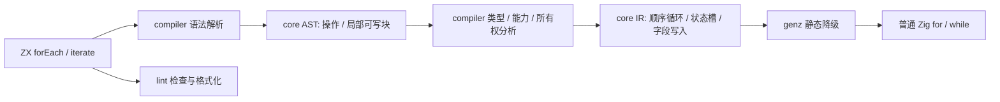
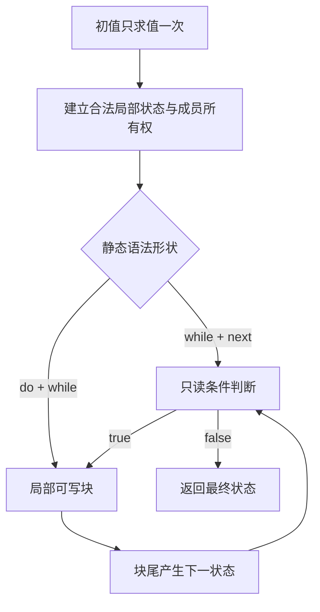

# 顺序遍历与状态迭代设计

## Intent：最终目标

为 ZX 增加两种直接表达循环意图的能力：

- `items.forEach(item => processItem(item))` 顺序执行，不构建结果列表。
- `iterate(initial_state, { while, next })` 按条件推进局部状态，返回最终状态。

`next` 支持类似 Immer 的局部可写语法，但语言语义是不可变状态转换：块内的字段赋值描述下一状态，正常到达块尾时自动产生下一状态。旧状态以及调用方的初值保持可观察不变。另提供内联 `do while` 形式，不要求用户定义辅助函数或添加“是否首轮”的业务字段。

概念上每轮都是 `Sₙ → Sₙ₊₁`。这里的“局部可写”只描述块内写法，不表示向用户开放可变对象；新状态是语义上的新值，也不意味着必须分配一份新对象。是否复用物理存储，由编译器在不可变语义约束下决定。

两者都是静态语言操作，编译成普通 Zig `for` / `while`。不引入专用运行库、代理对象、动态回调、闭包对象或解释执行层。引用型成员的更新依靠编译期所有权与别名分析，能够安全原地更新时不在每轮重建对象。

本次交付设计文档；下文语法属于待实现目标，不表示当前 CLI 已支持。

## Data：可用证据与问题本质

当前集合接口以 `map`、`filter`、`reduce` 为主，回调只允许直接出现的无捕获表达式 lambda。现有 `packages/compiler/src/zx/analysis/transforms.zig` 已有回调参数、输入输出类型和捕获约束检查；`core` 提供语法与 IR，`genz` 负责 Zig 生成。ZX 当前不允许通用 `for` / `while` 语句、一般局部赋值及块 lambda。

缺少的不是循环执行能力，而是两种明确的表达方式：执行每个元素的操作而不产生集合；按状态条件执行未知轮数的计算。用 `map` 丢弃结果、构造调度列表或填入经验次数，会把控制流伪装成数据转换。

自举表达式解析目前使用由 token 和模板 part 数量推导的调度机会，虽然有有限步数约束，仍需创建额外的标量列表。`iterate` 能直接表达“未结束就推进一步”，但迁移后仍须证明状态会推进，不能把循环语法当作终止证明。

## Edges：边界与限制

### 静态回调与调用图

回调必须直接写在操作中，其参数、捕获和调用目标在编译期确定。第一版沿用现有无捕获规则：需要的外部数据显式放入初始状态，允许调用静态导入的函数。不得以这个特性绕过 Store 能力检查、原生调用声明或无环调用图约束。

`iterate` 是编译器识别的内置操作，解析到该内置符号时才适用这些规则；不能只看函数名文本改写普通用户函数。配置中的 `while`、`next`、`do` 是静态语法槽位，不构造包含运行时函数的对象。它们只在相应上下文中识别，不开放任意循环语句或任意函数值。

### 所有权与成本

“调用方初值不变”是语义要求；“原地更新”是满足该语义后的实现选择。

- 对整数等值字段，建立局部 Zig 状态值并直接更新字段即可；不存在每轮对象堆分配。
- 未修改的字符串、只读列表和聚合成员可以保留合法借用，必须满足返回值的生命周期约束。
- 若初值及其别名在循环后仍可观察，不能写入它们共享的可变存储。编译器应在进入可写区域前，为实际需要修改的共享部分建立独立所有权；不得每轮复制整份状态。
- 若所有权与后续使用分析证明没有可观察的旧别名，可以复用原有存储。不能只凭参数标有 owned 就忽略调用方后续读取。
- 当写集合可静态确定时，仅准备这些部分；通过动态索引写列表时，独立化范围可能必须覆盖对应列表。嵌套共享关系也必须检查，浅拷贝不能冒充隔离。
- 不能安全隔离的原生句柄、Store 句柄等不可复制资源，报告具体的所有权或能力诊断；禁止猜测复制方式、引入引用计数代理或偷偷修改旧值。

这个承诺不等于所有程序绝对零复制。保留共享旧值又修改同一存储，通常必须分离存储。目标是避免不必要复制、避免每轮对象分配，并在生成结果中能明确看见必要的初始化和循环成本。用户在循环体内显式创建集合，仍可能产生应用语义本身需要的分配。

### 终止与失败

`iterate` 不设置隐式轮数上限，不用剩余预算代替条件。非终止循环保留其语义；形式化验证另行要求不变量与递减量，不能默认所有 while 都可静态证明终止。

错误与能力沿用现有调用规则。失败后不执行后续迭代；局部可写区不是事务，已经发生的外部副作用不自动回滚。不引入异步、并行、隐式调度或错误吞噬。

## Answer：交付格式与成功标准

### 1. forEach：顺序执行，不收集结果

```typescript
items.forEach(item => processItem(item))
```

语义为：接收者求值一次，按当前列表的索引从小到大执行，每个元素恰好一次，空列表执行零次。整体类型为 `void`。回调可以返回 `void` 或其他普通值，其结果在当前轮按所有权规则丢弃，不创建返回列表。

元素默认借用，不能通过参数修改输入列表或其共享成员，不能在遍历时改变正在遍历的容器。需要消费元素时必须显式取得合法所有权，不能由 `forEach` 暗中消耗输入。回调中的副作用保持顺序，编译器不得按纯转换规则重排或并行化它们。

第一版提供上述单参数表达式回调；多参数索引、循环控制语句与一般块回调不是这个接口成立的前提。独立的 `void` 调用语句需要在语法、AST 和 IR 中正式支持，不能靠把结果绑定到无用变量实现。

以下是普通 Zig 降级示意，具体错误传播与临时值释放由现有类型和所有权规则生成：

```zig
const source_items = items;

for (source_items) |item| {
    processItem(item);
}
```

当被调用函数返回非 `void` 时生成对应的显式丢弃；不能机械把这段 `void` 调用代码用于所有返回类型。

### 2. iterate：先判断，再推进状态

```typescript
const final_state = iterate(initial_state, {
	while: state => state.remaining > 0,

	next: state => {
		state.remaining -= 1
		state.processed += 1
	}
})
```

设初值类型为 `S`，操作结果也为 `S`。初值只求值一次。每轮先以当前状态计算 `while`；结果必须是 `bool`。条件为假时返回当前状态，初始条件为假则不进入 `next`。

`while` 接收只读状态；`next` 的参数在块内表现为下一状态的草稿。草稿是编译期语义，不是调用方对象的可写别名，也不是运行时代理。块内语句按源码顺序执行，后续读取能看到前面描述的更新；这些更新不改变块入口旧状态的可观察值。正常到达块尾自动产生下一状态，随后重新判断条件，不要求 `return state`。

因此 `state.remaining -= 1` 描述的是下一状态的 remaining 比当前草稿值少一，不是修改调用方对象。同一块中的多次赋值按顺序组合成一次状态转换；编译器检查更新中产生的借用是否仍指向旧值，不能因表面写法类似赋值就省略别名分析。

局部可写语法在此范围内允许 `state.field = value`、已有类型支持的算术复合赋值，以及类型不变的整体 `state = replacement`。嵌套字段与索引写入使用同一套可写位置、边界和所有权检查。局部 `const` 仍不可重新赋值，不能给捕获变量赋值。算术溢出与除零规则沿用现有数值语义，不因复合赋值而放宽。

`next` 的块不使用函数 `return`；块结束隐式产出累加器。`if` / `switch` 可组织内部更新，所有正常分支汇合到同一块尾。第一版不增加 `break` / `continue`，提前停止通过状态和条件表达。

当前 ZX 禁止分号，因此上述示例保留仓库既有的无分号风格；用户示意中的分号不作为本功能扩大语法范围的理由。

对只包含值字段的状态，降级可直接是：

```zig
var state = initial_state;

while (state.remaining > 0) {
    state.remaining -= 1;
    state.processed += 1;
}

const final_state = state;
```

这段示意不包含引用型字段的独立化。它说明局部字段更新无需构建“下一对象”；共享成员的处理必须先通过前述所有权检查。

### 3. do while：至少执行一次，全部内联

建议采用同一 `iterate` 的另一种静态配置形状：用 `do` 替代 `next`，明确表示后置判断。

```typescript
const final_state = iterate(initial_state, {
	do: state => {
		state.value = advanceValue(state.value)
		state.processed += 1
	},

	while: state => state.value < state.limit
})
```

先执行一次 `do`，再对更新后的状态判断 `while`。条件为真则再次执行，条件为假则返回最终状态。无需外部辅助函数；`do` 中可以直接写完整更新逻辑。示例中的 `advanceValue` 只是已有业务函数调用，不是表达 do while 所必需的包装函数。

`do` 的可写规则与 `next` 完全相同。两种配置恰好为 `{ while, next }` 和 `{ do, while }`，不能同时声明 `do` 与 `next`，不能缺少条件，未知或重复槽位诊断。槽位在对象中的书写顺序不决定执行顺序。

`do` 是本方案建议的接口拼写，尚未实现。它避免增加首轮状态字段和运行时模式开关，也不会将 JavaScript 对象或回调传入 Zig。

```zig
var state = initial_state;

while (true) {
    state.value = advanceValue(state.value);
    state.processed += 1;

    if (!(state.value < state.limit)) break;
}

const final_state = state;
```

### 4. 编译器职责与实施顺序





实施按以下边界推进，不把职责全部塞进 compiler：

1. `core` 定义必要的语法与 IR 节点。局部写入必须有明确的可写位置，不能伪装成普通二元表达式或生成文本拼接。
2. `compiler` 接通静态内置解析、`void` 调用语句、局部可写块、类型和能力检查，以及跨迭代与退出位置的借用分析。Zig 种子 parser 与正在迁移的 RX/ZX parser 保持同一语言契约。
3. `genz` 直接生成循环、局部变量与字段写入；静态回调可以内联或降为直接调用，但不得生成动态函数指针调度。
4. `lint` 支持这几种结构的命名、缩进和语义块空行；语言约束错误仍由语法与语义分析负责。
5. 以自举解析器的实际循环为消费方，替换人工调度列表。保留终止状态检查、诊断位置和必要的不变量，不通过扩大循环次数掩盖状态机错误。

成功标准包括：顺序与执行次数准确；`forEach` 不分配结果集合；先判断与后判断行为明确；块尾返回正确的最终状态；调用后读取初值及其合法别名仍得到旧值；嵌套引用不会被误写；生成 Zig 没有专用运行库、代理和动态回调；可原地更新的值字段不产生每轮对象分配；必要的存储分离有可解释的所有权证据。最终以源码语义、生成结果和已有材料的执行证据共同验收，不以语法能通过或仅有标量示例判定完成。

## 自我复核

此设计有意增加了受限的局部更新语法，因此不能只加两个方法名而不处理 AST、控制流、别名和生命周期。语言层始终是不可变状态转换；编译器生成的局部 Zig 变量及字段写入是满足该语义的实现方式。“类似 Immer”只描述写法与可观察结果，不沿用 Immer 的代理与运行时机制。

`do` 的接口拼写、不可复制资源诊断和共享成员独立化策略都应在正式实现中有对应证据。当前文档没有宣称这些能力已完成，也没有新增测试用例或启动全量测试。
