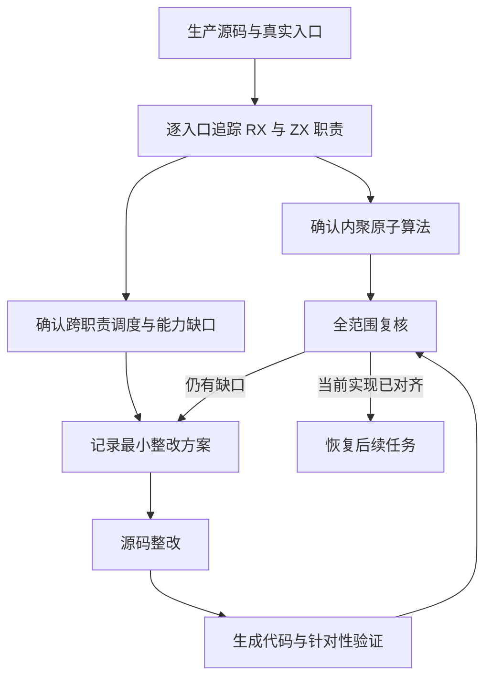

# RX 与 ZX 现行实现全面对齐

## Intent：最终目标

先全面审查现行 RX/ZX 实现，按用户的核心设计要求完成对齐，再恢复后续功能及自举迁移。RX 必须显式编排真实阶段与数据流；ZX 保持原子语义职责。AGENTS.md 的强制原则是验收基准。

## Data：可用证据

基线为 d3667ffe。源码清单.json 记录各包 src 中全部 RX/ZX 文件、哈希、静态导入和 RX 调用。清单是定位证据，不是架构合规结论。额外检查测试与公开示例的使用模式、RX/ZX 语言实现及生成入口的真实可达性。

## Edges：边界与限制

暂停 NativeType 等后续迁移，不把最近原生模块整改替代全范围审查。单 Call、函数行数和文件数量均不能直接判定合规。集合循环、递归、状态机内部的内聚算法允许留在 ZX；跨职责的初始化、处理阶段、后置检查与结果汇合须明确编排。按规则检查是否需要语言能力完善，不能用空转发层补标签数。

不新增测试、不运行全量测试、不进行浏览器 UI 确认。保留其他会话的未提交文件。必要验证仅针对实际改动；生产代码整改前先汇总职责证据与具体方案。

## Answer：交付与成功标准

1. 全部生产 RX 入口及其 ZX 调用闭包的覆盖清单，区分合理原子模块、组织缺陷、语言能力缺口和过渡原生依赖。
2. 检查 ZX 函数是否存在跨职责总控、机械碎片、隐式状态或额外复制；同时核对 RX 语言的类型与控制流能力能否表达合理设计。
3. 按依赖顺序整改确认的问题，记录实际调用图及生成行为，保持零运行库、静态链接及数据借用。
4. 汇总未完成项；只有检查与整改覆盖当前范围，才恢复原目标后续任务，不能将抽样审计写成全面对齐。

## 审查分工

- 主审：词法、解析、模块标识、CLI 与 lint 的 RX/ZX 实现，构建接入及汇总。
- 只读辅助一：IR 规范校验与所有权自举模块。
- 只读辅助二：RX 语言及自身模块、ZX 语义类型模块。

## 验收数据流

## 状态

审查进行中，尚未证明全面对齐。

## 第一批具体实施

先整改不改公开 ABI 的 IR 布尔门禁和准备阶段：body 结构与引用、contracts 表门禁与谓词遍历、tasks 接口/捕获/消费、program pure 函数事实与入口检查、scopes 的准备/初始化/遍历/后置条件；native export 的名称、效果声明、类型名冲突、函数兼容规则通过 RX 短路连接。遍历规则仍保留 ZX，删除被替代的总控，不新增转发式包装。

本批属于逐职责重构，各输入输出不同，不是统一语法模式替换，故不使用 grit 批量替换。后续批次仍须完成上面审查列出的整改，当前不恢复 NativeType 等任务。

## 新增硬约束：ZX 最多 300 行

用户要求每个 ZX 文件总行数（含空行）不得超过 300，文件与函数须原子化、单一职责，已写入 AGENTS.md。现行 packages 全扫描确认三处超限：keyword_transition.zx 722 行、ownership/runtime/execute.zx 742 行、decimal_original/cases.zx 816 行。关键词按词法前缀职责分组，所有权按语义规则族拆分，十进制 fixture 从生成器按字面量形式分组；保留原用例与结果，不新增测试语义。不改历史归档证据。

整改过程已确认 RX 现有契约：子分支不能覆盖可见 Call 同名结果，使用 Task.out 建立语义分组；普通顺序 Task 的 Return 仍退出所在模块，条件结果用可复用 RX 子模块返回再由 Task.out汇合。这些不是新语言缺口，按既有契约组织即可。

## 实际能力缺口：RX 布尔分支的非空事实

将 native export 阶段移入 RX 后，`Switch on={$ctx.owner != null}` 的 true 分支不能将 string? 传给 string 参数。当前约束推导、独立属性编译和最终 Switch IR 校验均未承接该事实，不是用户代码应重复空值兜底的问题。

修复按稳定绑定身份传递非空事实，不改原绑定的可选类型；推导使用临时 payload 投影，属性生成引用处的 optional_value，最终 verifier 根据实际布尔分支独立复验。case/default 仅按可证明真值建立事实，离开分支恢复。Parallel Task 通过父侧 unwrap 和 payload 捕获传递，不能让独立子程序依赖父级未携带的证明。任意对象字段投影的身份不是本次已证明能力，不将它混入稳定符号事实。

## 300 行重构的实际进展

关键词生成器按首字符子树分组，保留 213 条转移、枚举及原关键词判定；输出最多 220 行。十进制生成器按整数、e/E 指数、小数和小数指数的语法类别分组，403 个原字面量逐项保持，三个目录与身份文件哈希不变；最大 helper 272 行。

所有权执行器按十个语义规则族组织，保留原 61 个 WorkAction 分支正文。每个规则族直接消费工作栈中连续属于该族的动作，主循环只做静态分派；不使用假造的单次循环、动态处理表或额外原生桥。Machine 保持原字段与数组表示。实际分配与所有权行为仍需构建及既有专项验证，源码拆分不能代替证明。

## 最新约束：ZX 最多 240 行

用户将此前 300 行限制改为 240 行，以此为准。主项目根 AGENTS.md 与实施工作树同步修订，两个 ZX 生成器的上限同步收紧。当前唯一超过 240 行的 integer fixture 从生成器按单数字整数、多数字整数、带符号整数拆分，保留原字面量、索引及预期，不按行切片。重新扫描 packages 的 1741 个 ZX 文件，最大 232 行，无超限。403 个原用例与 35 项审查条目生成检查通过。

## 循环列表结果的直接消费

首批生成审查确认 place 算法只返回 `result.states`，但生成器为初始和最终循环状态分配包装。修复放在 genz 的通用 iteration consumer：原本仅由聚合元素列表专用路径接管的列表投影，允许在普通局部布局或 deep 布局成立时直接消费。列表返回前必须完成 buffers/calls 的容量转交，不能复用标量消费的省略清理路径。

deep 消费路径的初值直接在局部表示上下文中生成，不先构造指针外壳再拆开；普通返回完整循环对象的路径保持原身份语义。终态读取列表字段，不再构造不会逃逸的完整状态对象。具体实现位于 `packages/genz/src/zx/iteration_consumer.zig` 与 `iteration.zig`，构建、生成调用图与已有专项验证通过前不计为完成。

