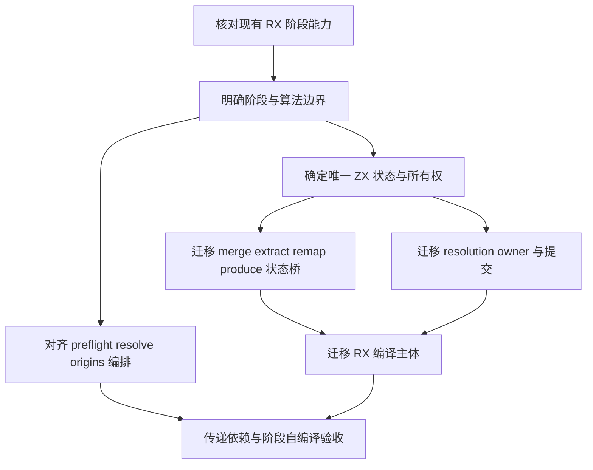
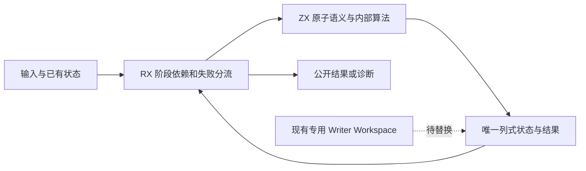

# 语义层与 RX 实现审查

审查基线：`d3667ffe`。范围为 `packages/compiler/src/rx` 与 `packages/compiler/src/zx/analysis/semantic`。源码行号对应本次审查时的实现，后续修改可能移动。

## Intent：最终目标

在继续自举迁移前，核对现有 RX 语言能力、RX 入口编排、传递 ZX 职责和原生依赖。RX 应显示阶段依赖、分支与汇合，ZX 承担原子语义；算法内部循环和递归允许留在 ZX，不以单个 Call 或文件行数判断组织违规。

本报告用于确定整改边界与依赖顺序，不提出通过更换文件后缀来完成自举。

## Data：可用证据

已盘点本范围全部 21 个 RX 入口：RX 子系统 8 个，语义层 13 个；沿相对 import 递归建立 ZX 静态依赖清单，并读取入口、主要阶段函数、专用 native 接口及宿主接入实现。依据包括 `rules/自举完成标准.md`、`rules/RX开发约定.md` 和 `packages/compiler/src/rx/README.md`。

### RX 已有语言能力

| 证据                                       | 已实现能力                                                                                 |
| ------------------------------------------ | ------------------------------------------------------------------------------------------ |
| `rx/analysis/program/flow.zig:3-8`         | 流程模型包含 Call、Parallel、Return、Task、selection。                                     |
| `rx/analysis/program/statements.zig:13-73` | 实际降低这些控制结构；Task.out 在第 39—53 行发布作用域输出，Switch 在第 55—72 行生成分支。 |
| `rx/analysis/flow_compile.zig:33-64`       | 检查独立 Parallel 分支并汇合输出。                                                         |
| `rx/analysis/flow_compile.zig:67-86`       | Task.out 的类型化和作用域结果发布。                                                        |
| `semantic/validate_types.rx:2-14`          | RX 调 shape，显式 Switch，再调 rows 或返回 false，是现有阶段编排范例。                     |
| `rx/analysis/flow_compile.zig:46-54`       | Parallel 当前只允许无 Store、无原生外部调用的纯分支。                                      |

上表路径前缀均为 `packages/compiler/src/`，其中 `semantic/` 指 `zx/analysis/semantic/`。现有能力足以表达顺序阶段、条件分流和结果发布。本次看到的依赖阶段本来不能随意并行，不能把 Parallel 的限制当作它们迁移的阻塞理由。

### 全部入口覆盖表

闭包数量包含模型和接口引用文件，只用于覆盖盘点，不作为质量或自举完成度指标。下表 `semantic/` 仍指 `zx/analysis/semantic/`。

| RX 入口                           | ZX 闭包文件数 | 职责与判断                                                                               |
| --------------------------------- | ------------: | ---------------------------------------------------------------------------------------- |
| `rx/syntax/parse.rx`              |            53 | prepare→validate→document/parse 已显式编排；文档状态机、属性、边界、实体解码留 ZX 合理。 |
| `rx/dependency_graph/validate.rx` |             3 | DFS 状态推进与环检测；单 Call 是完整图算法入口，不据此判违规。                           |
| `rx/path_segments/normalize.rx`   |             6 | scan→resolve 已显示依赖；逆序抵消父目录属于 ZX 算法。                                    |
| `rx/path_kind/validate.rx`        |             7 | 路径类别与名称判定，原子规则。                                                           |
| `rx/schema/attribute/classify.rx` |             2 | 标签属性角色分类，原子规则。                                                             |
| `rx/schema/call/validate.rx`      |             2 | fn/module 互斥、输入与 setter 条件，原子规则。                                           |
| `rx/schema/content/validate.rx`   |             1 | 非空白内容扫描，原子规则。                                                               |
| `rx/schema/file/classify.rx`      |             5 | 特殊文件后缀分类，原子规则。                                                             |
| `semantic/validate_types.rx`      |             8 | shape→条件→rows，阶段边界清楚。                                                          |
| `semantic/resolve.rx`             |            60 | initial→execute 已显式，但 execute 内含初始化与普通解析两条阶段路径。                    |
| `semantic/construct_type.rx`      |            21 | 类型校验、规范化、查重、追加组成一个类型驻留操作；不因单 Call 判违规。                   |
| `semantic/query_types.rx`         |             6 | 类型包含关系查询和动态规划，ZX 内循环合理。                                              |
| `semantic/lookup.rx`              |             8 | 类型查找；RX 发布可选编号，合理。                                                        |
| `semantic/nominal.rx`             |            11 | find→encode 已显式。                                                                     |
| `semantic/origins.rx`             |             8 | 来源绑定验证；shape 门禁藏在 ZX，可与 validate_types 对齐。                              |
| `semantic/preflight.rx`           |             9 | 多个准备、校验阶段藏在单个 ZX，并依赖专用 workspace，是优先整改候选。                    |
| `semantic/merge.rx`               |            19 | 逐类型重映射、查重、提交是合并算法；循环留 ZX 合理，Writer 状态桥未迁完。                |
| `semantic/extract.rx`             |             7 | 依赖栈遍历与提取算法；循环留 ZX 合理，Workspace 仍原生。                                 |
| `semantic/remap.rx`               |             3 | 类型引用映射算法；Buffer 仍是专用原生边界。                                              |
| `semantic/produce.rx`             |             3 | 选择名义类型并写来源记录；Writer 仍原生。                                                |
| `semantic/ordering/sort.rx`       |             2 | 建堆、下沉、交换是同一排序算法，不要求拆成 RX；Columns 仍原生。                          |

## Edges：边界与限制

本次是静态职责与依赖审查，不是所有传递 ZX 文件的逐行算法正确性证明，也不是完整编译器自举验收。没有运行测试，没有执行阶段自编译；frontend/modules 及其它包的完整审查由主任务汇总。

审查区分三类问题：

1. 已有语言能力可以表达、但阶段没有明确呈现在 RX：组织调整候选。
2. 自有状态与语义仍依赖专用手写 Zig：自举未完成项。
3. 尚无最小表达与生成证据说明普通能力不足：只能列为待核实需求，不能先断言语言能力缺口。

`zig:integers` 的通用 widen/narrow 和 `std:encoding` 应与 Workspace/Writer 分开记录。普通名称不自动证明最终边界合规，最终仍需核对实现及生成依赖。

## Answer：整改候选与成功标准

### 有源码依据的组织调整候选

#### 1. preflight：显示外部准备与失败阶段

证据：`semantic/merging/preflight.zx:18-20` 是 shape 门禁；第 22—42 行分配并检查来源映射；第 44—46 行检查 prefix 条件；第 48—64 行分配编号映射并检查 prefix。

这些阶段具有不同的输入状态和失败边界，可由 RX 表达顺序与失败分支。阶段内部循环保留 ZX。当前不足主要是编排组织与专用状态桥，没有证明 RX 缺少相应表达能力。

#### 2. resolve：显示请求模式分流

证据：`semantic/resolve.rx:2-3` 当前表达 initial→execute；`resolving/execute.zx:15-19` 是普通 run，第 21—34 行是 initialize 后按声明迭代 run。

初始化请求与单项解析是对外可辨认的两条工作流，适合 RX Switch。run 的解析栈和声明迭代仍可作为 ZX 算法；不要拆成大量细粒度 RX Call。

#### 3. origins：统一形状校验门禁的组织

证据：`semantic/types/nominal/validate.zx:14-24` 是 shape 失败返回，否则逐绑定 check，与既有 `validate_types.rx` 同型。

可把门禁分流放在 RX，ZX 保留逐绑定检查。这是低风险一致性整改，优先级低于专用状态桥。

#### 4. construct_type：避免机械拆分

证据：`semantic/constructing/update.zx:15-35` 的校验、排序、查重、追加共享一个类型驻留操作的后置条件，同时被解析算法复用。

是否需要进一步暴露顶层阶段可结合调用者审阅，但目前不足以认定该单 Call 组织违规。不能把内部排序、匹配或算法分支一律搬入 RX。

### 确定仍存在的专用桥和宿主职责

以下语义层路径前缀为 `packages/compiler/src/zx/analysis/semantic/`。

| 桥或宿主                   | 证据                                                                                                         | 剩余职责                                                               |
| -------------------------- | ------------------------------------------------------------------------------------------------------------ | ---------------------------------------------------------------------- |
| `zig:merge_workspace`      | `merging/preflight.zx:22,28,32,48,56`；`native/merge_workspace.zig:10-32`                                    | 来源索引、类型编号映射的分配与读写。                                   |
| `zig:merge_writer`         | `merging/append.zx:26,41-49`；`native/merge_writer.zig:34-49`                                                | 原生 TypeStorage 追加、重映射结果提交、来源复制。                      |
| `zig:extract_workspace`    | `extracting/include.zx:24-61`；`native/extract_workspace.zig:24-72`                                          | 映射表、DFS 栈、类型表和来源表提交。                                   |
| `zig:references`           | `types/remap.zx`；`native/references.zig:4-10`                                                               | 专用引用缓冲读写。                                                     |
| `zig:origin_writer`        | `types/nominal/produce.zx:18-19`；`native/origin_writer.zig:12-17`                                           | 从宿主来源记录复制并追加持久来源状态。                                 |
| `zig:named_columns`        | `ordering/sort.zx:12,26`、`ordering/sift.zx`                                                                 | 名称列读取和原地交换。                                                 |
| resolution 宿主            | `resolution.zig:25-47`                                                                                       | Source 适配、resolved/aliases/visiting 快照、执行与提交。              |
| resolution snapshot/commit | `resolving/host/snapshot.zig:9-29`；`resolving/host/commit.zig:11-32`                                        | 原生 Map 状态复制、字符串所有权复制、TypeStorage 追加、resolved 更新。 |
| RX 图宿主                  | `packages/compiler/src/rx/module_graph.zig:15-38`                                                            | 图准备后执行 ZX，再由 Zig 把 issue 转成诊断并分配最终编号数组。        |
| RX 编译主体                | `packages/compiler/src/rx/analysis/flow_compile.zig`、`analysis/program/statements.zig`、`modules.zig:56-77` | 模块注册、流程类型化、bindings/调用状态和 IR 生成仍手写 Zig。          |

上述桥不能因算法入口已改为 ZX 而计为完成；也不应因此否认已迁移算法的成果。应分别记录“逻辑已迁移”和“状态、适配、提交仍待迁移”。

### 能力需求尚待证明的部分

ZX 已有对象状态、数组 push、索引赋值、loop、reduce、排序等普通能力。`rx/dependency_graph/walk.zx:11-57` 直接维护 marks/frames/cursors，`semantic/resolving/execute.zx:23-31` 维护声明解析状态。因此“可变算法状态必须依赖 native workspace”不是成立的通用理由。

真正需要下一阶段提供最小表达证据的问题是：

- 跨调用持久类型表、映射如何由唯一 ZX 状态持有。
- 跨 owner 字符串何时复制、由谁释放。
- 增量提交如何避免每次重建完整表。
- 移除 Columns/Writer 后是否能保持原有时间与空间复杂度。

这些是状态表示、所有权及生成效率需求。先复用现有普通能力；只有出现可复核的表达或生成缺口，才完善通用语言能力，不新增同职责专用桥作为最终方案。

### 建议整改顺序

1. 用 `validate_types.rx` 为参照确认阶段组织，完成 preflight、resolve、origins 的职责划分；不为形式改变算法。
2. 为 merge/extract/remap/produce 确定唯一状态及所有权，再迁移 Workspace/Writer，避免每个入口各造一个过渡接口。
3. resolution 先迁 resolved/aliases/visiting 的正式 owner，再移除 snapshot/commit 的双重状态并接通 Source。
4. 继续迁移 RX 自身的模块注册、流程类型化、binding 与 IR 生成，不能把 XML 和 DFS 已 ZX 化称为整个 RX 编译器已自举。
5. 最后执行传递依赖闭包和阶段自编译验收；当前静态证据不支持“完整职责已自举”的结论。

### 自我复核

本报告没有把单 Call、行数、原生 import 数量作为违规或完成标准；对构造、查询、排序、DFS 等完整算法保留 ZX 的合理性作了区分。组织调整候选不等于已证实的运行缺陷；专用状态桥则有直接源码证据，属于确定的未完成项。未运行测试、未验证 stage 1/2/3 产物一致性，也未把静态职责审查表述为逐行算法正确性证明。
