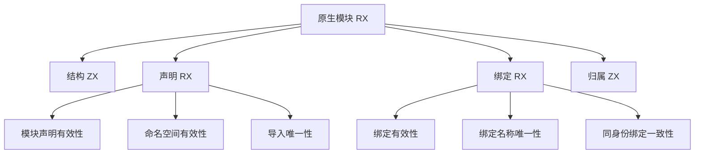
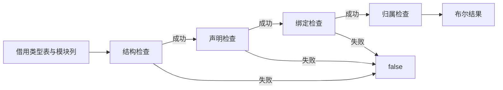

# RX 编排与 ZX 原子职责整改

## Intent：最终目标

落实 AGENTS.md 的强制原则，让自举模块的阶段依赖与短路在 RX 中可读，ZX 只承担单一语义规则。先整改原生模块校验，再检查其他已迁移入口；本阶段不代表整体自举完成。

## Data：可用证据

当前 native_modules_check.rx 只调用 native/validate.zx；后者调度结构检查、模块规则和类型归属。native/module.zx 混合声明、命名空间、绑定与重复导入规则。native/bindings.zx 又混合绑定有效性、名称唯一性和跨模块一致性。布尔结果没有诊断先后顺序契约。

## Edges：边界与限制

保留已有公开输入输出与零容量分配器。结构检查必须先于列索引。集合循环留在 ZX，RX 不新增循环标签或动态调度。各规则直接借用原始列，不构造中间列表；多次外层遍历是明确的取舍，原有重复匹配算法复杂度不变。此次是职责重构，不是超过五个文件的同构语法替换，不适合使用 grit 机械迁移。

不新增测试、不跑全量测试。原生导出入口及其他自举入口仍需继续整改，不以本轮成果替代全范围验收。

## Answer：交付与成功标准

RX 展示结构、声明、绑定和归属阶段；声明与绑定子模块展开各自独立规则。删除旧总控，核对调用闭包与生成 Zig，执行已有原生模块专项验证。





## 执行与自我复核

已删除 native/validate.zx、native/module.zx、native/bindings.zx。新增声明和绑定的独立规则目录，根 RX 串接三个检查与归属查询，两个 RX 子模块负责规则短路。原生输入输出 ABI、Zig 适配器及 seed 保持原样。

自我复核：不能把此次三个 RX 文件等同于全编译器已符合设计。canonical 目录中 contracts、expressions、functions、native_export、tasks 等入口仍需按实际职责检查；单调用本身不是违规证据，但 native_export 的 exports.zx 已确认含独立阶段调度，必须继续整改。scopes/run 也仍有多阶段调度。此清单只覆盖 canonical 入口，不是全仓库完成审计。

语义复核：所有规则是无副作用的布尔谓词；将按模块逐项校验改为按规则逐列校验，不改变接受集合。结构门禁仍最先执行，所有子列长度检查通过后才索引。绑定 TypeId 范围校验在归属查询前完成。身份的 null 回退、空字符串拒绝、跨身份允许重名、同身份同名类型一致性均保持。

生成初查：第一轮生成 native_modules.zig 只有 owner 查询原有的一处备用 create，受借用 origin 分支保护；新增规则与 RX 中间连接没有集合分配或复制。最终生成物与首次生成物逐字一致；已有专项通过原适配器的零容量分配器执行，未触发该备用分配。

## 实际编排源码

### native_modules_check.rx

```xml
<Module>
    <Call fn="./native/structure" in={$in.modules} />

    <Switch on={$ctx.structure}>
        <Case value={true}>
            <Call module="./native/declarations_check" in={$in.modules} />

            <Switch on={$ctx.declarations_check}>
                <Case value={true}>
                    <Call module="./native/bindings_check" in={$in} />

                    <Switch on={$ctx.bindings_check}>
                        <Case value={true}>
                            <Call fn="./native/owners" in={$in} />

                            <Return value={$ctx.owners} />
                        </Case>

                        <Default>
                            <Return value={false} />
                        </Default>
                    </Switch>
                </Case>

                <Default>
                    <Return value={false} />
                </Default>
            </Switch>
        </Case>

        <Default>
            <Return value={false} />
        </Default>
    </Switch>
</Module>
```

### native/declarations_check.rx

```xml
<Module>
    <Call fn="./declarations/declarations" in={$in} />

    <Switch on={$ctx.declarations}>
        <Case value={true}>
            <Call fn="./declarations/namespaces" in={$in} />

            <Switch on={$ctx.namespaces}>
                <Case value={true}>
                    <Call fn="./declarations/imports_unique" in={$in} />

                    <Return value={$ctx.imports_unique} />
                </Case>

                <Default>
                    <Return value={false} />
                </Default>
            </Switch>
        </Case>

        <Default>
            <Return value={false} />
        </Default>
    </Switch>
</Module>
```

### native/bindings_check.rx

```xml
<Module>
    <Call fn="./bindings/binding_values" in={$in} />

    <Switch on={$ctx.binding_values}>
        <Case value={true}>
            <Call fn="./bindings/bindings_unique" in={$in.modules} />

            <Switch on={$ctx.bindings_unique}>
                <Case value={true}>
                    <Call fn="./bindings/bindings_consistent" in={$in.modules} />

                    <Return value={$ctx.bindings_consistent} />
                </Case>

                <Default>
                    <Return value={false} />
                </Default>
            </Switch>
        </Case>

        <Default>
            <Return value={false} />
        </Default>
    </Switch>
</Module>
```

## 单一规则示例

以下函数只检查每个模块的绑定名称唯一性，不承担其他检查的调度。

```typescript
import type { Modules } from "../model"

export type Input = Modules

export type Output = bool

export default function (in: Input): Output {
    const result = loop({ modules: in, index: 0, valid: true }, {
        while: current => current.valid && current.index < current.modules.specifiers.length,
        next: current => {
            const bindings = loop({ names: current.modules.type_names[current.index], index: 0, valid: true }, {
                while: binding => binding.valid && binding.index < binding.names.length,
                next: binding => {
                    const duplicate = loop({ names: binding.names, name: binding.names[binding.index], count: binding.index, index: 0, found: false }, {
                        while: previous => !previous.found && previous.index < previous.count,
                        next: previous => {
                            previous.found = previous.names[previous.index] == previous.name
                            previous.index += 1
                        }
                    })

                    binding.valid = !duplicate.found
                    binding.index += 1
                }
            })

            current.valid = bindings.valid

            current.index += 1
        }
    })

    return result.valid
}
```

## 验证结果

- 根目录 `zig build -j3 --summary all`：35/35 构建步骤通过。
- `packages/test` 中 `zig build test-native-references-analysis test-native-references-ir test-native-references-library test-native-link -j3 --summary all`：53/53 步骤、85/85 测试通过。
- 未新增测试，未执行全量测试。专项覆盖原生声明、引用归属、错误边界、库往返和链接；不能据此宣称所有编译器行为已穷尽验证。
- 源码哈希、最终日志与生成源码归档见同目录验证结果.json 和验证目录。格式化已使用 zxc fmt --write，diff 空白检查通过。

本轮完成的是原生模块校验职责整改；原生导出、作用域及其他入口仍待继续整改。没有改变整体自举目标或验收标准。
