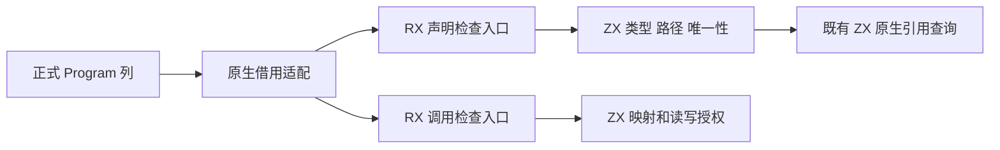
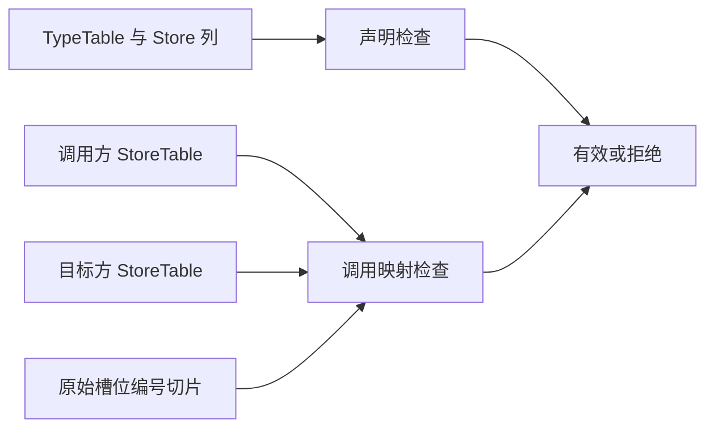

# Store 语义检查自举

## Intent：最终目标

把 Store 声明与调用授权的完整 IR 语义检查迁入 RX/ZX，原生适配器只负责直接借用列数据与调用生成入口。保留原先拒绝边界，不生成额外持久摘要、不引入专用运行库。

## Data：可用证据

现有 `zx/ir/stores.zig` 验证类型模块无 Store、槽位为对象且不包含原生引用、路径带 `store.` 前缀且不重复；调用检查匹配槽位数、编排模式、编号、类型、路径、读写权限与映射唯一性。正式 FunctionTable 和 StoreTable 已是唯一持久列存储，所有权检查已能直接借用描述符。ZX 的 `semantic/querying/execute` 已完整实现原生引用包含查询，可复用而无需再次移植该算法。

## Edges：边界与限制

声明入口借用 TypeTable、路径字节列和类型编号列，路径保持原字节语义，不隐式 UTF-8 解码、规范化或复制。调用入口直接借用调用方与目标方 StoreTable 描述符及槽位编号切片。既有 Program 结构门禁保证表形状；迁移不得把授权规则转移到 native helper。类型查询可能需要临时工作区，声明入口使用调用期 arena；调用映射只读且不应分配，沿用类型检查入口的零容量分配器约束。旧算法仅在 generated_parser=false 的种子构建中使用。

不改变 Store 的应用生命周期、共享内存语义或外部 API；不新增测试、不执行仓库全量测试。该特性不代表完整 Store 编排或完整编译器自举完成。

## Answer：交付格式与成功标准

交付两个 RX 入口及对应 ZX 语义模块、最小原生适配器和生成构建接线。根构建、现有 Store/所有权/IR/原生引用与库边界专项通过；确认生成调用映射不分配，正式构建不执行种子算法。完成后提交并 push。





原生适配保持直接借用，例如：

```zig
const input: Input = .{
    .available = borrow.pointer(@FieldType(Input, "available"), &program.stores),
    .required = borrow.pointer(@FieldType(Input, "required"), target),
    .slots = invocation.stores,
    .orchestration = program.store_mode == .orchestration,
};
```

## 接入与验证结果

两项语义检查已通过正式生成模块接入。声明入口直接借用路径字节列与类型编号列，原生引用判定复用已有 ZX 查询；调用入口直接借用双方 Store 描述符。generated_parser=false 时使用原算法的种子文件，正式构建选择生成入口。

根构建 35/35 步骤、编译器包回归 28/28 步骤及 372/372 用例、Store 边界专项 49/49 步骤及 267/267 用例均通过。未新增测试、未执行仓库全量测试。

## 自我复核

独立只读审查确认原声明与授权接受规则保持一致，路径仍按字节前缀与逐字节相等判断，未新增 UTF-8 或 NUL 限制。重复路径检查提前只改变无效输入的短路顺序。函数编号仍由原有 expression_rules 短路门禁保证，映射编号在读取前检查。

已检查实际生成调用代码及 ABI：execute 调用链只有表形状检查、widen、栈上循环状态、数组读取和 mem.eql，没有堆分配。OutOfMemory 仍在保守错误签名中，但当前调用链无触发路径；未来变更生成器后须重新验证零容量分配器约束。

接入结果.json 保存命令、日志及源码 SHA256，生成代码压缩归档。IR 与序列化形状未变化，维持 IR 30、输入指纹 v33。本特性不覆盖完整 Store 调度、共享状态回收或整个编译器自举。
