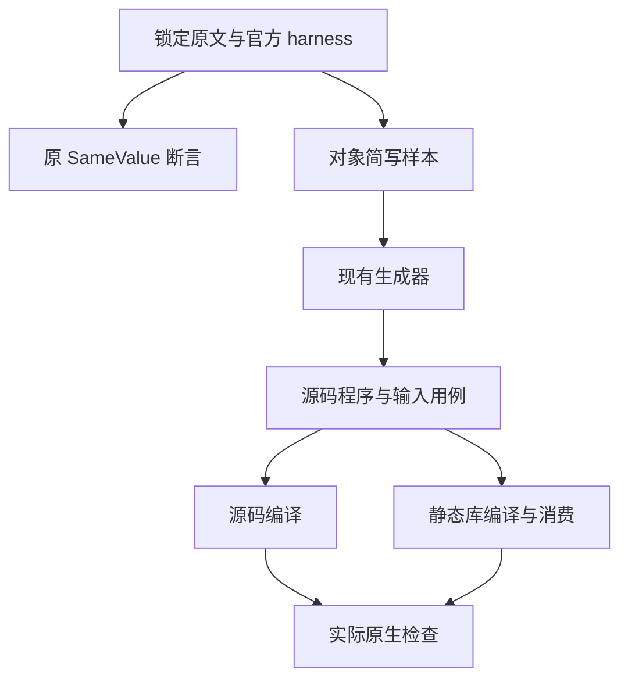

# Yield 对象简写原例覆盖

## Intent：最终目标

适配尚未审查的 yield-non-strict-access.js 原例，在正式生成的静态 Zig 程序中保留 yield 绑定、对象简写和点号属性读取，执行原值 1 的断言及独立输入控制。

## Data：可用证据

锁定 Test262 修订 7ab7fafa0003f73fc85c1b95d88094d33f7eb8bd。原文件 SHA 为 b3cd9a45bf610907cb8f1c8c2cd27882bc7dc3ac75e7084baf8f21ecfe335175，元数据为 noStrict。当前所有审查记录中不存在该路径。

原文是 var yield = 1、var object = {yield}、assert.sameValue(object.yield, 1)。独立运行未经改写的原文及官方 assert / sta harness；原断言成功之后才进入 ZX 适配。成熟实现参考 object_construction/fields/number_shorthand.zx，继续扩展现有对象简写生成器及 test-object-construction 门禁。

## Edges：边界与限制

var 改为 const，进入具有 i64 输入输出的 ZX 函数；保留 yield 名称、简写及点号读取。原断言仅关联输入 1 的运行用例。零、负数、不同正数及 i64 最小最大值是额外 ZX 控制，不能冒充上游断言。ZX 没有 JS 脚本与严格模式区分，此适配不宣称支持 strict / non-strict 上下文协议；严格模式负例的既有排除记录保持原意。

只增加测试目录、样本、生成逻辑和 suite 注册；不修改生产语言实现，不增加运行库或动态层。使用已有普通 Zig 支持代码，源代码必须实际读取输入并构造对象，不为原值写常量结果。

先在本目录生成草稿，再按既有测试授权同步正式测试包；本检出门禁运行期间冻结包输入。只有两个模式均通过才登记 adapted 审查结果。仅经当前源码复验的生产问题才通知实现会话。

## Answer：交付格式与成功标准

交付九个最小正式测试文件及中文记录。Debug / ReleaseSafe 执行整个原有对象构造门禁；新增 test-object-shorthand 对原有重复简写及新增 yield 简写分别执行源码与库链接、编码解码后的普通 Zig 生成，新增七个输入在两条路径均通过；保存实际源身份、生成模块、二进制和原始日志。类型检查、生成器一致性和目录审查通过后，以英文 Conventional Commit 提交 push。

