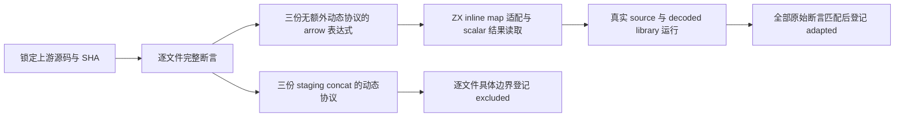

# 产品读取与列表拼接的上游审阅分析

## Intent：最终目标

给产品字段读取、箭头表达式以及列表拼接提供真实上游观察对应关系。只把保留整份原始可观察断言的执行映射计入本轮正向适配；不因名字类似而重复登记已经审阅的 concat 文件，不用静态列表值代替 JS 对象身份、原型或动态协议。

本分析只读检查仓库与锁定上游源码，未修改正式代码、案例、审阅记录，也未执行候选 ZX 编译或运行。新增的三份箭头表达式候选需要主任务真实执行后再登记 `adapted`。

## Data：可用证据

### 快照与去重

上游 revision 为 `7ab7fafa0003f73fc85c1b95d88094d33f7eb8bd`，来自 `packages/test/upstream/lock.json`。本机原始源码目录为 `/tmp/zxc-test262-reference/test262-7ab7fafa0003f73fc85c1b95d88094d33f7eb8bd/`。

逐路径连接 index 与 reviews，并把提取源码 SHA-256 与两侧记录比较，得到：

| 范围                                                | 锁定文件 | 已审阅 | 尚未审阅 | 本次结论                                   |
| --------------------------------------------------- | -------: | -----: | -------: | ------------------------------------------ |
| `test/built-ins/Array/prototype/concat/`            |       69 |     69 |        0 | 不再增加审阅计数；69/69 原始 SHA 匹配      |
| `test/language/expressions/strict-equals/`          |       30 |     30 |        0 | 不作为本轮新组                             |
| `test/language/expressions/strict-does-not-equals/` |       30 |     30 |        0 | 不作为本轮新组                             |
| `test/staging/sm/Array/concat-*.js`                 |        3 |      0 |        3 | 每份各有动态协议观察，不可正向适配         |
| 本文选择的 arrow-function 文件                      |        3 |      0 |        3 | 可严格保留各自唯一运行时断言，建议正向适配 |

Concat 的 68 条在 `packages/test/upstream/reviews/built_ins/array/concat_dynamic_protocols.jsonl`；另 1 条 `S15.4.4.4_A1_T1.js` 在 `dense_values.jsonl`。两者当前均为 `excluded`。这是逐文件协议边界的结论，不能把目录全量已审阅说成已实现 JS concat。

普通稠密 concat 的 Sputnik 文件也伴随额外观察：`A1_T1` 有动态 `Object.prototype.toString` 的 Array class 检查；`A1_T3` 还断言新结果与 receiver 严格不是同一对象；`A1_T2` 有异构项和对象严格身份；`A1_T4` 有 holes 和 undefined；`A3_T1/T2/T3` 观察继承索引与自有属性。现有数值拼接测试保留其数值子集，但不能据此撤销这些排除。

### 当前 ZX 契约与既有测试

`packages/compiler/src/zx/analysis/list_operations.zig` 中 concat 要求恰好一个参数，参数类型提示与 receiver 相同，返回 `[list_type, void]` 产品。列表操作没有 JS receiver 的动态属性访问，也没有任意 variadic 参数展开。

`packages/compiler/src/zx/analysis/transforms.zig` 接受 map 的一个非捕获、单参数 inline lambda，以元素类型绑定参数，分析表达式 body，返回 body 类型的列表。`expressions.zig` 对独立 lambda 报告“callbacks are only allowed directly in map, filter, reduce or loop rules”。因此适配必须明确把 JS 一等函数的声明与普通调用转成 map 内的单次调用，而不能声称 ZX 已支持一般一等函数。

现有成熟实现：

- `packages/test/tests/language/expressions/arrow/bodies/cases.zx` 的 kind 8 是 `in.items.map(a => a + 1)`；`language/expressions/arrow/bodies/increment/one` 输入 `[1]` 得 `[2]`。
- `packages/test/tests/built_ins/list/concat/owned/0/i64.zx` 使用 `const [next, _] = owned.concat(in.other)` 并返回 next。
- `packages/test/tests/built_ins/list/concat_three/owned/0/i64.zx` 连续两次读取 concat 的第零产品项。
- `packages/test/tests/collections/object_append/fixtures/concat.zx` 读取 state 产品的 count/values.length 并把 concat 第零项写回 values；`call_concat.zx` 通过跨模块 step 执行类似更新。

这些只能定位本地契约和已有覆盖。新工作仍需独立验证原输入未改、历史输出未改、跨模块产品读取后生成结果的所有权与错误路径。

## Edges：边界与限制

### 三份正向候选：不删任何原始断言

以下路径均以 `test/language/expressions/arrow-function/` 为前缀，各自只包含一条 `assert.sameValue`。本轮三份提取源码与 index SHA 均匹配。

| 文件                                            | 原始 body / 调用 / 唯一断言                                    | SHA-256                                                            | 建议                                                                              |
| ----------------------------------------------- | -------------------------------------------------------------- | ------------------------------------------------------------------ | --------------------------------------------------------------------------------- |
| `expression-body-implicit-return.js`            | `v => v + 1`；`plusOne(1)`；结果严格等于 2                     | `d4268cc791620bd175d5ca507c040f174b5a3fda900cc85024a01e0bb8829f90` | `adapted`：保持参数、表达式 body、输入 1、结果 2；单元素 map 调用一次             |
| `low-precedence-expression-body-no-parens.js`   | `x => x * x`；`square(3)`；结果严格等于 9                      | `6e6d92c5e4d34909f05759aa6daef80b2499a93ff3e004f608c7a3814cd375a0` | `adapted`：保留不带 body 括号的乘法表达式和输入 3、结果 9                         |
| `object-literal-return-requires-body-parens.js` | `val => ({ key: val })`；`keyMaker(1).key`；读取结果严格等于 1 | `d51bd2601c28ec0785c3425fcbcc550dac06e224eb7cb2723be1fcf5454f5c00` | `adapted`：保留对象表达式 body 的括号、key 字段构造和实际字段读取，输入 1、结果 1 |

这三份没有 class、函数反射、对象身份、this 或函数别名方面的额外断言。以单元素 map 代替独立函数调用改变宿主调用方式，因此分类为 `adapted`，不分类为 `equivalent`。输入全部处于 i64 与 JS Number 的精确整数公共区间；不要把较大整数新增本地测试混称原始 JS Number 对齐。

第 1 份可以关联已有 `increment/one` 的值断言，但建议本轮统一增加三个普通、无 kind 分派的小 fixture，使新上游原始单值断言与 ZX scalar 输出一一对应。每份可再加入有符号、零和多调用本地案例；原始适配记录只关联对应的原输入。

以下两个相邻文件不属于本轮正向组：`statement-body-requires-braces-must-return-explicitly.js` 的 lambda 是一般语句体，目前 collection callback 只分析 expression body；`...-missing.js` 还断言 undefined。不能去掉语句体或用 null 代替 undefined，然后声称适配了整份文件。

### 三份 staging concat：各自完整排除原因

| 原始路径                                               | 原始可观察断言                                                                                                                                                                                | 当前边界与建议                                                                                                                                                                                   |
| ------------------------------------------------------ | --------------------------------------------------------------------------------------------------------------------------------------------------------------------------------------------- | ------------------------------------------------------------------------------------------------------------------------------------------------------------------------------------------------ |
| `test/staging/sm/Array/concat-proxy.js`                | constructor 的 Symbol.species 返回 Proxy；第一次 defineProperty 索引 0 时删除源索引 1；结果 `0 in p=true`、`1 in p=false`、`2 in p=true`                                                      | ZX concat 没有 species 构造、Proxy defineProperty 回调、操作中删除形成的 holes 或 `in` 属性存在性。三项原始属性存在性断言不可用 `[1,3]` 替换。建议 `excluded`。                                  |
| `test/staging/sm/Array/concat-spreadable-basic.js`     | frozen `[1,2,3]` 分别展开 fakeArray 一次和两次；五种 truthy Spreadable 值展开为 hey；六种 falsey 值保持原对象为一项；普通 `[5,4]` 初次展开，设置 false 后保留为嵌套数组，再设置 true 恢复展开 | ZX 同类型单 list 参数没有 Symbol 属性或动态 ToBoolean；原文还包含 number/string 混合项、对象身份、单个对象在两次属性修改之间切换展开。只保留普通 `[5,4]` 一次结果丢失其他断言。建议 `excluded`。 |
| `test/staging/sm/Array/concat-spreadable-primitive.js` | 对 number 10、boolean false、Symbol 各自的原型设置 Spreadable=true 及会失败的 length getter；调用 `[1,2].concat(value)` 应保持 `[1,2,value]`，全过程不得调用 length getter；随后删除原型属性  | ZX 不提供 primitive 装箱的原型、动态 getter、Symbol 值或同一个异构数组。静态拒绝类型并不能验证 getter 没被调用，普通 concat 参数值也不能保留原型干预路径。建议 `excluded`。                      |

对应 SHA 分别为：

- `concat-proxy.js`：`58edc341b19e01ec324127ca12fc0a19ae9ee59212054ac02a26fdb9baa59e16`。
- `concat-spreadable-basic.js`：`d5d4c6fe2c1d9417d08bd094307ec40e9008c9b27b3d22cea9026b1039e1bdd6`。
- `concat-spreadable-primitive.js`：`f0f31ccb8fb12f78c25fed704a39ed01c378aaba4bf708b2c06c1fcadb17fa09`。

三份都尚未登记。主任务可按实际优先级选择是否顺带提交这三条审阅；本轮核心进展建议为三份正向 arrow 表达式，避免只增加排除条目。

### 既有审阅记录的自我批判

`arrow_bodies.jsonl` 内有 5 条旧 `adapted`，reason 明示“仅为部分适配”或未覆盖某些原文断言。当前任务以整份全部可观察断言为标准，不能拿这些记录作为新三份文件已对齐的证据。本文没有读取那五份上游全部源码，也不在本轮主动更改这组旧记录；后续全量完成审计需单独重新审阅。这项限制与新三份全部断言可保留的结论分开记录。

## Answer：交付格式与成功标准

### 可供主任务实现的普通源码

以下只是可复制的方案，未编译运行。三份 fixture 分别保持自己的原始 lambda body，不通过案例 id 或固定结果分派。

加一：

```typescript
export type Input = i64

export type Output = i64

export default function (in: Input): Output {
  const values: i64[] = [in]
  const result = values.map(v => v + 1)

  return result[0]
}
```

平方：

```typescript
export type Input = i64

export type Output = i64

export default function (in: Input): Output {
  const values: i64[] = [in]
  const result = values.map(x => x * x)

  return result[0]
}
```

对象 body 与产品读取：

```typescript
export type Input = i64

export type Item = { key: i64 }

export type Output = i64

export default function (in: Input): Output {
  const values: i64[] = [in]
  const result: Item[] = values.map(val => ({ key: val }))

  return result[0].key
}
```

第三份结果是值产品的字段读取。它与 JS concat receiver 的动态突变、对象身份毫无替代关系。独立的 list buffer 回归可采用同样的产品读取路径，但不能挂接为 concat 动态协议原始文件通过。

### 架构与数据流




成功标准：三个 fixture 真实编译运行，在本轮门禁中具有三个原始断言精确映射；原始 SHA 与锁定 index 一致；审阅去重；不新增专用 runtime；报告 source/library 路线实际运行结果；不把静态语法接受、方案推断或旧部分适配计作整份上游文件通过。

本次只读分析没有确认生产实现缺陷，不应给实现会话发送问题消息。后续若真实执行发现错误，再附可复现源码、实际结果和期望结果通知实现会话。
