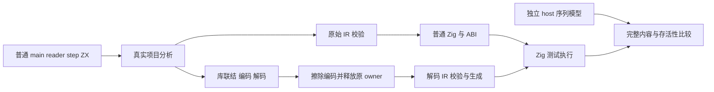
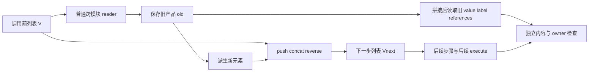

# 产品读取与列表拼接的实现边界分析

## Intent：最终目标

对最新普通语言能力建立独立语义回归：跨模块函数读取列表中的 object、tuple、optional 产品，产品包含 string 叶子；随后执行 push、concat、reverse；读取结果、输入和早期执行结果在后续更新及调用后仍保持正确。

本报告只分析文件并提出具体普通源码与独立期待，不修改正式源码，不把未执行的方案记作测试通过。读取时 HEAD 为 `10ca9e6f`，本次相关生产改动来自 `316e3498`。

## Data：可用证据

### 相关生产改变

`packages/genz/src/zx/buffer_call/analysis/flow.zig`：`functions` 为每个函数计算 `pure and detached(output_type)` reader 标志。`detached` 递归接受 scalar、enumeration、error_set、optional、object、tuple；其余类型拒绝。

- string 属于 scalar，因此 `{ value: u64, label: string }` 属于本次放宽覆盖的产品。
- `[{ value: u64, label: string }, u64]` 以及上述产品的 optional 也可沿该资格传播。
- `{ value: u64, items: u64[] }` 含 list，不是 detached。
- `{ value: u64, node: Node }` 含 native_reference，不是 detached，即使宿主 API 本身是纯读。
- 资格标志只是生成器内部决策，不得用于计算测试结果。

`packages/genz/src/zx/buffer_call/analysis/audit.zig` 的其他约束没有一起消失：调用带 lane 引用时只接受一次引用；已发生转移后再调用 reader 会返回 `unsupported_read`；reverse 仍在 `unsupported_operation` 范围。因此拒绝某种优化并不意味着语言语义不支持该程序。

`packages/genz/src/zx/lower.zig` 的 `projection` 新增 `.call` 分支：当 callee 为 value function，字段或 tuple 字段投影通过 `value_call.expression` 处理。这里应分别测试 `read(...).value`、`readPair(...)[0]`、以及对绑定后的调用结果取字段。只测试保存结果再读字段，不能充分代表直接调用表达式投影路径。

`packages/genz/src/zx/value_call/analysis.zig`：普通函数纯度来自 stores、parallel、callee summaries；对象返回或 state represented 返回可进入 value 函数机制。state represented、buffer lane、detached reader 是不同层次，不能相互代称。

`packages/genz/src/zx/value_call/argument.zig`、`root.zig`：参数产品可能借用、绑定或按 ABI/state 布局转换；函数调用结果可能通过 callValue、普通 call 或转换产出。旧结果跨随后调用保留，可以检验临时地址和返回产品寿命，但不能根据某个内部调用后缀直接推断语义正确。

### 现有覆盖的实际边界

| 成熟实现                                            | 已覆盖                                                                                   | 本次缺口                                                                                        |
| --------------------------------------------------- | ---------------------------------------------------------------------------------------- | ----------------------------------------------------------------------------------------------- |
| `collections/object_append`                         | u64 列表上的直接/跨模块 push、concat、单 lane、双 lane、cached append、元素读取等        | reader 返回含 string 的 object/tuple/optional 产品；reader 后拼接产品列表；调用结果字段直接投影 |
| `collections/iterate_calls`                         | loop 中旧 object/tuple 别名、分支 reader、含 list 子产品；输入保持；OOM                  | 叶子只有 i64/u64，未将列表产品读取与 push/concat/reverse 组合                                   |
| `collections/value_return/borrowed_objects`         | 含 string 的 Cell 列表只读；保存最后 Cell；重复调用后结果保持；借用 owner 和 string 地址 | 不改变列表；无 reader 后 append、concat、reverse；无直接调用投影                                |
| `collections/value_return/escaping` 与 `containers` | object 经 optional/list/tuple/嵌套容器逃逸后存活                                         | 不围绕新 detached reader lane；无 string 内容与拼接前后版本组合                                 |
| `collections/modular_loop/compile.zig`              | 原源码和失去原 owner 的库解码两路真实 emit、IR 校验                                      | 可复用 owner 生命周期与两路构建方式，无需沿用优化 shape 断言                                    |

现有 `object_append/check.zig` 使用独立 `std.ArrayList(u64)` 模拟结果；`iterate_calls/check.zig` 根据语言递推计算 old/next；`borrowed_objects/root.zig` 使用内容相同但地址不同的两个 writable 字符串，以及两个不同 Cell owner。这三种方式可以组合，避免复制生成器算法。

## Edges：边界与限制

1. 本次 reader 资格允许 string，不证明 string 深拷贝。String 语义是不可变字节序列；宿主 writable backing 只用于验证程序没有写入 owner。除既有借用契约外，不统一要求新产品的 string 指针保持或改变。
2. 标量叶子产品与引用产品都要验证普通语言行为。list/native_reference 产品属于正确 fallback 边界，不要求它们生成 buffered append 或消除 helper。
3. reverse 会改变后续索引所指向的元素，但不应改变已经读出的旧产品。应设计元素内容不同的输入，避免全等 seed 掩盖 stale-version 问题。
4. 可见性要至少包括同一程序内 append 后读取 old，以及第一次 execute 的完整结果在第二次 execute 后仍正确。只检查最终 total 可能漏掉临时产品共享。
5. 不在 reader 中调用专用原生编译器桥。唯一可选 native variant 是普通静态宿主 opaque Node 的显式应用语义；其用途只为验证引用型产品 fallback，不是实现 oracle。
6. 未执行这些 fixture，语法提案应先由真实项目分析、emit、Zig 编译来确认。下文 reverse 使用 `[0]` 是根据正式 `list_operations.zig` 的 tuple 返回契约；不能误写成直接列表返回。
7. 编解码路线必须结束 analysis/library/编码字节 owner 生命周期后再 emit decoded module；仅在同一 owner 存活期间执行 roundtrip 不足以证明 decoder 独立持有数据。
8. 不要求所有输入长度的机器证明。有限矩阵覆盖空、一、二、增长阈值、重复 owner、空字符串和失败路径；声明实际执行数量。

## Answer：交付方案与成功标准

### 建议最小普通源码结构

新职责目录可为 `packages/test/tests/collections/product_reader/`，独立注册一个 `test-product-reader`。不要改写旧集合 suites；新增 main/model/reader/step 的 ZX 文件和 compile/model/seed/execution/root 的 Zig 文件。只有引用型产品的 ABI 不同才按子目录或独立 runner 收口。

先以六种职责覆盖主要行为：

| mode           | reader 输出                            | 列表更新                        | 独立重点                                               |
| -------------- | -------------------------------------- | ------------------------------- | ------------------------------------------------------ |
| object_push    | `{value:u64,label:string}`             | push 一个由 old 派生的新 Cell   | 缓存 old 后拼接、old 字段仍可见、string 内容           |
| tuple_concat   | `[Cell,u64]`                           | concat 两个派生 Cell            | tuple 内 object 投影、输出顺序、旧长度                 |
| optional_push  | `Cell?`                                | 空 seed 下使用 fallback 再 push | null/present 两条路径、第一步填充                      |
| projected_push | `Cell` 或 `[Cell,u64]`                 | push                            | `reader(args).value` 和 `readerPair(args)[1]` 直接投影 |
| reverse_saved  | `Cell`                                 | push 后 reverse                 | 已读 old 保持；下一步根据反转后的列表重新选取          |
| list_fallback  | `{value:u64,label:string,items:u64[]}` | concat/reverse                  | 嵌套列表 owner 未改；旧读取产品仍保留原内容            |

若 native reference 的应用级输入/ABI 可直接复用已有 targets fixture，可增加 `native_fallback`，将 `Node` 装在普通 Cell 中返回，host read 只用于观察 Node 原 value。不要因为它多一个静态模块而将 native case 的缺失隐藏在一个 scalar mock 中。

### 具体 ZX 提案：object reader 与更新

共享类型 `model.zx`：

```typescript
export type Cell = { value: u64; label: string }

export type State = { values: Cell[]; seen: u64; label: string; count: u64 }

export type ReaderInput = { values: Cell[]; selected: u64 }

export type StepInput = { state: State; item: u64 }
```

`read.zx` 返回新产品，从列表元素读取两个 scalar 叶子。这样覆盖 string 产品 reader，而不是仅返回一个 scalar value：

```typescript
import type { Cell, ReaderInput } from "./model"

export type Input = ReaderInput

export type Output = Cell

export default function (in: Input): Output {
  const cell = in.values[in.selected]

  return { value: cell.value, label: cell.label }
}
```

`object_step.zx` 可以采用以下结构。空 seed 用独立 optional mode，避免所有模式都塞进兜底分支：

```typescript
import read from "./read"

import type { State, StepInput } from "./model"

export type Input = StepInput

export type Output = State

export default function (in: Input): Output {
  const old = read({ values: in.state.values, selected: in.item % in.state.values.length })

  return {
    values: in.state.values.push({ value: old.value + in.item + 1, label: old.label })[0],
    seen: in.state.seen + old.value,
    label: old.label,
    count: in.state.count + 1
  }
}
```

这里 object 字段评估先拼接，再从已保存 old 读取 value/label。`old` 的内容必须是拼接前 reader 结果。独立模型先保存 host 值，再修改 host ArrayList；不能调用 `flow.detached`、`value_call.functions` 或 buffer 分析作为模型。

`main.zx` 从 `in.seed` 建立初值，用 `in.steps.reduce((state,item)=>step({state,item}), initial)`。如要区分借用 foreign seed 与 owned seed，可分别使用直接 seed 和 `.map(cell => cell)`；不将两者悄悄统一成 owned seed。

### 其他具体 fixture 变化

- `read_pair.zx` 返回 `[ {value:cell.value,label:cell.label}, in.values.length ]`。concat step 把 `[old[0], {value:old[0].value+item+1,label:old[0].label}]` 追加；seen 加 `old[0].value`，previous_length 保存 `old[1]`。
- `read_optional.zx` 先检查列表长度为零并返回 null，否则返回上述 Cell 产品；optional step 使用独立输入 fallback Cell。空 seed 第一次读 null 后 push fallback 派生 Cell；后续读取真实列表元素。不要用强行越界再 catch 代替 null 语义。
- `projected_step.zx` 直接使用 `read(args).value`、`read(args).label` 和 `readPair(args)[1]`，另用绑定 old 的 sibling mode 作语义对照。纯调用允许多次求值，因此这些 reader 不插入 native 计数器来假设单次调用。
- `reverse_step.zx` 先 `const old = read(...)`，再 `const appended = in.state.values.push(new_cell)[0]`，最后用 `appended.reverse()[0]` 作为新列表。返回 seen/label 时仍读取 old；下一次选择在反转后结果上进行。
- `list_read.zx` 返回 `{value:cell.value,label:cell.label,items:cell.items}`；在 step 中保存 old 后 concat 两个普通产品，reverse 后仍观察 old.items 与旧产品。以正常参考路径验证含 list 产品，不给 reader 资格强制放宽。
- `native_read.zx` 返回带原 Node 的产品；输入 Node 对应 distinct HostNode owner，部分 owner 内容相同，重复引用同 owner。检查输出保留正确 Node 身份及 host value，不要求产品本身地址不同。

### 避免提前内联掩盖 reader 路径

主 agent 提出使用独立 `detached_reader` 目录；名称选择不影响本报告方案。核心正向模式优先使用 `reduce`，而不是把同一逻辑直接改写成含 Cell 列表的 `loop`。

证据来自 `inline_call/selection.zig`：`find` 对 `.transform`、`.iteration`、`.capture`、`.task` 停止下探；专门的 `iteration` 仅处理 `.iteration`，并在初值满足 list_plan 且含 productList 时标记 condition/body。含 Cell[] 的 loop 因此可能提前内联 step/reader。无内部 loop 的 imported step + main reduce 能保留函数边界，正好复用成熟 `object_append/call_push` 组织。不要添加超长代码、编译器开关或虚构副作用来阻止优化。

可用的最小 main 提案：

```typescript
import step from "./object_step"

import type { Cell, State } from "./model"

export type Input = { seed: Cell[], steps: u64[] }

export type Output = State

export default function (in: Input): Output {
  const initial: State = { values: in.seed, seen: 0, label: "", count: 0 }

  return in.steps.reduce((state, item) => step({ state, item }), initial)
}
```

更完整的 nested 产品 reader 可返回：

```typescript
export type Snapshot = {
    value: u64
    detail: { label: string; maybe: u64? }
    pair: [u64, string]
}
```

从选中 Cell 构造 `value=cell.value`、`detail.label=cell.label`、`detail.maybe=cell.value`、`pair=[cell.value,cell.label]`，保持 leaf 期待简单，避免模板插值同时引入无关语义。step 在 push/concat 后读取 `old.detail.label`、`old.detail.maybe ?? 0`、`old.pair[0]`、`old.pair[1]`；独立模型保存相同原值。为了避免只测 present，另将 `maybe` 根据普通输入 bool 设为 null 或 value。

在最终实际生成证据中确认被执行的 reduce body 调用 step，step 的执行路径仍调用 reader；不要只从文件中看到 helper 定义就认定分支覆盖。可记录原始函数身份和生成函数范围，读取 callValue/callBuffered 的实际调用位置。此观察仅证明目标路径仍存在，不用它计算语言 oracle，不强求所有模式同一个优化形状；reverse/list/native fallback 保留普通正确调用也应通过。

### 独立期待与可区分的 seed

使用三个 writable Cell owner：`{value:7,label:"same"}`、另一个 `{value:7,label:"same"}`、`{value:0,label:""}`；再加 `{value:19,label:"尾😀"}`。前两个 string 使用不同 backing。列表模式重复 owner `[A,B,A,C,D]`，steps 的 item 为 `index % 7`。另外提供不同 value 的纯顺序 seed，避免 reverse 只观察到同值。

令 `V₀` 为输入 seed 的普通 host 值序列，初始 `seen=0`、`count=0`。对每个 `item=t`：

1. 非空 mode：`j=t mod len(V)`，把 `V[j]` 复制到 host 局部 `old`。越界 mode 另外使用显式 selected，无 mod。
2. object_push：`new={value:old.value+t+1,label:old.label}`，`V'=V ++ [new]`。
3. tuple_concat：`V'=V ++ [old,new]`，`previous_length=len(V)`。
4. optional_push：若 V 为空则 old 为 fallback，否则按索引选取；接着执行 object_push 的更新。
5. reverse_saved：`V'=reverse(V ++ [new])`。host 模型自己交换数组元素，不依赖产物或 IR。
6. 所有上述模式 `seen'=seen+old.value`、`label'=old.label`、`count'=count+1`。输出逐元素检查完整 value/label 内容与序列，不能只检查 count 或总和。

list_fallback 的 items 来自 writable host 数组 `[2,19,37]` 与内容相同但地址不同的另一组；记录所有 nested array 内容与输入指针槽位。native_fallback 的 Node owner 使用不同地址，并记录宿主对象原 value。只按公开借用契约检查所保留 references 的身份，不推导某个新 object 必须 boxed 或 unboxed。

### 测试矩阵与失败路径

- seed 长度 0、1、2、3、17、257；steps 长度 0、1、2、3、7、16、257。非 optional 的空 seed 且 steps 非空应为 `IndexOutOfBounds`，不要为了让 fixture 通过而跳过。
- 直接 selected 读覆盖 0、最后一个、len、max u64；count=0 时不发生读取，因此 selected 无效也应成功。
- string 覆盖空、重复内容不同 owner、非 ASCII；检查输入 bytes 在成功、语言错误、OOM 后均未修改。
- 同一 arena 保留第一次完整结果，然后运行 seed/step 不同的第二次调用；在解开第二个 error union 前检查 first，再在第二次成功后检查 first；第二次语言错误或 OOM 也先检查 first。
- OOM 分别覆盖空路径、单步、混合 append、引用 fallback；复用 `tests/support/allocation_testing.zig` 全失败位置枚举。输入不变检查必须放在执行结果 unwrap 前，才能覆盖失败路径。
- 如测试线性分配，只对确有公开成本期待的正向模式单独量测；reverse 和引用 fallback 不应沿用 object_append 的固定预算。阶段正确性不靠分配预算通过来判定。

### 构建与编解码复用

复用 `iterate_calls/compile.zig` 或 `modular_loop/compile.zig` 的 owner block：analysis/link/encode 用 page_allocator，decode 用独立执行 arena；擦除 bytes，离开 block 后 defer 释放 bytes、library、analysis；此后校验并 emit decoded module。原 source/decoded 两路各编译为 program+zxc_abi，执行同一个独立 runner。

Build 注册方式参考 `build/object_append.zig`：每 mode 一次真实生成，四个文件输出；两 route 各 `b.addTest`；对 native variant 只给 program/runner 注入显式 host 模块，不加专用运行库。Debug 和 ReleaseSafe 各独立执行，保存原始 logs、输入 SHA、生成源码/ABI SHA。不要仅比较两 route 字节来代替运行。





### 自我批判与验收

本报告通过源码阅读确认资格边界和既有覆盖，尚未执行新增 fixture，不能断言最新生产实现已存在缺陷。含 string 的产品读与引用产品 fallback 应分开评估，避免在资格边界上写期待 shape 的测试。直接调用投影和缓存调用结果投影都必须真实编译。

成功标准为：正式测试经过 source/decoded、Debug/ReleaseSafe 四种实际执行组合；完整独立序列、string bytes、旧产品、旧执行结果与输入 owner 验证通过；语言错误和 OOM 覆盖；无专用 runtime；证据说明测试边界。若失败，仅在确认是生产语义或生成产物缺陷后通知实现 chat，fixture 语法、错误预期或分析脚本问题先在测试自身修正。

## 追加核查：nested optional 产品增长失败

### Intent：判断门禁是否过度要求

独立只读复核新 `detached_reader` 的 nested 增长失败，区分语言正确性、必要保守 fallback 和可改进的缓冲资格分析。不修改测试、生成器或 fixture，也不自行向实现 chat 发消息。

### Data：实际失败与生成证据

读取 `Debug执行结果.json`、`ReleaseSafe执行结果.json` 确认源 HEAD 为 `10ca9e6f19d960cb9dd2c533c41bad37881f233f`，两条实际命令均退出 1。两份原始日志都记录 `240/242`，失败为 nested-source/nested-library 的同一增长 test；每个 nested runner 的其余七项 test 均通过。

增长 test 每个 Case 在同一个 arena 中执行 n 步，再执行 n+1 步并保留首次结果。n=1024 时两种构建模式、两种路由均记录：

```text
allocated = 11777392
capacity  = 11776888
limit     = 2198528
```

其他已执行 test 证明其覆盖范围内的完整值、输入保持、后续调用保留和 OOM 路径正确。不能把增长失败描述成已经观测到错误值、悬空地址或泄漏。

读取 `fixtures/nested_read.zx`、`nested_step.zx`：reader 输出 `{cell:Cell,length:u64,pair:[string,u64],maybe:Cell?}`；maybe 在偶数 selected 时返回列表中的原 Cell，在奇数时为 null。step 先保存 reader 结果，再 push 全新 Cell，最后读 `(old.maybe ?? fallback).value`。该程序没有 list_update、Store 写入或对 Cell 字段的更新。

实际 Debug 缓存文件 `/tmp/zxc-detached-reader-debug-10ca9e6f/o/15d90c7208b30ed98d92bb8001435fc2/source.zig` 确認：

- `function_0_value` 第 118 行局部 `value_1` 是 `*const zx_type_11`，由列表取出的既有 Cell owner。
- 第 157 行 maybe 为 `?*const zx_type_11`，持有 `value_1` 或 null；没有把旧 values slice 装进 maybe。
- `function_1_value` 第 234 行先执行 `function_0_value` 保存整个 old。
- 第 260 行分配长为旧 len+1 的 `*const Cell` 指针数组，第 262 行复制全部旧指针槽；第 268 行之后再读 old.maybe 的 Cell.value。
- 第 325 行 reduce 的实际路径调用 `function_1_value`；没有 `function_1_buffered`。这里的 memcpy 是运行路径上的动作，不能仅以普通 helper 定义存在来解释增长。

n 次 append 的槽位复制长度为 `seed*n + n*(n-1)/2`，槽位分配长度为 `seed*n + n*(n+1)/2`。两次调用都保留在 arena 中，因此生成器这一路径的槽位总分配和总复制为 Θ(n²)。该结论由实际生成代码推导；单个 n=1024 的计数本身不能证明增长阶数。Cell 和 fallback object 的额外分配每步为常数，不能解释 list memcpy 的二次方项。

### Edges：旧 Cell 别名不等于旧列表槽数组别名

maybe 确实返回一个旧 Cell 地址；它不是无引用的标量副本。安全问题应围绕实际能被后续动作改变或失效的存储判断。

此实例 values 为指向独立 Cell owner 的指针数组。列表 buffer 扩容或 append 写新槽不会改写旧 Cell owner，也不会改写 Cell.label 的 byte owner；既有 owner 由宿主输入或当前执行 arena 持有。即使 buffer 迁移，已保存 maybe 指向 Cell，不指向旧数组内的指针槽。step 只是 append 新 Cell，且首次 result 在下一次 execute 中保留；每次 execute 仍需独立 buffer，不能跨 execute 复用首次结果的可见槽数组。

因此不能用“maybe 含 pointer”直接认定本实例必须保留旧列表 backing。反过来，也不能由该实例推广为所有 optional 产品都安全：optional 内含 list 的产品可能保留 slice；native reference 有独立所有权及副作用；list_update、逃逸整个旧 slice 或其他调用语义仍需原有约束。

### Answer：实现缺口判断与边界

`flow.detached` 将 optional Cell 递归识别为 detached；而 `audit.count` 使用 `flow.leaves(..., include_optional=true)`，把 optional 自身当作待追踪叶子。`may.contains` 对 path 选择的最终类型为 optional 时没有递归判定其 child 的叶子边界。

具体的保守传播链如下：

```text
old.maybe
→ old 的 reader 调用结果字段 maybe
→ nested reader return 的 conditional
→ some(cell)
→ cell = values[selected]
→ may.index 保守追踪整个 values target
→ 命中 caller 的 list lane
```

于是使用 optional 产品的 coalesce 被认为仍读取该 list lane。`.binary` 的审核可因此得到 `unsupported_read`；其他 optional 包装也有 `container_escape` 的保守分支。未额外运行诊断程序打印实际 lane.rejection，因此这里的 rejection 名称属于源码路径推导，不把它写成已测得的诊断输出。

这说明 reader 接纳与后续 optional 结果传播尚未一致表达“产品可含稳定元素 owner，但不保留列表槽数组”。本实例的 quadratic copy 属于有实际生成证据的性能实现缺口，并非新测试要求把含 list/native 产品强行优化；语言值和所有权正确性目前未失败。

线性预算的具体 `65536 + (...)*1024` 是测试选择的宽松门禁，不是语言规范规定的精确字节值。对实现 chat 报告时应主述每步 alloc(len+1)+memcpy、optional Cell 导致错误 lane 依赖传播与增长结果，不以 2.2MB 这一数值独立证明生产 bug。修复应保留含 list optional 的保守语义，并回归旧 result 与输入 owner 检查，避免为了减少计数引入不安全覆盖。

### 自我批判

本次只读核查既没有修改资格谓词，也没有用资格谓词计算业务 oracle。实际源码已能直接解释 Θ(n²) 行为，并表明这个 Cell owner 不依赖旧槽数组。仍需实现侧最小修复、真实生成和四路完整回归来证明可安全消除该开销。不得通过把 nested mode 排除出增长门禁、改为深拷贝 maybe fixture、抬高预算掩盖本实例，亦不得仅根据报告就宣称修复完成。

## 后续独立复核

以上缺口分析对应10ca9e6f失败冻结版本。随后实现392a2b62统一detached结果的依赖排除，17ea774b归档验证；主会话按原27份字节输入与预算重新实际运行两优化模式，各128/128通过。原始失败、修复后生成物及增长规模对照均保留于实施记录，不将旧源码推导当作新版本缺陷。
