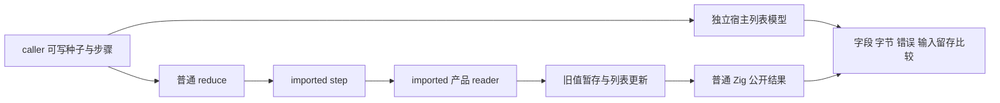
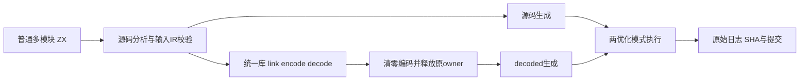

# 产品读取与列表拼接回归执行计划

## Intent：最终目标

为 316e3498 的 detached 产品 reader 与 value call 投影提供独立普通源码回归；同时对齐三份未审阅的 Test262 箭头表达式返回用例。整个任务仍包括全部 Test262 与全部 zxc 特性，不把本轮完成等同整体完成。

## Data：可用证据

当前 source 为 10ca9e6f，生产实现包含 316e3498。既有 object_append 测试主要使用 u64，borrowed_objects 有字符串产品读取但没有随后 push/concat/reverse。两份只读分析报告列出调用路径和边界。concat 69/69 已审阅，不重复增加审阅；三份箭头用例均只有一个值断言，拟通过单元素 map 调用原 lambda 保留断言。

## Edges：边界与限制

正式修改限于测试、构建登记、目录矩阵和审阅记录；其余 11 份跟踪修改保留原字节。不修改生产实现；只有实际可复现生产缺陷才通知授权实现 chat。零专用运行库、静态 Zig 和显式 ABI 保持不变，不调用浏览器，不问问题。

普通 reduce → imported step → imported reader 避免 loop(Cell[]) 提前展开 helper，实际生成物检查调用仍存在。含 list 的 reader 与 reverse 只验正确行为，不强制获得缓冲优化；内存增长约束只针对可复用的正向路径，不要求全部 ABI 包装零分配。期待由独立宿主列表模型计算，不依赖生产资格谓词或生成函数编号。

## Answer：交付与成功标准

新增 object、tuple、optional、projection、nested、concat、reference、reverse 八组普通程序，经源码与释放原 owner 后的真实统一库 codec 两路执行。覆盖空/非空 caller 种子、重复和交替步骤、动态读取、完整字符串字节、先读取再修改后使用旧值、同 Arena 后续调用中的旧结果留存、逐分配失败，以及正向长输入的增长约束。

三份原始箭头文件、archive/index/SHA 与真实 Node 执行结果逐项保存；新增普通参数目录、精确 assertion 映射和审阅。Debug/ReleaseSafe 使用冻结工作区和独立缓存实际执行，保存 argv、终止码、输入与原始生成文本。完成后自我复核，英文 Conventional Commit 提交并 push。

## 实际完成与范围变化

三份Arrow与54个命名JSON已先独立提交push（eda91c3a），本部分仅提交27份产品测试/登记及自己的执行证据。失败版本冻结10ca9e6f；实现392a2b62修复后另冻结17ea774b，同样输入/预算的Debug和ReleaseSafe均128/128实际通过。具体计数、失败/修复增长数据和自我复核见实施记录；旧失败不抹去，全量目标不缩小。
