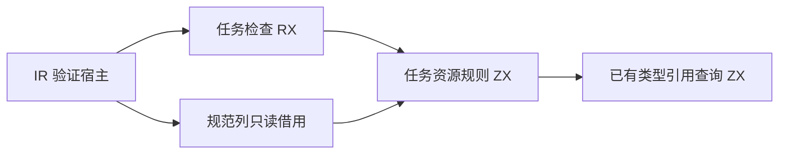

# 任务资源检查自举

## Intent：最终目标

将 IR 任务资源检查的完整 validate 算法迁至 RX 编排及 ZX 逻辑，直接借用规范类型、表达式、符号和控制列。任务返回/输入限制、原生引用逃逸和一次消费规则保持一致。

## Data：可用证据

基线 9e7a2b0b。当前 tasks.zig 的 validate 和 bindings 使用 Zig 实现语言规则；callSafe 单独负责函数图并发安全。body_structure 在该检查前已验证控制段覆盖、payload 唯一和所有 block 可达，因此原递归 bindings 遍历与遍历 constant_values 列等价，不需要重建树或复制摘要。

## Edges：边界与限制

seed 保留原算法供引导构建；正式路径只允许原生整数转换和列借用。借用指针不能逃出调用，工作区使用宿主 arena 并释放。callSafe 及其他尚存 Zig 语义不计为完成。不得新增测试、放宽断言或执行仓库全量测试。

## Answer：交付与成功标准

正式接入生成任务检查器，根构建及相关现有任务、所有权、编解码专项通过，归档实际结果并提交推送。检查生成物和依赖链，不能仅以入口后缀宣称完成自举。




## 正式实现

- `canonical/tasks/model.zx` 引用既有 TypeTable 与 Body，不持久化另一份函数或表达式摘要。
- `references.zx` 遍历任务表达式、任务体类型及捕获符号，复用现有 ZX 类型引用查询。
- `consumption.zx` 维护每个表达式的 u64 消费计数；await/cancel、parallel、scope 和常量绑定各按旧规则计数，最后检查任务值恰好消费一次。
- `validate.zx` 决定任务输入输出限制并顺序组合检查；`tasks_check.rx` 提供编译器模块入口。
- `tasks.zig` 借用输入并释放 arena；原 validate/bindings 仅存于 `seed_tasks.zig`，由 `generated_parser = false` 的引导构建选择。原 `callSafe` 暂时保持原位，不把其列为已迁移。

关键宿主边界：

```zig
const table = ir.TypeTable.borrow(Table, program.types);
const body: Body = .{
    .stores = borrow.pointer(@FieldType(Body, "stores"), &program.stores),
    .symbols = borrow.pointer(@FieldType(Body, "symbols"), &program.symbols),
    .expressions = borrow.pointer(@FieldType(Body, "expressions"), &program.expressions),
    .control = borrow.pointer(@FieldType(Body, "control"), program.body.control),
    .root = if (program.body.root) |id| @backingInt(id) else null,
};
```

只在栈上组装描述符，列和底层数据均由原 Program 所有。消费计数是算法必需的独立工作区，不是输入镜像。

## 自我复核

1. 前置 control 校验逐项验证 statement payload、所有常量载荷恰好对应一条 statement，块段完整覆盖 statement，tree 校验确保所有块唯一可达，因此扁平扫描常量列覆盖旧递归扫描的同一集合。
2. 输入输出禁用 task、任务体与捕获值禁止原生引用、await/cancel 仅接受 task/reference、scope 任务绑定要求符号非空且来源为 task，各项逐一对照旧实现。
3. 本阶段未迁移 callSafe，未改变其并发能力规则，未证明整个编译器已自举。
4. 初次构建暴露新源码使用了尚不支持的类型导入重命名语法；已改为模型直接导出 Program，不为本任务扩展语言语法。

## 生成实现检查

已查看生成任务检查源码：仅导入 std、integers 和生成 ABI；输入的类型表、表达式表和符号表继续通过借用描述符读取。计数数组初始化需要一次分配，第一次更新由既有列表更新生成逻辑执行一次受 started 标志保护的复制，后续更新复用同一可变缓冲。该复制属于工作区，未复制 IR 输入，但仍是后续通用所有权转移优化的缺口；本阶段不宣称计数工作区已经达到最少分配或完全零复制。

已完成根构建 `zig build -j3 --summary all`：35/35 步骤。编译器包内 `zig build test -j2 --summary all`：28/28 步骤、372/372 用例。额外专项结果以最终验证记录为准。

已按原文件逐字对照：seed_tasks 保留原 validate/bindings 算法，callSafe 函数正文未变；两项比较均成立。生成模块的导入闭包为 std、integers、生成 ABI，没有任务专用原生语义回调。

任务、取消、原生引用与库/缓存编解码专项：64/64 步骤，174/174 用例通过。没有新增测试或运行仓库全量测试。验证结果、执行目录、命令及源码/生成物/日志 SHA256 已写入 `验证结果.json`，原始日志和生成代码压缩归档。

## 后续通用优化

上述计数工作区首次复制记录保留为本阶段历史证据。[循环初值所有权转移](../循环初值所有权转移/实施计划.md)已通过通用新分配来源、唯一消费路径和执行区域证明消除该复制；没有为任务校验器、字段名或回调常量增加特例。原有验证结果和生成源码归档仍对应本阶段基线。
