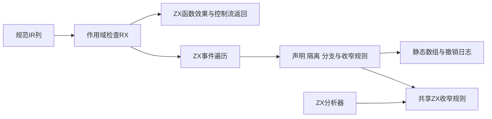
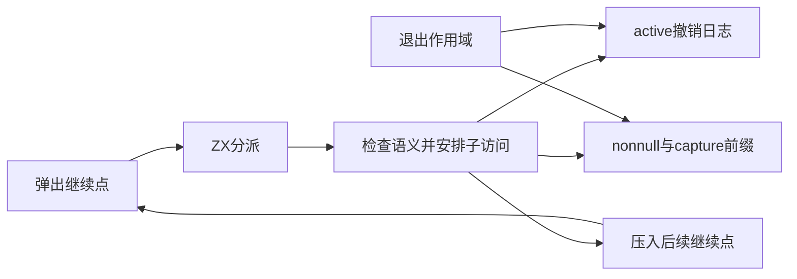

# 作用域与收窄检查自举

## Intent：最终目标

完整迁移scopes作用域验证及其共享Refinement规则到RX＋ZX。保留符号可见性、唯一声明与owner重入、回调和Task隔离、可选值证明、分支返回后收窄和switch穷尽性，不以原生判定代理自举。

## Data：可用证据

基线6df3ec2f。scopes通过递归访问规范ExpressionTable与ControlTable；每个block、scope、callback与Task都复制active布尔列并在退出恢复。declared和declaration_owner跨访问保留。core/refinement同时被分析器与IR检查使用，mark/restore维护nonnull事实与capture关联的前缀；assume规则只识别not、真and、假or及reference与None比较。

现有ZX不允许递归模块环，故采用ZX显式事件栈表达原递归继续点。使用独立静态Zig工作区仅执行数组存储、push/pop、get/set和undo；其中不得出现ExpressionKind、StatementKind、类型合法性或符号声明规则。所有语义分支和调度由ZX生成普通Zig逻辑，不引入zxc语言运行库。

## Edges：边界与限制

输入IR列借用。active修改记录撤销日志，退出作用域按mark恢复，消除整列快照；declared与owner不撤销。表达式帧携带原depth和callback/task限制标志，保留256门限。程序块帧携带独立block depth，表达式从0开始。事实和capture mark独立于active mark。

Refinement规则必须供Analyzer和validator共享，不能保留两份正式语义。旧core算法仅供seed路径；正式native存储操作不解释IR。调用安全性复用此前ZX纯度和并发检查，控制流返回复用规范ControlTable规则。事件栈属于编译器遍历算法，不成为生成应用的解释器或动态加载层。

不得新增测试，不跑全量测试，不为夹具硬编码。保持输入生命周期及OutOfMemory传播，预先暴露生成物中的额外复制或分配，而不是静默增加arena掩盖。

## Answer：交付与成功标准

交付RX编排、ZX事件和规则模块、只含存储操作的静态workspace、Analyzer共享收窄接线及seed路径。完成现有作用域、收窄、Task、Store、编解码和编译器专项；记录生成物、源码指纹、日志与自审后提交push。





## 实施结果

正式作用域入口改为借用规范类型、符号、表达式、控制流和函数列，调用 `scopes_check.rx`。RX 先准备返回与函数效果摘要，再运行 ZX 事件遍历；原 Zig 检查器逐字保存在 `seed_scopes.zig`，只供引导编译。

ZX 模块按 block、statement、branch、switch、expression、callback、task、scope 和共享 refinement 分工。事件只保存 phase 和三个数值参数；调度倒序压栈，执行顺序保持原深度优先顺序。普通声明禁止重复，callback 和 scope 保留原 owner 重入规则。Task 先验证捕获在外部可见，再清空 active 并激活捕获；Iteration 的 condition/body 分别激活自己的参数。退出作用域仅撤销 active 和事实前缀，永久 declared/owner 不撤销。

Analyzer 的 bind、assume、typeOf 与 IR 作用域检查使用相同 ZX 收窄规则。原生层只读写事件、布尔列、owner 数值、事实和 capture 关联，不解释表达式或声明合法性。生成代码静态调用这些内存操作；事件栈是编译器自身遍历数据，不注入用户应用，也不作为语言运行库。

共享收窄在符号局部值判空后使用具体 u32 值；不依赖对象字段路径收窄。初次构建暴露的 void RX Return 和 Zig 参数遮蔽已按实际语法修复，没有放宽语言检查。

### 内存和生命周期审计

`refinement_assume`、`refinement_bind`、`refinement_type` 生成入口没有 arena 分配表达式，宿主传零容量 FixedBufferAllocator。assume 的事件和 nonnull、bind 的 capture 仍可经 Workspace allocator 分配，这是算法状态，不能称整个收窄过程零分配。

scopes 生成物在 prepare 中实际分配 returns/pure/concurrent 摘要和相关临时状态；纯度与并发只在相应结构出现时计算。run 每次取事件采用按值 Frame，临时借用的生命周期覆盖同步 dispatch；事件存储不保留指针。ordinary Frame/Prepared 的分配版本没有调用点，实际走 value 版本。五组循环恢复保留嵌套 Program/Context 的非空 origin，只修改标量控制字段，因此其 create 备用分支不执行。此结论来自本次生成物及调用关系审阅，不是未来任意改写的通用证明。

Assume 在共享栈记录 eventCount，只处理新增后缀；嵌套调用即使覆盖 native current，也不改变已取出的按值 Frame。输入列和栈上描述符借用至同步调用结束；摘要 arena 和 Workspace 在整个运行期有效，返回 bool 后各自释放。Analyzer 重用事件容量，事实的所有权仍在 Analyzer，workspace 不释放借用的事实容器。

### 自我批判与边界

本轮消除了作用域 active 整列快照，未声称消除编译器所需的全部临时内存。returns 摘要仍沿用已有 ZX 实现的动态结果构造；事件、撤销记录和事实增长有实际分配成本。静态 Zig workspace 是自举过程中显式的内存原语，尚未代表整个编译器数据闭包完成。未新增 runtime、动态加载或对用例的特殊分支。

ZX 调度已对照原检查器逐项复核。Parallel 先检查所有调用的纯度再访问子表达式，与原失败顺序不同，但入口只返回布尔结果，无外部诊断顺序契约；接受/拒绝条件保持一致。普通构建和专项仅覆盖所列行为，不能替代全目标完成审计。

### 正式宿主入口

以下代码对应 `packages/compiler/src/zx/ir/scopes.zig`。

```zig
const std = @import("std");
const zx = @import("zx");
const ir = zx.ir;
const options = @import("parser_options");
const Workspace = @import("flow_workspace");
const borrow = @import("canonical/borrow.zig");

pub fn validate(allocator: std.mem.Allocator, program: ir.Program) std.mem.Allocator.Error!bool {
    if (comptime !options.generated_parser) return @import("seed_scopes.zig").validate(allocator, program);

    const generated = @import("generated_ir_scopes");
    const Input = std.meta.Child(generated.Input);
    const Table = std.meta.Child(@FieldType(Input, "table"));
    const Body = std.meta.Child(@FieldType(Input, "body"));
    const Functions = std.meta.Child(@FieldType(Input, "functions"));
    const table = ir.TypeTable.borrow(Table, program.types);
    const functions = @import("canonical/functions/input.zig").view(Functions, program.functions);

    const body: Body = .{
        .stores = borrow.pointer(@FieldType(Body, "stores"), &program.stores),
        .symbols = borrow.pointer(@FieldType(Body, "symbols"), &program.symbols),
        .expressions = borrow.pointer(@FieldType(Body, "expressions"), &program.expressions),
        .control = borrow.pointer(@FieldType(Body, "control"), program.body.control),
        .root = if (program.body.root) |id| @backingInt(id) else null,
    };

    var facts: zx.Refinement = .{};

    defer facts.deinit(allocator);

    var workspace = try Workspace.init(allocator, program.symbols.count(), &facts);

    defer workspace.deinit();

    const input: Input = .{ .table = &table, .body = &body, .functions = &functions, .output_type = @backingInt(program.output_type), .transaction = program.store_mode == .transaction, .writer = @ptrCast(&workspace) };
    var arena = std.heap.ArenaAllocator.init(allocator);

    defer arena.deinit();

    return generated.execute(&arena, &input) catch |err| switch (err) {
        error.OutOfMemory => return error.OutOfMemory,
        else => return false,
    };
}
```

## 验证记录

未新增测试，未运行仓库全量测试。已执行并确认退出码为 0：

| 范围             | 命令                                                                                                                                                                              | 结果                   |
| ---------------- | --------------------------------------------------------------------------------------------------------------------------------------------------------------------------------- | ---------------------- |
| 根构建           | `zig build -j3 --summary all`                                                                                                                                                     | 35/35 步               |
| compiler 包      | `zig build test -j3 --summary all`                                                                                                                                                | 28/28 步，372/372 测试 |
| 语义和编解码专项 | `zig build test-typed-try-analysis test-zx-tasks-analysis test-zx-cancel-analysis test-native-references-ir test-contracts test-library-codec test-cache-codec -j3 --summary all` | 78/78 步，225/225 测试 |
| 运行边界专项     | `zig build test-switch-scope test-typed-try-runtime test-rx-store-io test-rx-parallel-inference -j3 --summary all`                                                                | 93/93 步，143/143 测试 |

compiler 包覆盖回调捕获拒绝、嵌套作用域恢复、参数遮蔽和分配失败释放；typed-try 覆盖捕获关联、提前返回收窄、None 左右对称、not、and/or 和仅展开一层 optional。Store IO 与 Task 专项覆盖相关实际执行和失败清理。范围以现有测试为准，不由计数推断一般形式化证明。

另一会话在 a206e375 提供上一契约列迁移的独立 Debug／ReleaseSafe 复验，本轮阅读确认没有生产缺陷反馈。该记录不是本轮 scopes 变更的验证结果，不混计。

格式整理后最终根构建再次通过 35/35 步。最终生成目录为 `.zig-cache/o/7a89805a693c6bb088a88377f0be1264/`，四个模块及其 ABI 共八个生成文件与专项运行使用的版本逐字一致。验证结果 JSON 记录最终源码与生成物 SHA-256，压缩日志和生成物同步归档。
