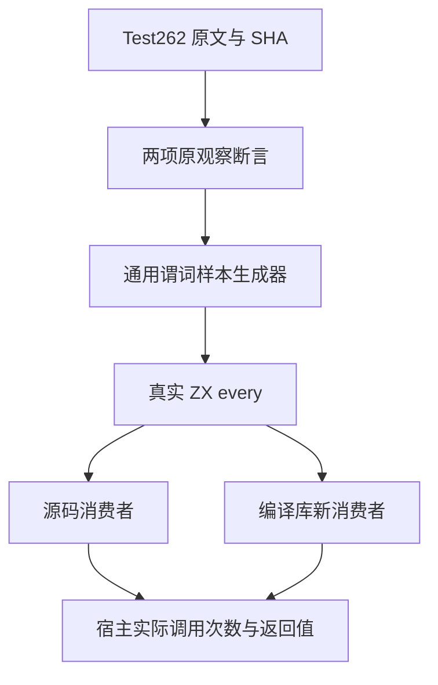
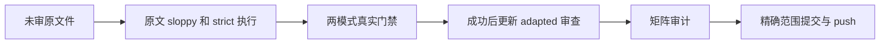

# 全称回调原始调用次数计划

## Intent：最终目标

接入一个尚未审查的 Test262 every 原文件，完整保留返回 true 与调用两次两个原观察断言，并由真实源码与编译库消费者验证。

## Data：可用证据

锁定 revision `7ab7fafa0003f73fc85c1b95d88094d33f7eb8bd`；原文件 `test/built-ins/Array/prototype/every/15.4.4.16-7-c-ii-9.js` 的 SHA 为 `2a11e0ea3a25ee003b35a12d4605dd7d5c76e749a774dee14417f0040a27eccf`。主代理亲读全文并核对索引及全部审查记录，当前未审。原输入 [11,12]，回调递增 called 并返回 true，原断言是 every=true 与 called=2。

现有 generate_predicate_reviews.ts 从样本生成期待值和命名案例；真实 ZX 使用 every(item => host.predicate(item))，宿主逐次计数，checker 比较真实返回值、calls、visited 和输入。库路径在提供者释放及编码缓冲填毒后分析新消费者。沿用这一职责完整且已成熟的实现，只增加数据样本，不增加源码算法或针对用例的特殊分支。

## Edges：边界与限制

IR 契约明确 map/filter/every/some 为单元素参数。因此零形式参数仅在原断言观察语义上适配为显式未使用元素参数；审查状态为 adapted，不声称支持零参数 callback 语法或完整 JavaScript index/source/this 协议。原文件的描述与两项可执行断言分别保存，避免把观察等价误写成语言协议等价。

草稿和配套工具先写入本目录。仅同步数据及 every 目录到正式测试包，原审查记录在 Debug/ReleaseSafe 两真实消费者都成功后才更新。运行中冻结所有正式包输入。审查元数据的后续更新另记 SHA，不伪装成执行时输入。当前完整根 Debug 1804 与历史 Safe 17752 的固定检出保持不变。

## Answer：交付格式与成功标准

交付三个最小正式数据文件、相同草稿、原文及两模式原文执行证据、完整谓词门禁的真实命名检查与生成模块证据、矩阵审计、IDEA 执行记录和自我批判。Debug/ReleaseSafe 中每个方法均运行 source/library；every 新案例四次真实验证两个原断言。审计 catalog 加一，unreviewed 减一；执行检查数量与原案例数量分别报告。每个部分以英文 Conventional Commit 提交并推送。

