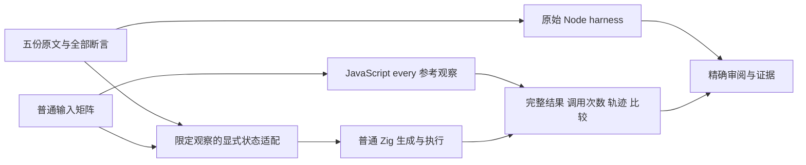
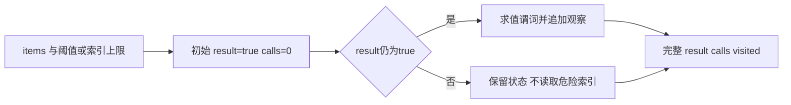

# 全称谓词观察与上游审阅执行计划

## Intent：最终目标

完整审阅五份 every 原文件，保留结果、调用次数和输入未修改的全部断言，同时验证 zxc 显式归约中的停止标记与惰性索引。全量 Test262 与全部特性目标继续保留。

## Data：可用证据

锁定 revision 为 7ab7fafa0003f73fc85c1b95d88094d33f7eb8bd。五份原文件为 15.4.4.16-4-12、7-c-ii-3、8-1、8-11、8-12，查询确认均未审阅，原文已逐项阅读。现有 collections support 会复制可写输入并在调用后深比较；generate_array_callbacks 是同职责参考。

## Edges：边界与限制

zxc 没有 every API，本部分不添加或宣称原生 every。原观察改为显式累加记录：result 为停止标记，calls/visited 记录实际谓词求值；false 后返回原状态，不再求值谓词。归约仍遍历剩余输入，不能声称具有 every 的循环退出或性能行为。适配仅覆盖这些原文的稠密、无 getter、无外部突变输入，准确标记 adapted。

空输入原文的 void 回调改为不可达的类型正确谓词，不声称支持 undefined 返回。数值原文保留 val>10；索引原文把稠密回调索引改为显式求值序号，保留 false 和 7 次；全 true 保留 true 和 10 次。输入保留原文的五个元素断言由可写输入深比较及完整返回轨迹共同验证。

预期观察使用 JavaScript 原生 every 收集，不复制被测归约算法。额外嵌套列表用例只验证 zxc IndexOutOfBounds 与停止后的惰性读取，不归因 JavaScript 对空行的行为。程序不读取用例名称或内置期望轨迹。只修改测试包，使用普通静态 Zig，无运行库。

## Answer：交付格式与成功标准

五份原文 SHA、原始 harness 普通/严格模式执行、具名矩阵、全部断言映射、Debug/ReleaseSafe 独立执行、真实二进制名字和生成物 SHA、目录审计、输入保留和自我复核。提交前使用项目 formatter 固定最终字节；使用英文 Conventional Commit 并实际 push。

