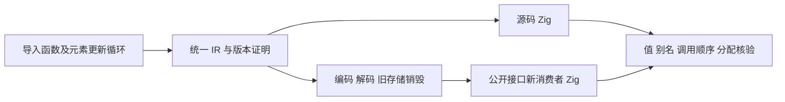
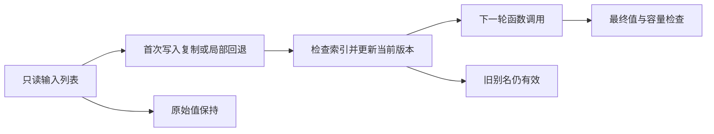

# 函数元素更新缓冲执行计划

## Intent：最终目标

为 c938a523 发布的普通函数元素更新与函数内循环缓冲能力补充专门回归，验证语义、借用输入保护、旧版本、重复别名、默认空缓冲路径和分配清理。持续推进 zxc 全特性与 Test262 对齐目标。

## Data：可用证据

当前基线 `7786ec66f09d193230b45e7ffc78df4220188e89`。现有 iterate_calls 验证借用调用视图，iterate_buffer 验证直接循环更新；已有工具多数将解码 provider 直接生成，不能全部代替新消费者。本部分复用 detached_reader 的实际消费者组织方式，源码及库路线均运行。

## Edges：边界与限制

现有附加工区用于复现先前冻结证据，本部分创建当前基线的隔离工作区。先保存中文 IDEA 文档与代码草稿，再按精确路径同步正式测试。仅修改 test 包，不改正在实现的所有权草稿。

覆盖裸 list 返回、调用链、禁用写入、显式旧版本在第二轮才读取、重复结果别名、无调用者容量时的局部回退。元素更新的副作用错误顺序与 replacement 携带嵌套候选留作后续独立部分。回调外捕获不属于当前 ZX 语法契约；旧版本必须放入显式循环状态。副作用宿主可能使函数不满足 pure 缓冲条件，因此其调用轨迹只证明对应更新表达式顺序，不冒充已启用共享槽的证据；纯路径另以值、旧版本、分配成本和生成物核验。

测试期望来自闭式数值公式及独立初值，不复制生成器版本算法。容量预算只判断是否随调用次数复制大列表，不要求未声明的所有其它临时对象零分配。先确认故障来自生产实现后才通知实现会话，不发送成功和准备阶段工具错误。

## Answer：交付与成功标准

在 Debug/ReleaseSafe 执行源码与真实编译库消费者；覆盖零/一/二/多轮、输入可写哨兵、旧快照、错误、OOM 与重复调用。冻结输入、原始日志、生成物和实际二进制 SHA，进行自我批判，保护原有修改，英文 Conventional Commit 后实际 push。

