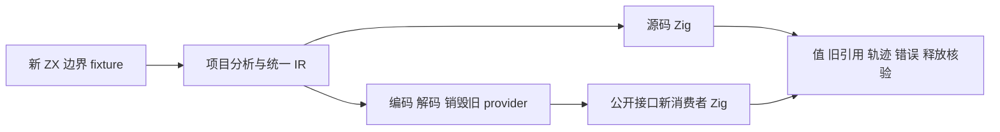
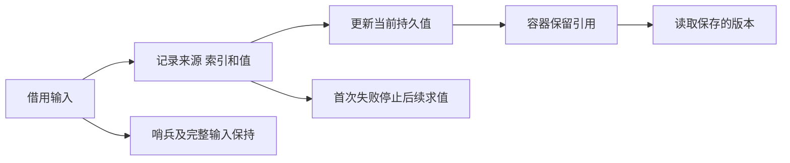

# 函数元素更新错误与引用执行计划

## Intent：最终目标

继续验证元素更新的持久值语义，补齐上一部分明确未覆盖的 replacement 携带候选引用和副作用错误顺序，源码与真实编译库消费均需执行。

## Data：可用证据

基线 `8b0a7060ef454d5eb0e5b3888fe454bf2a4c7f7e`。已发布 function_updates 的真实编译库消费者与闭式预期检查可复用；现有 runtime/evaluation_order 的宿主记录可以观察表达式求值。本部分先读取相关实现和成熟测试，再在隔离工作区扩充 fixture。

## Edges：边界与限制

保留既有纯缓冲回归，新增用例不修改生产优化以适应测试。native 副作用可能阻止共享缓冲，不能将其错误顺序当作启用缓冲的证明。replacement 要核验保存的嵌套列表仍是旧版本；不能仅要求生成器拒绝某优化。

只读分析结果不是运行结论。确认为生产缺陷才通知实现会话，工具或 fixture 错误自行修正。旧证据已在文档中冻结，本部分复用同一工作区并更新基线，保留缓存二进制供旧证据核验。草稿与冻结输入完成后精确同步正式路径，不触碰起始既有修改。

## Answer：交付与成功标准

新增前/后写入引用逃逸的运行检查，以及来源、索引、值、更新后语句的调用轨迹、失败优先级、零轮、越界和 OOM 清理。两种优化、两条产物路线执行通过，冻结日志和生成物，自我批判，英文 Conventional Commit 并实际 push。整个 Test262 及全特性目标仍进行中。

