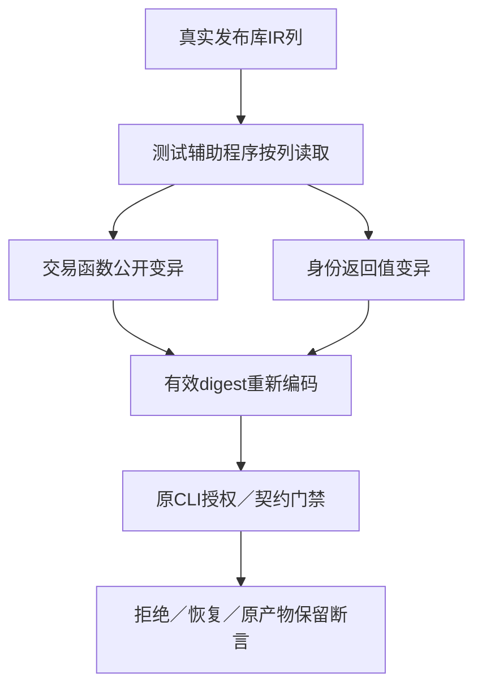
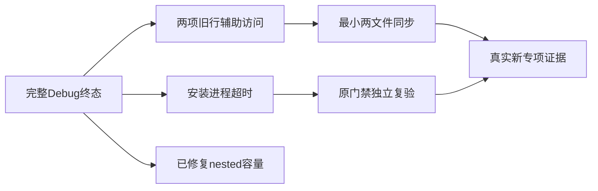

# 函数列库变异夹具同步计划

## Intent：最终目标

恢复两个原库发布安全／契约测试的真实变异路径，完整保留原负向、恢复与产物不变断言；归档固定版本完整Debug终态，并独立复验原构建模式超时失败。

## Data：可用证据

固定a73d056c完整根Debug真实退出1：6681/6693步骤，111377/111381检查，五失败步骤。两个Node辅助程序仍按functions数组读取，当前FunctionTable实际为列；因此变异前TypeError。一个构建模式安装步骤180秒ETIMEDOUT，不能误称同一种schema错误。其余两个步骤为nested容量，已由通用生产修复独立复验关闭。
直接阅读当前FunctionTable唯一列契约：files/input_types/output_types/store_modes/stores用于暴露真实transaction；roots/control/contracts/symbols/expressions用于将身份返回Reference改为Integer零。保留原有效digest、结构重排、发布保护及授权检验逻辑。

## Edges：边界与限制

只改两个测试辅助程序，不改生产codec和语义，不兼容旧行格式，不改变原测试断言，不增加超时。正式源码草稿先保存在本目录，经已有测试授权同步。其他两个完整Safe检出仍冻结；这个完整Debug失败是历史a73版本，不直接报告为当前生产缺陷。

## Answer：交付格式与成功标准

两个原负向库门禁在Debug和ReleaseSafe均完整运行，原变异能进入真正授权／SMT检查；原build-modes单独复验，保留180秒限制。归档真实全根终态、源身份、日志和自我批判，英文Conventional Commit提交push。仅当前生产失败且可独立证明时通知实现会话。

## 执行步骤

先归档整个Debug日志和原版本全部运行二进制，保持原检出不变。同步两完整草稿、类型检查并冻结包输入。两模式运行原库边界和契约门禁，单独原构建模式复验。判断生产缺陷与测试失效后再决定修复／通知；发布仅包含本部分明确拥有的文件。
