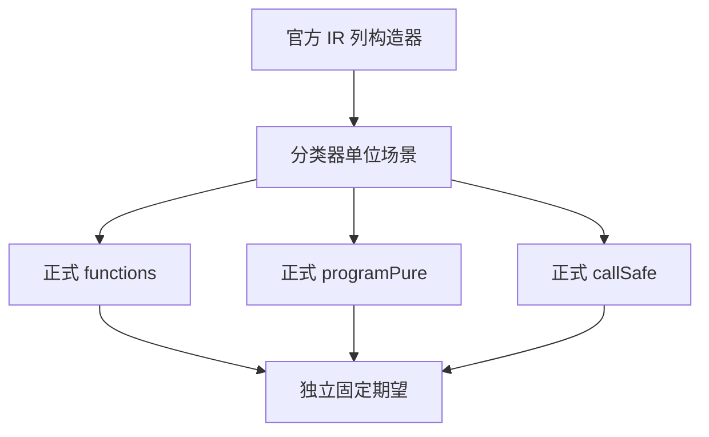
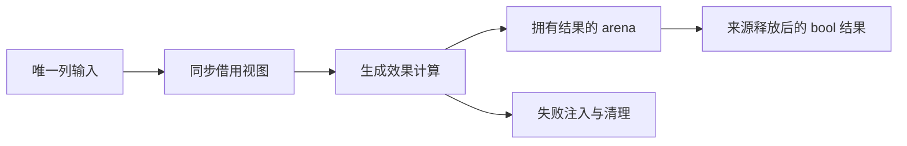

# 函数效果入口独立覆盖

## Intent：最终目标

直接执行此前主要随类型实例化覆盖的 parallel.functions、parallel.programPure 与 tasks.callSafe 正式生成入口，独立验证函数效果传播、程序纯度、并发许可、所有权及分配失败清理。

## Data：可用证据

当前源码输入视图只借用 native_modules、native_concurrent、stores、expressions 四列。functions 以纯模式生成逐函数 bool；programPure 拒绝顶层 Store，再按根表达式实际调用判断；callSafe 使用并发模式并判断指定函数。原生模块非 null 是唯一原生判据，模块 0 必须识别为原生。调用只能依赖此前函数，绑定 Store 和越界目标应拒绝。

成熟职责参考 build/native_references.zig：测试缓存中复制编译器内部模块，沿用正式 frontend.import_table，不新增生产导出。资源检查参考 ir/allocation_test.zig，使用已有 allocation_testing。空结果检查遵循接口允许分配及返回 OutOfMemory 的契约，逐个注入失败点，并核对最终结果与清理，不假定参数描述结构无需分配。Zig ast-grep 注册配置在本检出缺失，按现有文件路径与源码阅读定位，不把未返回定义当成没有实现。

## Edges：边界与限制

只新增独立测试与 build 注册，不修改生产算法。输入由官方 FunctionTable、ExpressionTable、StoreTable 构造器建立，先验证列结构；它们是分类器单位输入，不声称这些最小表构成完整合法 IR、源码程序或 Task 执行。非法目标、无授权 StoreGet 等属于分类器防御边界，不借此证明完整类型验证。

正式编译时断言 generated_parser=true。不用 seed 实现作为期望值，不复制生产分类算法；期望来自明确的独立场景。全量 Debug 1804 和固定 Safe 17752 的检出保持不变。草稿先写本目录，再按既有测试授权同步；正式门禁运行期间冻结包输入。

## Answer：交付格式与成功标准

交付分职责 fixture、函数传播、程序纯度和资源测试，独立构建步骤及根 test 接线。Debug/ReleaseSafe 运行全部新命名检查，并复验原合法 Task/原生 IR 门禁。归档源身份、实际测试二进制与原始日志、执行记录和自我批判；每部分使用英文 Conventional Commit 提交 push。仅当前生产缺陷经实际复验后通知实现会话。

