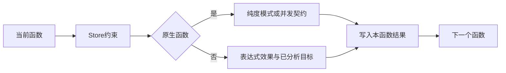

# 函数效果检查自举

## Intent：最终目标

将函数图纯度、任务调用并发安全和程序纯度判定迁入 RX＋ZX。原生函数存在性与并发契约直接来自唯一函数列存储，不构造 bool 摘要，不以原生回调代判语言规则。

## Data：可用证据

基线 dcd796ea。tasks.callSafe 与 parallel.functions/programPure 仍在 Zig 中按拓扑顺序检查函数、Store及调用。FunctionTable.external 仍持久保存 ?External 行，其内部 concurrent 字段无法作为规范 ZX 列直接借用。RX module_native 和原生引用 IR 变异夹具直接复制/修改该列，其余普通调用者通过 at 读取临时行。

## Edges：边界与限制

将 external 完整分解为原生输入形状、可空模块编号、成员、导出名、allocator/io/process/tuple/fallible/errors/concurrent 列；原 External 仅为临时构造与读取值。可空模块编号是唯一是否原生判别，其余列在非原生行须为默认值。NativeType 的递归数据仍是现有原生模型，不称其已完成自举。

保留任务并发与纯计算的差异：任务允许显式 concurrent 原生函数，纯计算拒绝全部原生函数与任务效果。所有模式拒绝 Store 访问、绑定 Store 的调用和向前函数引用。引导seed保留旧算法，正式路径使用生成模块。

## Answer：交付与成功标准

正式列存储及版本门禁迁移，完整接入三项生成检查。函数图结果由arena所有的结果对象管理，禁止为转交结果再复制bool数组。根构建、已有任务/并行/原生引用及编解码专项通过，保存生成依赖与生命周期证据，完成后提交推送。不新增测试，不运行仓库全量测试。




## 存储与生命周期复核

External 全部十一字段已拆列，可空模块编号仍区分 null 与合法模块 0；输入形状 null/匿名形状、错误集合 null/空列表、导出名 null/空字符串均原样保留。Storage 先为所有列 reserve，再分配三个描述符，最后统一追加；新增列不取得成员字符串及 NativeType.children 的独立所有权。prefix/snapshot/finish/pop 沿既有字段反射机制覆盖全部列。

IR 版本升至31，Zig生成指纹升至v36。统一库codec直接保存新列；语义缓存中的单函数Artifact/Signature仍保持临时Function/External结构，不按同名字段机械迁移。

parallel.Result拥有arena和结果slice；seed及生成路径均先完成所有分配，随后才把arena状态移入Result。scopes只初始化一次缓存并通过optional指针捕获deinit。生成输入四列视图仅在同步调用期间借用，任务/程序查询仅返回bool然后释放arena。

## 自我复核

独立只读审查未发现可行动的字段遗漏、双重判别、错误短路或arena所有权缺陷。原seed算法保持原样，正式纯度分析的非OOM异常不可达依赖前置列结构验证；该前提仍由现有validate入口及其唯一生产调用路径保证。本阶段不意味着NativeType递归数据、scopes其余规则或完整编译器已经自举。

## 结果工作区优化

初次列迁移接入根构建通过35/35步骤后，将函数结果数组由逐项追加改为按函数数一次分配。`analyze.zx` 以map构造独占bool数组，loop按索引写入，沿用通用初值所有权证明接管；调用检查显式接收已完成前缀limit，在读取目标标志前检查target小于limit。

生成的 `ir_functions.zig` 已确认为一次 `alloc(bool, count)`，首次写入使用constCast，未出现dupe(bool)或ArrayList增长。生成错误集合因此缩小为IndexOutOfBounds和OutOfMemory；已按编译诊断去除宿主对不可能Overflow错误的处理，未扩大兜底错误集合。

代码边界示例：

```zig
const values = generated.execute(&arena, &view) catch |err| switch (err) {
    error.OutOfMemory => return error.OutOfMemory,
    else => unreachable,
};

return .{ .arena = arena, .values = values };
```

该结果对象在scopes退出时统一释放，未复制生成结果。输入视图只是四个既有列的借用，不拥有另一套元数据。

## 最终验证

| 范围                                   | 结果                   |
| -------------------------------------- | ---------------------- |
| 根构建                                 | 35/35步骤              |
| 编译器包回归                           | 28/28步骤，372/372用例 |
| 任务、取消、原生引用、编解码与并行推导 | 68/68步骤，279/279用例 |
| 原生链接、库初始化器、模块生成与RX推导 | 51/51步骤，193/193用例 |

全部退出0。额外对parallel.functions和未有生产调用者的programPure进行对象编译实例化；nm确认二者实际出现在对象文件符号中。该检查只证明宿主接口及生成代码可编译，不称为新运行测试。命令、源码及对象指纹见验证结果.json，六个生成文件与四组日志已压缩归档。

未新增测试用例。现有原生引用mutator仅按新列接口迁移，原mode和断言保持。旧库版本在结构解析前通过Envelope门禁明确返回不兼容版本；旧语义缓存按IR31失效。根构建与所有相关检查之外未运行仓库全量测试。
