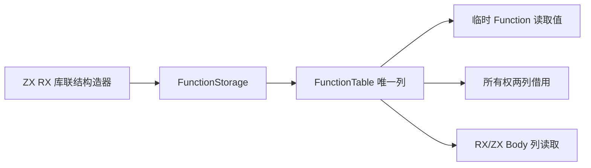

# 函数表存储迁移

## Intent：最终目标

以唯一列存储替代持久 Function 行数组，让所有权检查直接借用正式归属与可写槽位列，同时为 RX/ZX 批量读取函数 Body 提供同一数据源。

## Data：可用证据

当前 Program.functions、Project、RX Builder、链接器与库装载仍使用 Function 数组。ownership/input.zig 每次分配摘要、指针和 Store 描述符数组。Function 包含文件、输入输出类型、归属、Store 模式、Store 表、Body、合约与完整 External 元数据，不能为缩小接口而丢弃字段。

## Edges：边界与限制

Function 仅保留为构造及按值读取记录，正式表不能另存一份持久 Function 数组。Body 及 Store 的只读描述符使用稳定指针列，描述符内继续借用原 owner 的数组；前缀视图必须截取所有外层列，不重建函数行。contracts 与 external 暂保持独立原生列，明确属于尚待 RX/ZX 化的状态，不宣称整个 Function 已自举。跨 owner 的字符串、类型和编号映射仍按现有生命周期复制。

ZX 对象数组 ABI 使用指针元素，不能将连续 descriptor 数组强转为它。采用与 ZX 对象数组一致的只读描述符指针列；逐层验证指针表示与限定符、描述符尺寸/对齐/字段偏移以及枚举成员标签。只有通过真实生成 ABI 实例化，才可接正式调用。

## Answer：交付格式与成功标准

先保存并编译 schema、结构校验和列借用草稿，再迁移正式唯一存储及全部构造/读取/codec/fingerprint。所有权只借用所需两列，不生成新的持久摘要。验证现有受影响专项，不新增测试，不执行全量测试。完整 Store 编排及通用调用工作区释放仍单独验收。

## 描述符 ABI 前置验证

最初的嵌套列草稿共检查 130 个外层列，已成功生成并以 ReleaseSafe 对象实例化。但复核指出原生 ControlBody/Block 读取视图依赖稳定 ControlTable 地址；完全展开后若临时重建描述符，地址会随函数返回失效，若再持久保存一份描述符则形成额外同步状态。因此改用稳定只读描述符指针列，保留现有内部数组所有权与地址边界。

四类正式表仅按生成 ABI 的字段顺序排列声明，字段名、类型和含义不变。借用接口同时检查结构尺寸、对齐、布局类别、每个字段偏移，以及递归只读指针和枚举映射；不靠尺寸相同推断可强转。指针数组形式的真实生成入口已通过 ReleaseSafe 对象实例化，覆盖符号、表达式、控制与 Store 描述符。

正式所有权和 Body 结构检查现可直接借用原有描述符，所有权函数摘要中的 Store 描述符数组也已消除。源 Function 数组仍存在，仍需迁移成唯一 FunctionTable；本阶段不能把其剩余摘要/指针包装标为已消除，也不能声称完整函数表或完整自举完成。

## 当前阶段验证与自我复核

正式稳定描述符借用根构建 35/35 步骤通过。所有权、拥有输入、缓存所有权、Store 证明、库/缓存 codec、模块 artifact 与 RX 推断专项 123/123 步骤、606/606 用例通过；前端专项 23/23 步骤、313/313 用例通过。未新增测试、未执行全量测试。

函数表草稿保留十二个持久列，包含完整 contracts 与 external；append 为符号、表达式和 Store 创建稳定描述符，ControlTable 复用现有稳定地址。prefix 截取外层列，snapshot 只复制外层列，仍共享内层描述符和 Body；快照不能越过这些数据的 owner 生命周期。构造、finish、读取、前缀、快照及生成接口的 ReleaseSafe 对象实例化已成功，但尚未执行草稿的运行时行为、故障注入或正式全路径迁移，因此不是完整 FunctionTable 验收。

自我复核：第一版增加全部列的函数维度虽然能编译，但不满足原生视图的稳定地址需求，已改为经过实际字段偏移验证的指针列。正式路径现消除了 Body 描述符重建和每次所有权检查的 Store 描述符数组；仍有两份函数摘要包装数组，正式 Function 行数组也仍存在。它们是下一阶段的明确未完成内容，不以借用接口或草稿编译成功代替全部自举。
