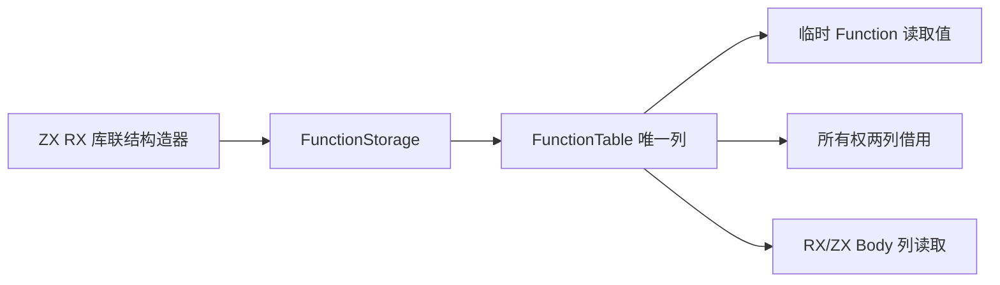
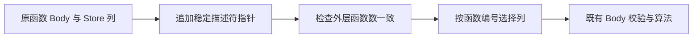

# 函数表存储迁移

## Intent：最终目标

以唯一列存储替代持久 Function 行数组，让所有权检查直接借用正式归属与可写槽位列，同时为 RX/ZX 批量读取函数 Body 提供同一数据源。

## Data：可用证据

迁移前 Program.functions、Project、RX Builder、链接器与库装载使用 Function 数组，ownership/input.zig 分配摘要与指针包装数组。正式迁移已将这些持久存储切换为同一 FunctionTable；所有权入口仅在栈上组装两列借用视图。Function 包含文件、输入输出类型、归属、Store 模式、Store 表、Body、合约与完整 External 元数据，不能为缩小接口而丢弃字段。

## Edges：边界与限制

Function 仅保留为构造及按值读取记录，正式表不能另存一份持久 Function 数组。Body 及 Store 的只读描述符使用稳定指针列，描述符内继续借用原 owner 的数组；前缀视图必须截取所有外层列，不重建函数行。contracts 与 external 暂保持独立原生列，明确属于尚待 RX/ZX 化的状态，不宣称整个 Function 已自举。跨 owner 的字符串、类型和编号映射仍按现有生命周期复制。

ZX 对象数组 ABI 使用指针元素，不能将连续 descriptor 数组强转为它。采用与 ZX 对象数组一致的只读描述符指针列；逐层验证指针表示与限定符、描述符尺寸/对齐/字段偏移以及枚举成员标签。只有通过真实生成 ABI 实例化，才可接正式调用。

## Answer：交付格式与成功标准

先保存并编译 schema、结构校验和列借用草稿，再迁移正式唯一存储及全部构造/读取/codec/fingerprint。所有权只借用所需两列，不生成新的持久摘要。验证现有受影响专项，不新增测试，不执行全量测试。完整 Store 编排及通用调用工作区释放仍单独验收。

## 描述符 ABI 前置验证

最初的嵌套列草稿共检查 130 个外层列，已成功生成并以 ReleaseSafe 对象实例化。但复核指出原生 ControlBody/Block 读取视图依赖稳定 ControlTable 地址；完全展开后若临时重建描述符，地址会随函数返回失效，若再持久保存一份描述符则形成额外同步状态。因此改用稳定只读描述符指针列，保留现有内部数组所有权与地址边界。

四类正式表仅按生成 ABI 的字段顺序排列声明，字段名、类型和含义不变。借用接口同时检查结构尺寸、对齐、布局类别、每个字段偏移，以及递归只读指针和枚举映射；不靠尺寸相同推断可强转。指针数组形式的真实生成入口已通过 ReleaseSafe 对象实例化，覆盖符号、表达式、控制与 Store 描述符。

正式所有权和 Body 结构检查现可直接借用原有描述符，所有权函数摘要中的 Store 描述符数组也已消除。源 Function 数组仍存在，仍需迁移成唯一 FunctionTable；本阶段不能把其剩余摘要/指针包装标为已消除，也不能声称完整函数表或完整自举完成。

## 描述符前置阶段验证与自我复核

正式稳定描述符借用根构建 35/35 步骤通过。所有权、拥有输入、缓存所有权、Store 证明、库/缓存 codec、模块 artifact 与 RX 推断专项 123/123 步骤、606/606 用例通过；前端专项 23/23 步骤、313/313 用例通过。未新增测试、未执行全量测试。

函数表草稿保留十二个持久列，包含完整 contracts 与 external；append 为符号、表达式和 Store 创建稳定描述符，ControlTable 复用现有稳定地址。prefix 截取外层列，snapshot 只复制外层列，仍共享内层描述符和 Body；快照不能越过这些数据的 owner 生命周期。构造、finish、读取、前缀、快照及生成接口的 ReleaseSafe 对象实例化已成功，但尚未执行草稿的运行时行为、故障注入或正式全路径迁移，因此不是完整 FunctionTable 验收。

自我复核：第一版增加全部列的函数维度虽然能编译，但不满足原生视图的稳定地址需求，已改为经过实际字段偏移验证的指针列。正式路径现消除了 Body 描述符重建和每次所有权检查的 Store 描述符数组；仍有两份函数摘要包装数组，正式 Function 行数组也仍存在。它们是下一阶段的明确未完成内容，不以借用接口或草稿编译成功代替全部自举。

## 正式基础落位阶段（接入前）

FunctionTable 与 FunctionStorage 已迁入 `packages/core/src/function_table/`，通过 `ir` 导出；草稿实例化入口改为直接引用正式 Storage，移除草稿中的重复实现。Program.functions 尚未切换，因此当前 IR 版本仍为 29，不能把基础类型的落位视为迁移已完成。

Storage 新增同步撤销末项的 pop：先按值读取函数，再释放本 Storage 创建的三个描述符，最后弹出全部十二列。ControlTable、字符串和所有内层数据仍由原 owner 持有，不在 pop 中释放。撤销只适用于尚未向存活快照公开的末项；库初始化器在去重前刚追加、尚未公开的函数符合这个边界。pop 不使已经借出的旧视图自动安全。

| 正式调用点                                             | 必须保留的语义                                                            |
| ------------------------------------------------------ | ------------------------------------------------------------------------- |
| Project.loadInput 保存 analyzed.functions              | 复制外层列快照，允许 Project 随后继续扩容；内层 owner 必须持续存活        |
| Project 最终输出                                       | 按 type_only 决定是否排除 entry，并截取所有列，不删除类型模块最后一个依赖 |
| semantic_cache/restore 返回 Program                    | 保存外层列快照，不能借用仍会扩容的 Project 列                             |
| RX module_native.merge                                 | 仅复制 external 列后重映射 module 编号，保护其他共享调用的源元数据        |
| library/initializers.source                            | 去重成功时撤销刚追加的整行，不能留下不等宽列                              |
| compiled/load 与 ArtifactNodes.function                | 保持跨 owner 深复制和编号映射，列描述符复制不能替代它                     |
| native_restore 与 native_artifact 的局部 Function 数组 | 改为 Storage 构造校验用 Program；Artifact.Signature 数组仍保留            |
| genz inline_call.prepare                               | 为改写后的 Body 保存稳定描述符，不能修改 at 返回的临时值后丢失更新        |

Artifact.Module.functions 是 Signature 数组，ArtifactNodes.functions 是编号映射，native.Member.function 是构造记录；它们不属于 Program 的持久 Function 数组。迁移不能按字段名字一律替换。

原定正式接入顺序（现已实施）：切换 Program/Analyzer/Context 的表类型与构造器，再迁移所有读取、前缀和上述变更点，随后将 ownership 的函数输入改为两列借用；在任何函数按编号读取前验证完整列宽。序列化形状实际变化时同步升级 IR 30 与生成指纹 v33，最后运行受影响专项并复核本次 diff。

基础落位时的自我复核：正式表基础与生成 ABI 对象实例化只能证明已实例化接口可编译；尚不能证明完整 Program 路径、故障分配、列快照生命周期或所有权检查已接入。完成正式迁移前不将本阶段作为完整特性提交。

正式基础类型的 ReleaseSafe 对象实例化已通过，覆盖 append、pop、重新追加、finish、snapshot、prefix、at 与生成 ABI 借用；根构建 35/35 步骤通过。未新增测试用例，未执行测试专项或全量测试。此次结果只覆盖基础落位，Program.functions 的正式切换和所有权两列接入仍未完成。

## 正式函数表接入

上述前置阶段之后，Program.functions 已切换为 FunctionTable，Project、RX Builder、库装载、库联结及模块联结统一以 FunctionStorage 构造；Function 仅作为临时构造记录与按值读取结果。表包含全部十二列，不另存旧行数组或所有权摘要。校验入口先检查所有外层列宽，再进入各函数 Body、类型和引用检查。

所有权模型现为 `Functions { ownership: Ownership[], stores: Stores[] }`。原生适配器经过布局检查后直接借用两列，在栈上保存输入描述符；原有每次检查分配的摘要与指针数组已删除。ControlTable 地址继续来自稳定 owner，不从临时 Function 返回局部地址。

Project 与缓存恢复保留外层快照。RX 原生模块归并仅复制 external 列；genz 的内联改写以新 Storage 保存完整函数，并保留未选中、Store 与 ExpansionLimit 函数的编号与字段。native_restore 临时表在深复制返回成员之后释放自己的描述符。初始化器去重调用全列 pop，不动内层共享数据。

Program 的序列化形状已改变，因此 IR 升级为 30，Zig 输入指纹升级为 v33。Artifact Signature、原生接口声明以及 FunctionId 映射继续保留各自原有形状。既有测试夹具仅适配列读取及明确的列副本修改，未新增用例、删减断言或硬编码生产特例。

静态自我复核与独立只读审查均未发现字段遗漏、失配回滚、跨 owner 浅拷贝或循环跳转目标变化。生产检索未发现遗留的持久 ir.Function 数组；fromValues 的数组参数是构造边界。该结论不表示 contracts、external、Store 编排或整个编译器已经 RX/ZX 自举。

## 正式接入验收

格式整理后的根构建 35/35 步骤通过；编译器包回归 28/28 步骤、372/372 用例通过；所有权、库与缓存 codec、模块 artifact、RX 推断专项 123/123 步骤、606/606 用例通过；原生引用 IR、typed try 库、native link、库初始化器与模块生成边界专项 65/65 步骤、86/86 用例通过。未新增测试，未执行仓库全量测试。

具体命令、日志和本次源码 SHA256 记录在 `函数表接入结果.json`。正式源码经过仓库格式化及 diff 复核，草稿不再重复持有 FunctionTable/Storage 实现。

本特性完成的是唯一持久函数表与所有权两列直接借用；不把已有测试通过外推为整个编译器自举完成，也不把 owner 内的外层快照误称为跨 owner 零复制。

## 后续原生函数列细化

[函数效果检查自举](../函数效果检查自举/实施计划.md)在IR31中以十一项原生属性列替换原external行列，函数表由十二列变为二十二列；可空模块编号为唯一原生判别。原有生命周期、前缀与快照规则继续适用，本文件已有IR30证据保持历史原貌。
