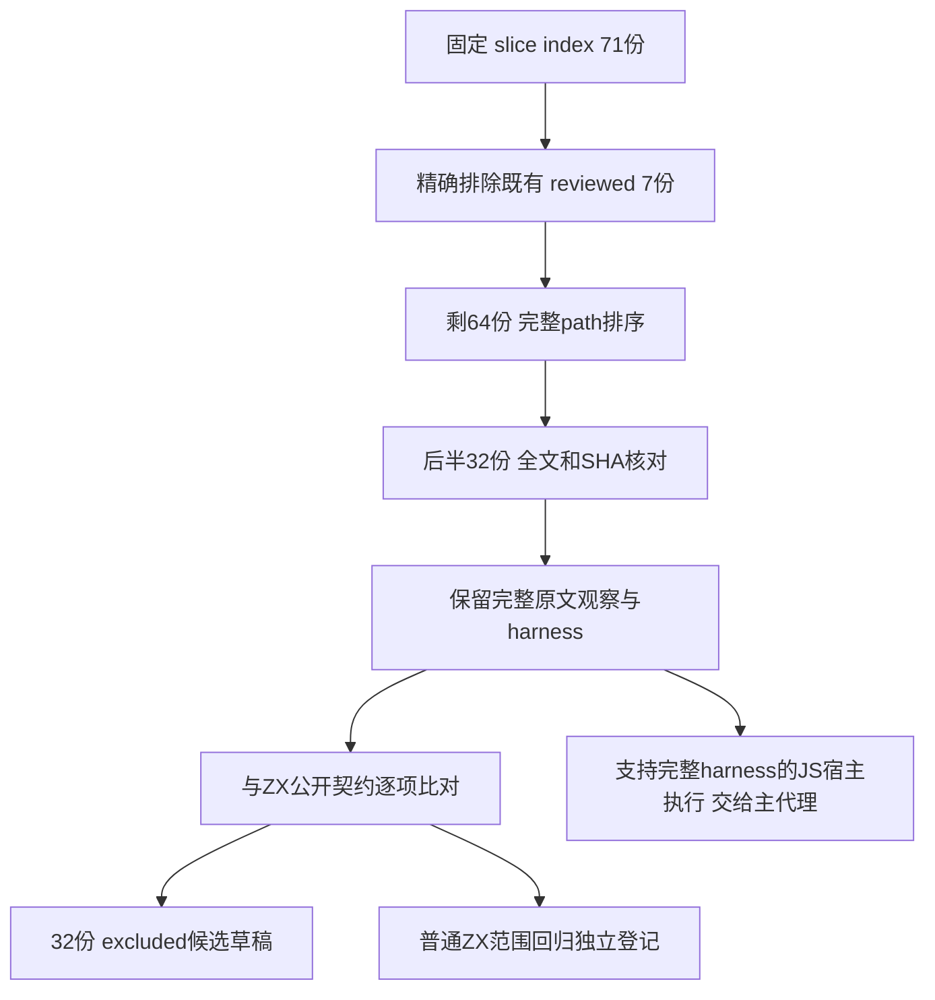

# Array.prototype.slice 后半原文审阅

## Intent：最终目标

按固定 family 与既有 reviewed 集合，完整读取尚未审阅排序后半 32 份原文，记录完整关键观察、原 SHA、harness 和明确契约差异。交付分析草稿供主代理登记或执行；本文件不将删减后的局部值观察登记为 adapted。

## Data：可用证据

- 仓库阅读固定 SHA：`dc8d800b22c683c9ae1214bcd6b1717cdbbb8efb`，正式源码均以该 SHA 的 `git show` 阅读。并发创建的前半分析只用于确认交接边界。
- Test262 原文根：`/tmp/zxc-test262-reference/test262-7ab7fafa0003f73fc85c1b95d88094d33f7eb8bd`；固定 upstream commit：`7ab7fafa0003f73fc85c1b95d88094d33f7eb8bd`。
- 固定索引：[built-ins.jsonl](/Users/xiewendao/Documents/MatrixAges/zxc/packages/test/upstream/index/built-ins.jsonl:1)；元数据：[built-ins.jsonl](/Users/xiewendao/Documents/MatrixAges/zxc/packages/test/upstream/metadata/built-ins.jsonl:1)。
- family 是 path 精确前缀 `test/built-ins/Array/prototype/slice/`，71 份；扫描全部正式 review JSONL 后精确命中 7 份，均 excluded。
- 排除这 7 个完整 path 后剩 64 份，按完整 path ASCII 升序，取 `remaining[32:64]`。首份为 `S15.4.4.10_A3_T2.js`，末份为 `target-array-with-non-writable-property.js`。
- 本次 32 份全部全文读取，共 37,880 bytes、1,304 行；实际 SHA-256 32/32 与固定索引相同。全文阅读结论与按 filename/description 推断不同。
- 正式 reviewed 所在：[slice_result_reflection.jsonl](/Users/xiewendao/Documents/MatrixAges/zxc/packages/test/upstream/reviews/built_ins/array/slice_result_reflection.jsonl:1)。这些 7 份包含列表内容、长度、越界 undefined 与 getClass/Object.prototype.toString 的完整原文观察，不能将反射部分移除后计为 adapted。

| 既有原文              | 正式状态 | 固定原 SHA-256                                                     |
| --------------------- | -------- | ------------------------------------------------------------------ |
| S15.4.4.10_A1.1_T1.js | excluded | `ddb811c75fe85f8aa368c206d896dfa584421a9f1f4626a576cdb48a374a7a6a` |
| S15.4.4.10_A1.1_T2.js | excluded | `b8cb23f0e1fe8d5f8e3f17c8e86948aec928ae8ab9793f5254a84d3972df518b` |
| S15.4.4.10_A1.1_T3.js | excluded | `b92a1ddffd15405a50e2be0d7de12cafbbafc1ea692bfaef12e3ef19d1675e2d` |
| S15.4.4.10_A1.1_T4.js | excluded | `5631de8ec1efe60e865aa588778f9dcd810ee348031221f76f9b6ecc3b809eda` |
| S15.4.4.10_A1.1_T5.js | excluded | `58e59ecaf1da5e2d3f3474dfa9af3fc9b00906b2a2bec98edd2160d31e5e9cba` |
| S15.4.4.10_A1.1_T6.js | excluded | `adb55d6169d520a98c8d6adf827f0513f24924bed639becfe5f6f8f06e96c366` |
| S15.4.4.10_A1.1_T7.js | excluded | `afa63a034c138fa8e9f693e2add41044f095b46f571d3c85dfd9814efe93d3a3` |

### ZX 公开契约与既有范围/clone 覆盖

[设计文档:255](/Users/xiewendao/Documents/MatrixAges/zxc/docs/zx_design_doc.md:255) 约定列表不可直接改写，消费操作使旧绑定失效，结果为 `[新所有者,业务值]`；[splice:269](/Users/xiewendao/Documents/MatrixAges/zxc/docs/zx_design_doc.md:269) 明确范围越界失败。[对象运行时排除:741](/Users/xiewendao/Documents/MatrixAges/zxc/docs/zx_design_doc.md:741) 明确排除 this/new/原型、getter/setter 成员、反射和动态属性。这些是本次对象协议差异的公开依据。

[IR ListOperation:21](/Users/xiewendao/Documents/MatrixAges/zxc/packages/core/src/ir.zig:21) 只有 push/pop/sort/reverse/splice/concat，没有公开 slice。分析器 [list_operations:18](/Users/xiewendao/Documents/MatrixAges/zxc/packages/compiler/src/zx/analysis/list_operations.zig:18) 要求 splice 恰好三个参数，[32](/Users/xiewendao/Documents/MatrixAges/zxc/packages/compiler/src/zx/analysis/list_operations.zig:32) 将 start/count 约束为 u64、replacement 为同类型列表，[45](/Users/xiewendao/Documents/MatrixAges/zxc/packages/compiler/src/zx/analysis/list_operations.zig:45) 产生 owner 与业务列表组成的 tuple。JS slice 的 start/end、相对负索引、coercion 和夹取都不是该接口的协议。

生成器 [collections:84](/Users/xiewendao/Documents/MatrixAges/zxc/packages/genz/src/zx/collections.zig:84) 在分配与整数转换前检查 `start > length || count > length - start`，失败为 IndexOutOfBounds；随后复制前缀、replacement 和后缀得到新 owner，并以 source 的选定范围作为 removed 返回。生成器内部 Zig slice helper 不是公开 ZX slice 方法；源列表内存没有在该路径被改写。JS RangeError/TypeError 不能替换成这个错误以宣称同一原文适配成功。

旧设计文档 [271](/Users/xiewendao/Documents/MatrixAges/zxc/docs/zx_design_doc.md:271) 尚写 clone 显式取得所有权；当前 [calls:72](/Users/xiewendao/Documents/MatrixAges/zxc/packages/compiler/src/zx/analysis/calls.zig:72) 实际拒绝 clone 并报告 unsupported。成熟 [consumption_test:68](/Users/xiewendao/Documents/MatrixAges/zxc/packages/compiler/tests/ownership/consumption_test.zig:68) 和 [deep_copy/rejected.jsonl](/Users/xiewendao/Documents/MatrixAges/zxc/packages/test/tests/ownership/deep_copy/rejected.jsonl:1) 的 8 条正式负例覆盖 scalar/string/object/tuple/list/nested_list/local_owner/带参数。这里记录文档陈旧差异，不修订文档或把 clone 当可调用入口。

既有 [splice/owned/3/i64.zx:7](/Users/xiewendao/Documents/MatrixAges/zxc/packages/test/tests/built_ins/list/splice/owned/3/i64.zx:7) 用输入的固定三项构造 owner，再 splice；同职责 0..5 目录共有 8,575 条 JSONL（9、60、350、1485、6561、110）。它们包含 start==length/count==0、start>length/count==0、count 超剩余和 u64 最大值越界。splice_reverse 的 owner 长度 0/1/3/4 有 164 条（9、20、55、80），覆盖反转后的拼接/移除组合。这些数字仅来自已提交文件的静态行数，未执行。固定长度标量重建不证明任意动态输入、复合元素和旧输入同时留存；后续 ZX 独立回归应继续使用真实合法接口和独立值 oracle，不挪作这 32 份上游完整适配计数。

## Edges：边界与限制

本后半 32 份都存在完整原文无法在 ZX 现有公开合同内表达的观察，因此完整可适配数为 0、excluded 候选 32。原因是原文的真实动态对象协议和已声明语言差异，而不是只因为缺少同名方法。完整 RAB/realm 原文可由相应 JavaScript host 执行，执行结果不能自动作为 ZX 测试通过证据。

32 份均没有显式 flags，也没有 negative 元数据。原文普通 script 执行应保留 Test262 默认非严格/严格模式安排，并加载固定原版 assert.js/sta.js 与显式 includes；不把 includes=[] 误读成无需 harness。assert.sameValue 保留对象身份和 -0/+0；assert.throws 要求规定异常 constructor。propertyHelper 的 verifyProperty 同时检查自有 descriptor 和真实可写、可枚举、可配置行为，可能写入/删除属性；应逐例隔离 realm，不能删去 helper 或只比 descriptor JSON。

原版 compareArray.js 只有弃用说明，实际 assert.compareArray 在 assert.js 中实现：比较 length 与每个索引的 SameValue。resizableArrayBufferUtils 的 ToNumbers 同样按 length 逐索引读取，因此原文 undefined 的比较不另外证明结果稀疏槽位是否为自有属性。

两份 cross-realm 文件明确依赖 `$262.createRealm().global` 及不同 realm intrinsic 身份。三份 RAB 文件依赖 resize/maxByteLength、固定长度与 length-tracking TypedArray view，以及 helper 的全 ctors 集合：基础整数/浮点/Uint8Clamped、能力存在时的 Float16 与 BigInt 视图，还有 MyUint8Array/MyFloat32Array/MyBigInt64Array 子类。MayNeedBigInt 写入、ToNumbers 归一化与 BYTES_PER_ELEMENT 必须保留。不能缩减为一个 u64 列表，也不能以不支持 host 功能冒充成功。

`length-exceeding-integer-limit-proxied-array.js` 元数据只声明 exponentiation，但正文还用 Proxy 和 Reflect.get；执行器不能只按 features 列忽略正文所需能力。`A3_T3` 的 info/错误字符串有旧说明，实际 length=-1 是判断依据。`create-revoked-proxy` 的 receiver 被 revoke，不能只依元数据写成构造器被 revoke。`target-array-with-non-writable-property` 的 configurable=true 决定成功改写，不能按文件名假定抛错。

本轮未执行 JavaScript 原文、ZX 测试或门禁，未修改正式 reviews/tests/source，未提交。独立 ZX 范围值测试与正式上游登记必须各自保留统计及证据。以下均为全文审阅判断，非实际运行结果。

## Answer：逐文件交付与成功标准

逐文件记录必须同时保留完整关键设置、调用、断言、includes/flags/features 和原 SHA；JSON 的 `proposed_review_status` 是草稿建议，`formal_review_written=false` 与 `original_execution=not_run` 防止混淆正式覆盖。[后半审阅数据.json](/Users/xiewendao/Documents/MatrixAges/zxc/docs/2026-10-07/列表范围提取与上游审阅/后半审阅数据.json) 是机器可读同源记录。

### 1. S15.4.4.10_A3_T2.js

- 原文：[test/built-ins/Array/prototype/slice/S15.4.4.10_A3_T2.js](/tmp/zxc-test262-reference/test262-7ab7fafa0003f73fc85c1b95d88094d33f7eb8bd/test/built-ins/Array/prototype/slice/S15.4.4.10_A3_T2.js:1)，完整读取 1–17 行，共 449 bytes。
- 原 SHA-256：`9f13d5279743d762c4d5b76b952f41911c68b95e6df457708fca70e015865456`，实际 bytes 与固定索引一致。
- Harness：includes=[]；flags=[]（正文未声明 flags）；features=[]。
- 完整关键观察：obj={}，挂载 Array.prototype.slice；设置 obj[0]='x'、obj[4294967296]='y'、length=4294967297；slice(0,4294967297) 必须抛 RangeError。
- 判断：excluded 候选草稿，整份完整适配不可行。动态 array-like 的虚拟 length 与 Array 创建长度上限；不是实际 dense ZX 列表的严格范围错误。

### 2. S15.4.4.10_A3_T3.js

- 原文：[test/built-ins/Array/prototype/slice/S15.4.4.10_A3_T3.js](/tmp/zxc-test262-reference/test262-7ab7fafa0003f73fc85c1b95d88094d33f7eb8bd/test/built-ins/Array/prototype/slice/S15.4.4.10_A3_T3.js:1)，完整读取 1–22 行，共 878 bytes。
- 原 SHA-256：`6c9ad42bd5887b030c1685d3bdd6fbf3bd8c7ed3424707e6abc1643b4527cda0`，实际 bytes 与固定索引一致。
- Harness：includes=[]；flags=[]（正文未声明 flags）；features=[]。
- 完整关键观察：obj[4294967294]='x'、实际 length=-1；slice(4294967294,4294967295) 结果 length=0，arr[0]===undefined。
- 判断：excluded 候选草稿，整份完整适配不可行。负动态 length 的 ToLength 归零与 JS 越界 undefined。info 中 ToUint32、诊断字符串 4294967295 不能覆盖可执行的 length=-1。

### 3. S15.4.4.10_A4_T1.js

- 原文：[test/built-ins/Array/prototype/slice/S15.4.4.10_A4_T1.js](/tmp/zxc-test262-reference/test262-7ab7fafa0003f73fc85c1b95d88094d33f7eb8bd/test/built-ins/Array/prototype/slice/S15.4.4.10_A4_T1.js:1)，完整读取 1–25 行，共 896 bytes。
- 原 SHA-256：`8597e1b3183a5046f4be4ac5de238aeaea3d87c56ec8a300fc41e3d42b10bf00`，实际 bytes 与固定索引一致。
- Harness：includes=[]；flags=[]（正文未声明 flags）；features=[]。
- 完整关键观察：Array.prototype[1]=1；x=[0] 后 length=2；slice() 的 arr[0]=0、arr[1]=1，而且 arr.hasOwnProperty('1')===true。
- 判断：excluded 候选草稿，整份完整适配不可行。继承的稀疏索引必须复制为结果自有属性；不能仅将预填 [0,1] 的值输出算适配。

### 4. call-with-boolean.js

- 原文：[test/built-ins/Array/prototype/slice/call-with-boolean.js](/tmp/zxc-test262-reference/test262-7ab7fafa0003f73fc85c1b95d88094d33f7eb8bd/test/built-ins/Array/prototype/slice/call-with-boolean.js:1)，完整读取 1–11 行，共 489 bytes。
- 原 SHA-256：`0e58b58104670eb8ca4b310643199032a0dda70014f2eac8337379a0dd277200`，实际 bytes 与固定索引一致。
- Harness：includes=["compareArray.js"]；flags=[]（正文未声明 flags）；features=[]。
- 完整关键观察：Array.prototype.slice.call(true) 与 .call(false) 均 assert.compareArray 为 []。
- 判断：excluded 候选草稿，整份完整适配不可行。泛型 this 接收 boolean 原始值并执行对象化/长度读取；ZX 操作只接受静态列表。

### 5. coerced-start-end-grow.js

- 原文：[test/built-ins/Array/prototype/slice/coerced-start-end-grow.js](/tmp/zxc-test262-reference/test262-7ab7fafa0003f73fc85c1b95d88094d33f7eb8bd/test/built-ins/Array/prototype/slice/coerced-start-end-grow.js:1)，完整读取 1–56 行，共 1716 bytes。
- 原 SHA-256：`f3bd2154fe4107e12f3f548ef22ffe2dbbad10cfff82fe38a461c813d75fa60d`，实际 bytes 与固定索引一致。
- Harness：includes=["compareArray.js","resizableArrayBufferUtils.js"]；flags=[]（正文未声明 flags）；features=["resizable-arraybuffer"]。
- 完整关键观察：每个 ctors 元素均创建长度4、最大8元素的 RAB，length-tracking view 写入1..4。start.valueOf 扩至6后返回0，首次结果仍 [1,2,3,4]，byteLength=6*BYTES_PER_ELEMENT。第二独立循环 end.valueOf 扩至6后返回5：同一 view 先 slice(4,evil) 为 []，再 slice(3,evil) 为 [4,0]；最终 byteLength=6*BPE。
- 判断：excluded 候选草稿，整份完整适配不可行。动态参数 coercion 改变底层 TypedArray 长度，slice 必须捕获调用前长度；两个 end 调用共享已扩容状态，不能拆为互不相干的值用例。
- 额外原文执行要求：ArrayBuffer.prototype.resize；fixed/length-tracking TypedArray views；resizableArrayBufferUtils.js 完整 ctors 矩阵。

### 6. coerced-start-end-shrink.js

- 原文：[test/built-ins/Array/prototype/slice/coerced-start-end-shrink.js](/tmp/zxc-test262-reference/test262-7ab7fafa0003f73fc85c1b95d88094d33f7eb8bd/test/built-ins/Array/prototype/slice/coerced-start-end-shrink.js:1)，完整读取 1–95 行，共 2965 bytes。
- 原 SHA-256：`bdf91a1f0517fa8c92e6de49add9d23392181b188e8209752756b946708f85ac`，实际 bytes 与固定索引一致。
- Harness：includes=["compareArray.js","resizableArrayBufferUtils.js"]；flags=[]（正文未声明 flags）；features=["resizable-arraybuffer"]。
- 完整关键观察：四个独立 ctor 循环均初始4、最大8并 shrink 到2。固定长4/start coercion return0：首次 ToNumbers 结果 [undefined,undefined,undefined,undefined]，再调用 []。tracking 写1..4/start return0：首次 [1,2,undefined,undefined]，再 [1,2]。固定长4/end return3、start2：首次 [undefined]，再 []。tracking 写1..4/end return3、start1：首次 [2,undefined]，再 [2]。每组 byteLength=2*BPE。
- 判断：excluded 候选草稿，整份完整适配不可行。越界固定 view 与 tracking view 的长度/索引行为不同，原文经 ToNumbers 按长度读索引观察 undefined；不额外断言 holes 的 own-property 身份，不把静态 ZX bounds 错误替代。
- 额外原文执行要求：ArrayBuffer.prototype.resize；fixed/length-tracking TypedArray views；resizableArrayBufferUtils.js 完整 ctors 矩阵。

### 7. create-ctor-non-object.js

- 原文：[test/built-ins/Array/prototype/slice/create-ctor-non-object.js](/tmp/zxc-test262-reference/test262-7ab7fafa0003f73fc85c1b95d88094d33f7eb8bd/test/built-ins/Array/prototype/slice/create-ctor-non-object.js:1)，完整读取 1–43 行，共 934 bytes。
- 原 SHA-256：`f34e0f46126c8cdddf2dea8b3b0c8e2411b5e69000ad0eee58aaa7d5c2e92590`，实际 bytes 与固定索引一致。
- Harness：includes=[]；flags=[]（正文未声明 flags）；features=[]。
- 完整关键观察：分别重新创建 [] 并把 constructor 设为 null、1、'string'、true；四次 slice() 均抛 TypeError。
- 判断：excluded 候选草稿，整份完整适配不可行。动态 Array constructor 协议与运行期 TypeError；静态 ZX 类型拒绝不能等价替代四次异常。

### 8. create-ctor-poisoned.js

- 原文：[test/built-ins/Array/prototype/slice/create-ctor-poisoned.js](/tmp/zxc-test262-reference/test262-7ab7fafa0003f73fc85c1b95d88094d33f7eb8bd/test/built-ins/Array/prototype/slice/create-ctor-poisoned.js:1)，完整读取 1–27 行，共 593 bytes。
- 原 SHA-256：`1bce1ba36887cc88f76dbca418df301a2a02395b805e7be5a53ed4c3b48470af`，实际 bytes 与固定索引一致。
- Harness：includes=[]；flags=[]（正文未声明 flags）；features=[]。
- 完整关键观察：[] 的 constructor getter 抛 Test262Error；slice() 必须传播该构造类型的异常。
- 判断：excluded 候选草稿，整份完整适配不可行。constructor 读取与 abrupt completion；值范围结果不能涵盖 getter 调用。

### 9. create-non-array-invalid-len.js

- 原文：[test/built-ins/Array/prototype/slice/create-non-array-invalid-len.js](/tmp/zxc-test262-reference/test262-7ab7fafa0003f73fc85c1b95d88094d33f7eb8bd/test/built-ins/Array/prototype/slice/create-non-array-invalid-len.js:1)，完整读取 1–42 行，共 940 bytes。
- 原 SHA-256：`f882459d9379ad5f45fa8564c3d3b4dfd7088562638f3af27858e074b6adaf42`，实际 bytes 与固定索引一致。
- Harness：includes=[]；flags=[]（正文未声明 flags）；features=[]。
- 完整关键观察：非 Array obj 的 length getter 返回2^32，setter 每次调用递增 callCount；generic slice.call(obj) 抛 RangeError，callCount===0。
- 判断：excluded 候选草稿，整份完整适配不可行。创建 Array 失败的错误优先序及禁止写回 receiver length；不能拿 OOM/IndexOutOfBounds 代替 RangeError。

### 10. create-non-array.js

- 原文：[test/built-ins/Array/prototype/slice/create-non-array.js](/tmp/zxc-test262-reference/test262-7ab7fafa0003f73fc85c1b95d88094d33f7eb8bd/test/built-ins/Array/prototype/slice/create-non-array.js:1)，完整读取 1–33 行，共 863 bytes。
- 原 SHA-256：`d24cdf6f49ed61c85b9af7783006dd4c5d89c77176a4d8887757d4a22df6448c`，实际 bytes 与固定索引一致。
- Harness：includes=[]；flags=[]（正文未声明 flags）；features=[]。
- 完整关键观察：非 Array obj.length=0，constructor getter 递增 callCount；slice.call(obj) 后 callCount=0、结果原型为当前 Array.prototype、Array.isArray(result)===true。
- 判断：excluded 候选草稿，整份完整适配不可行。必须忽略非 Array 的 constructor，并产生 Array exotic object；静态列表和值相等缺两个反射观察。

### 11. create-proto-from-ctor-realm-array.js

- 原文：[test/built-ins/Array/prototype/slice/create-proto-from-ctor-realm-array.js](/tmp/zxc-test262-reference/test262-7ab7fafa0003f73fc85c1b95d88094d33f7eb8bd/test/built-ins/Array/prototype/slice/create-proto-from-ctor-realm-array.js:1)，完整读取 1–43 行，共 1297 bytes。
- 原 SHA-256：`4e5ea5e76d5e2a5851bd1071f064b7db52cdc317f73213763e2f420d7d58e7db`，实际 bytes 与固定索引一致。
- Harness：includes=[]；flags=[]（正文未声明 flags）；features=["cross-realm","Symbol.species"]。
- 完整关键观察：$262.createRealm().global.Array 作 array.constructor；当前 Array 与 foreign Array 的 Symbol.species 均配置计数 getter；slice() 结果原型为当前 Array.prototype，两 getter 计数均0。
- 判断：excluded 候选草稿，整份完整适配不可行。foreign intrinsic Array 特例、realm 身份及避免 species getter 读取；必须有真正独立 realm host。
- 额外原文执行要求：$262.createRealm；独立 realm intrinsic identity。

### 12. create-proto-from-ctor-realm-non-array.js

- 原文：[test/built-ins/Array/prototype/slice/create-proto-from-ctor-realm-non-array.js](/tmp/zxc-test262-reference/test262-7ab7fafa0003f73fc85c1b95d88094d33f7eb8bd/test/built-ins/Array/prototype/slice/create-proto-from-ctor-realm-non-array.js:1)，完整读取 1–44 行，共 1320 bytes。
- 原 SHA-256：`de70a434d6d2815d3289996c936cdb19f15079555be5ab75ef2582b41413495a`，实际 bytes 与固定索引一致。
- Harness：includes=[]；flags=[]（正文未声明 flags）；features=["cross-realm","Symbol.species"]。
- 完整关键观察：foreign realm Object 作 array.constructor，其 Symbol.species 为 CustomCtor；当前 Array Symbol.species 配计数 getter；slice() 结果原型为 CustomCtor.prototype，当前 Array species getter 计数0。
- 判断：excluded 候选草稿，整份完整适配不可行。foreign 非 Array constructor 不被 Array intrinsic 特例忽略；不能把两份 realm 原文合并为同一个默认构造预期。
- 额外原文执行要求：$262.createRealm；独立 realm intrinsic identity。

### 13. create-proxied-array-invalid-len.js

- 原文：[test/built-ins/Array/prototype/slice/create-proxied-array-invalid-len.js](/tmp/zxc-test262-reference/test262-7ab7fafa0003f73fc85c1b95d88094d33f7eb8bd/test/built-ins/Array/prototype/slice/create-proxied-array-invalid-len.js:1)，完整读取 1–52 行，共 1151 bytes。
- 原 SHA-256：`c52406c83691de6bb1b87680515f66d4c50b8bcbc62f5b7becc1ba84e40eafd9`，实际 bytes 与固定索引一致。
- Harness：includes=[]；flags=[]（正文未声明 flags）；features=["Proxy"]。
- 完整关键观察：Proxy 包装真实 []，get('length') 返回2^32，其余字段转发；set trap 递增 setCallCount；generic slice 抛 RangeError，setCallCount===0。
- 判断：excluded 候选草稿，整份完整适配不可行。Proxy 可报告虚拟长度，Array 创建失败前不得发生 receiver setter；真实列表长度与静态错误都不能模拟。

### 14. create-proxy.js

- 原文：[test/built-ins/Array/prototype/slice/create-proxy.js](/tmp/zxc-test262-reference/test262-7ab7fafa0003f73fc85c1b95d88094d33f7eb8bd/test/built-ins/Array/prototype/slice/create-proxy.js:1)，完整读取 1–39 行，共 1101 bytes。
- 原 SHA-256：`05a073e5de628a11e934bea96ff0a8624d617a15f5816f4c8d6d93b96a93e4c3`，实际 bytes 与固定索引一致。
- Harness：includes=[]；flags=[]（正文未声明 flags）；features=["Proxy","Symbol.species"]。
- 完整关键观察：array.constructor 的 Symbol.species 为 Ctor；两层 Proxy 嵌套包装该 array；generic slice.call(proxy) 结果 Object.getPrototypeOf(result)===Ctor.prototype。
- 判断：excluded 候选草稿，整份完整适配不可行。IsArray 穿透嵌套 Proxy 后仍必须走 species；普通结构对象与列表没有 Proxy/原型。

### 15. create-revoked-proxy.js

- 原文：[test/built-ins/Array/prototype/slice/create-revoked-proxy.js](/tmp/zxc-test262-reference/test262-7ab7fafa0003f73fc85c1b95d88094d33f7eb8bd/test/built-ins/Array/prototype/slice/create-revoked-proxy.js:1)，完整读取 1–39 行，共 963 bytes。
- 原 SHA-256：`eafd8af98ec830166dc00a9b40522ef6cd8ac033fcdda5aae263e5bad3324237`，实际 bytes 与固定索引一致。
- Harness：includes=[]；flags=[]（正文未声明 flags）；features=["Proxy"]。
- 完整关键观察：Proxy.revocable([], {}) 的 proxy 上定义 constructor 计数 getter，随后 revoke；slice.call(o.proxy) 抛 TypeError，constructor getter 调用0次。
- 判断：excluded 候选草稿，整份完整适配不可行。可执行 receiver 是已 revoke 的 Proxy；元数据描述的 constructor 不能误读为另一个 fixture。需保存异常与读取顺序两观察。

### 16. create-species-abrupt.js

- 原文：[test/built-ins/Array/prototype/slice/create-species-abrupt.js](/tmp/zxc-test262-reference/test262-7ab7fafa0003f73fc85c1b95d88094d33f7eb8bd/test/built-ins/Array/prototype/slice/create-species-abrupt.js:1)，完整读取 1–33 行，共 811 bytes。
- 原 SHA-256：`3778768618ca5d631a744b13542237454523ccc3c83ab56d342b7aeea9e09faf`，实际 bytes 与固定索引一致。
- Harness：includes=[]；flags=[]（正文未声明 flags）；features=["Symbol.species"]。
- 完整关键观察：array.constructor={}，Symbol.species 指向会抛 Test262Error 的 Ctor；slice() 传播 Test262Error。
- 判断：excluded 候选草稿，整份完整适配不可行。species 构造本体执行失败；不同于 getter 失败，二者完整观察不能删并成静态错误。

### 17. create-species-neg-zero.js

- 原文：[test/built-ins/Array/prototype/slice/create-species-neg-zero.js](/tmp/zxc-test262-reference/test262-7ab7fafa0003f73fc85c1b95d88094d33f7eb8bd/test/built-ins/Array/prototype/slice/create-species-neg-zero.js:1)，完整读取 1–45 行，共 1294 bytes。
- 原 SHA-256：`4225a0510e01e2f03cca540e51603550c0bdf3c25e17c9a19cd5732ab1c423fb`，实际 bytes 与固定索引一致。
- Harness：includes=[]；flags=[]（正文未声明 flags）；features=["Symbol.species"]。
- 完整关键观察：空 array 的自定义 species Ctor 记录 arguments；slice(0,-0) 后构造参数个数1且 args[0] SameValue 为 +0。
- 判断：excluded 候选草稿，整份完整适配不可行。SameValue 区分 -0/+0，以及实际构造参数观察；仅检查空列表不能证明。

### 18. create-species-non-ctor.js

- 原文：[test/built-ins/Array/prototype/slice/create-species-non-ctor.js](/tmp/zxc-test262-reference/test262-7ab7fafa0003f73fc85c1b95d88094d33f7eb8bd/test/built-ins/Array/prototype/slice/create-species-non-ctor.js:1)，完整读取 1–39 行，共 1010 bytes。
- 原 SHA-256：`b80794bed1be234ed767605d7bc74277974df4d25ed07da032ab1b6f602b0023`，实际 bytes 与固定索引一致。
- Harness：includes=["isConstructor.js"]；flags=[]（正文未声明 flags）；features=["Symbol.species","Reflect.construct"]。
- 完整关键观察：isConstructor(parseInt)===false 是实际前置断言；把 parseInt 放到 array.constructor[Symbol.species]；slice() 抛 TypeError。
- 判断：excluded 候选草稿，整份完整适配不可行。可调用但不可构造的函数资格；必须保留 Reflect.construct helper 前置断言。

### 19. create-species-null.js

- 原文：[test/built-ins/Array/prototype/slice/create-species-null.js](/tmp/zxc-test262-reference/test262-7ab7fafa0003f73fc85c1b95d88094d33f7eb8bd/test/built-ins/Array/prototype/slice/create-species-null.js:1)，完整读取 1–33 行，共 896 bytes。
- 原 SHA-256：`8ba3f6255c6f113f985a569b5b92bbf676fd7ebeb8e065ffb9ec2d31c50cda50`，实际 bytes 与固定索引一致。
- Harness：includes=[]；flags=[]（正文未声明 flags）；features=["Symbol.species"]。
- 完整关键观察：array.constructor={}，species=null；slice() 结果原型 Array.prototype 且 Array.isArray(result)===true。
- 判断：excluded 候选草稿，整份完整适配不可行。null species 回退 Array exotic object；类型等价与空值输出无法替代动态反射。

### 20. create-species-poisoned.js

- 原文：[test/built-ins/Array/prototype/slice/create-species-poisoned.js](/tmp/zxc-test262-reference/test262-7ab7fafa0003f73fc85c1b95d88094d33f7eb8bd/test/built-ins/Array/prototype/slice/create-species-poisoned.js:1)，完整读取 1–32 行，共 735 bytes。
- 原 SHA-256：`c3d11ed56329617057c6ca72cddd419ac80915fba65f13443dca3f3f366860a1`，实际 bytes 与固定索引一致。
- Harness：includes=[]；flags=[]（正文未声明 flags）；features=["Symbol.species"]。
- 完整关键观察：array.constructor={}，Symbol.species getter 抛 Test262Error；slice() 传播 Test262Error。
- 判断：excluded 候选草稿，整份完整适配不可行。species getter 读取失败；须与 Ctor 本体抛出、constructor getter 抛出区分。

### 21. create-species-undef.js

- 原文：[test/built-ins/Array/prototype/slice/create-species-undef.js](/tmp/zxc-test262-reference/test262-7ab7fafa0003f73fc85c1b95d88094d33f7eb8bd/test/built-ins/Array/prototype/slice/create-species-undef.js:1)，完整读取 1–34 行，共 930 bytes。
- 原 SHA-256：`9c6a9c32aa41e458b48253a2f6923d2c6a03e87917329667689f4953fd411b0c`，实际 bytes 与固定索引一致。
- Harness：includes=[]；flags=[]（正文未声明 flags）；features=["Symbol.species"]。
- 完整关键观察：array.constructor={}，species=undefined；slice() 结果原型 Array.prototype 且 Array.isArray(result)===true。
- 判断：excluded 候选草稿，整份完整适配不可行。undefined species 默认 Array 创建；不能删除 Array exotic/原型断言。

### 22. create-species.js

- 原文：[test/built-ins/Array/prototype/slice/create-species.js](/tmp/zxc-test262-reference/test262-7ab7fafa0003f73fc85c1b95d88094d33f7eb8bd/test/built-ins/Array/prototype/slice/create-species.js:1)，完整读取 1–43 行，共 1194 bytes。
- 原 SHA-256：`9779098d47c88dd998280d18995e644cf09b6e4c73eeaaeacdea64ecbb001290`，实际 bytes 与固定索引一致。
- Harness：includes=[]；flags=[]（正文未声明 flags）；features=["Symbol.species"]。
- 完整关键观察：a=[1,2,3,4,5]，species Ctor 计数并记录 this 与 arguments，显式返回外部 instance=[]；slice(1,-1) 后 count1、this 原型 Ctor.prototype、参数个数1、args[0]=3、result===instance。
- 判断：excluded 候选草稿，整份完整适配不可行。完整五项 observation 包括 result 与 Ctor 返回对象身份，原文没有独立断言 [2,3,4] 内容；不能凭值型列表补替它。

### 23. length-exceeding-integer-limit-proxied-array.js

- 原文：[test/built-ins/Array/prototype/slice/length-exceeding-integer-limit-proxied-array.js](/tmp/zxc-test262-reference/test262-7ab7fafa0003f73fc85c1b95d88094d33f7eb8bd/test/built-ins/Array/prototype/slice/length-exceeding-integer-limit-proxied-array.js:1)，完整读取 1–57 行，共 2321 bytes。
- 原 SHA-256：`475e0b135b8a218fff681ab62bfd29d02d22629ff7c53f3e915fc5f30d6ab950`，实际 bytes 与固定索引一致。
- Harness：includes=["compareArray.js"]；flags=[]（正文未声明 flags）；features=["exponentiation"]。
- 完整关键观察：真实 array 以字符串键存放 9007199254740988..991 对应字符串；Proxy get('length') 返回2**53+2，其他 Reflect.get。按原文五次 slice：start989 => ['989','990']；start989/end990 => ['989']；start989/end996 => ['989','990']；start-2 => ['989','990']；start-2/end-1 => ['989']。这里 '989'/'990' 分别是完整字符串 '9007199254740989'/'9007199254740990'。
- 判断：excluded 候选草稿，整份完整适配不可行。ToLength 夹到2^53-1、虚拟稀疏键和负索引归一化。features 仅 exponentiation，正文另有 Proxy/Reflect.get，执行需求须单独补记而不改原元数据。
- 额外原文执行要求：Proxy；Reflect.get。

### 24. length-exceeding-integer-limit.js

- 原文：[test/built-ins/Array/prototype/slice/length-exceeding-integer-limit.js](/tmp/zxc-test262-reference/test262-7ab7fafa0003f73fc85c1b95d88094d33f7eb8bd/test/built-ins/Array/prototype/slice/length-exceeding-integer-limit.js:1)，完整读取 1–48 行，共 2042 bytes。
- 原 SHA-256：`92cdd37f32b339c53c9a827aa656a3fc233957ca8e8f52ba7e0432b4454778c6`，实际 bytes 与固定索引一致。
- Harness：includes=["compareArray.js"]；flags=[]（正文未声明 flags）；features=["exponentiation"]。
- 完整关键观察：普通 arrayLike 的四个字符串键9007199254740988..991对应相同字符串，length=2**53+2；五次 generic slice 的起止与上一份相同，结果依次 ['9007199254740989','9007199254740990']、['9007199254740989']、双元素、双元素、单元素。
- 判断：excluded 候选草稿，整份完整适配不可行。generic dynamic length 夹取及负相对索引，需保留五次完整结果；不能分配虚拟2^53列表或以 strict u64 splice 模仿。

### 25. length.js

- 原文：[test/built-ins/Array/prototype/slice/length.js](/tmp/zxc-test262-reference/test262-7ab7fafa0003f73fc85c1b95d88094d33f7eb8bd/test/built-ins/Array/prototype/slice/length.js:1)，完整读取 1–29 行，共 1063 bytes。
- 原 SHA-256：`4aeeb5bc477a2c259a942ff6f30261e6b8635ec72fd2c5726f5e49c20777b110`，实际 bytes 与固定索引一致。
- Harness：includes=["propertyHelper.js"]；flags=[]（正文未声明 flags）；features=[]。
- 完整关键观察：verifyProperty(Array.prototype.slice,'length',{value:2,writable:false,enumerable:false,configurable:true})。
- 判断：excluded 候选草稿，整份完整适配不可行。函数 arity 的自有属性/descriptor 及真实 writable/enumerable/configurable 行为；不是元素长度。

### 26. name.js

- 原文：[test/built-ins/Array/prototype/slice/name.js](/tmp/zxc-test262-reference/test262-7ab7fafa0003f73fc85c1b95d88094d33f7eb8bd/test/built-ins/Array/prototype/slice/name.js:1)，完整读取 1–27 行，共 838 bytes。
- 原 SHA-256：`d4196d88331ade72f4ebe72ca60afcf812cf94f0cb5ecffae81008448dd764e5`，实际 bytes 与固定索引一致。
- Harness：includes=["propertyHelper.js"]；flags=[]（正文未声明 flags）；features=[]。
- 完整关键观察：verifyProperty(Array.prototype.slice,'name',{value:'slice',writable:false,enumerable:false,configurable:true})。
- 判断：excluded 候选草稿，整份完整适配不可行。函数 name 属性与完整 descriptor/修改删除行为，ZX 无函数对象反射。

### 27. not-a-constructor.js

- 原文：[test/built-ins/Array/prototype/slice/not-a-constructor.js](/tmp/zxc-test262-reference/test262-7ab7fafa0003f73fc85c1b95d88094d33f7eb8bd/test/built-ins/Array/prototype/slice/not-a-constructor.js:1)，完整读取 1–33 行，共 892 bytes。
- 原 SHA-256：`013d68473fe11b28782238a4dc7e898c46f16ed66e00dda205950cfe55eb11f9`，实际 bytes 与固定索引一致。
- Harness：includes=["isConstructor.js"]；flags=[]（正文未声明 flags）；features=["Reflect.construct","arrow-function"]。
- 完整关键观察：isConstructor(Array.prototype.slice)===false；new Array.prototype.slice() 抛 TypeError。
- 判断：excluded 候选草稿，整份完整适配不可行。Reflect.construct helper 与实际 new 的双观察；ZX 没有 this/new/函数构造资格协议。

### 28. prop-desc.js

- 原文：[test/built-ins/Array/prototype/slice/prop-desc.js](/tmp/zxc-test262-reference/test262-7ab7fafa0003f73fc85c1b95d88094d33f7eb8bd/test/built-ins/Array/prototype/slice/prop-desc.js:1)，完整读取 1–23 行，共 689 bytes。
- 原 SHA-256：`c13c3933910b6e34ac58f1c0221b8c992f22cafbd2b9f2aa0a7827eac9488533`，实际 bytes 与固定索引一致。
- Harness：includes=["propertyHelper.js"]；flags=[]（正文未声明 flags）；features=[]。
- 完整关键观察：typeof Array.prototype.slice==='function'；verifyProperty(Array.prototype,'slice',{writable:true,enumerable:false,configurable:true})。
- 判断：excluded 候选草稿，整份完整适配不可行。内建方法所在属性的 descriptor 与 callable typeof；不能替换成 ZX 已有方法名解析。

### 29. resizable-buffer.js

- 原文：[test/built-ins/Array/prototype/slice/resizable-buffer.js](/tmp/zxc-test262-reference/test262-7ab7fafa0003f73fc85c1b95d88094d33f7eb8bd/test/built-ins/Array/prototype/slice/resizable-buffer.js:1)，完整读取 1–124 行，共 3842 bytes。
- 原 SHA-256：`9ffe7856d86850dbcdd7d43955cc16f868c0d0b63946f1ab11fb7a9013c34b18`，实际 bytes 与固定索引一致。
- Harness：includes=["compareArray.js","resizableArrayBufferUtils.js"]；flags=[]（正文未声明 flags）；features=["resizable-arraybuffer"]。
- 完整关键观察：对全部 ctors，RAB 初始4最大8，fixed4@0、fixed2@2、tracking@0、tracking@2 写0..3。初始 slice 依次 [0,1,2,3]、[2,3]、[0,1,2,3]、[2,3]。shrink3 后 []、[]、[0,1,2]、[2]；shrink1 后 []、[]、[0]、[]；shrink0 后全 []。先前四份 slice 仍保持初始完整值。grow6 后依次4个0、2个0、6个0、4个0。
- 判断：excluded 候选草稿，整份完整适配不可行。fixed/tracking 与 offset 的五阶段矩阵，零长度 shrink 后数据清零及旧 Array 快照保留；ZX 不可变输入留存可以独立验证值保留，但无法完整适配底层 buffer/view 合同。
- 额外原文执行要求：ArrayBuffer.prototype.resize；fixed/length-tracking TypedArray views；resizableArrayBufferUtils.js 完整 ctors 矩阵。

### 30. target-array-non-extensible.js

- 原文：[test/built-ins/Array/prototype/slice/target-array-non-extensible.js](/tmp/zxc-test262-reference/test262-7ab7fafa0003f73fc85c1b95d88094d33f7eb8bd/test/built-ins/Array/prototype/slice/target-array-non-extensible.js:1)，完整读取 1–39 行，共 906 bytes。
- 原 SHA-256：`418e69c671b1968206856570e6ec5fc4f86d03eaa7a8ff05b16139f58637a6a0`，实际 bytes 与固定索引一致。
- Harness：includes=[]；flags=[]（正文未声明 flags）；features=["Symbol.species"]。
- 完整关键观察：species Ctor 初始化 this.length=0 并 Object.preventExtensions(this)；a=[1] 的 slice(0,1) 抛 TypeError。
- 判断：excluded 候选草稿，整份完整适配不可行。CreateDataProperty 在不可扩展结果上失败；静态结构的固定字段并非 JS preventExtensions。

### 31. target-array-with-non-configurable-property.js

- 原文：[test/built-ins/Array/prototype/slice/target-array-with-non-configurable-property.js](/tmp/zxc-test262-reference/test262-7ab7fafa0003f73fc85c1b95d88094d33f7eb8bd/test/built-ins/Array/prototype/slice/target-array-with-non-configurable-property.js:1)，完整读取 1–41 行，共 959 bytes。
- 原 SHA-256：`a113ebcdb5538d157196af3827b3dff94693219ad104798f01f00a6f73605f90`，实际 bytes 与固定索引一致。
- Harness：includes=[]；flags=[]（正文未声明 flags）；features=["Symbol.species"]。
- 完整关键观察：species Ctor 对结果 '0' 定义 configurable:false 的 setter 属性；a=[1] 的 slice(0,1) 抛 TypeError。
- 判断：excluded 候选草稿，整份完整适配不可行。不可配置 accessor 不能被 CreateDataProperty 替换；不能仅检查 setter 未运行或把它变为普通数组。

### 32. target-array-with-non-writable-property.js

- 原文：[test/built-ins/Array/prototype/slice/target-array-with-non-writable-property.js](/tmp/zxc-test262-reference/test262-7ab7fafa0003f73fc85c1b95d88094d33f7eb8bd/test/built-ins/Array/prototype/slice/target-array-with-non-writable-property.js:1)，完整读取 1–36 行，共 903 bytes。
- 原 SHA-256：`38f3048df953b3bf189aad56dd699f906b27c4172949b4d3628c8b1755a7521e`，实际 bytes 与固定索引一致。
- Harness：includes=["propertyHelper.js"]；flags=[]（正文未声明 flags）；features=["Symbol.species"]。
- 完整关键观察：species Ctor 返回 q=new Array(0)，q[0] descriptor 初始 value0,writable:false,configurable:true,enumerable:false；a=[1].slice(0) 后 verifyProperty(r,0,{value:1,writable:true,configurable:true,enumerable:true})。
- 判断：excluded 候选草稿，整份完整适配不可行。非 writable 但 configurable 的 data property 必须成功被重新定义；不能依据文件名推断 TypeError，须保留完整 descriptor 行为。

### 自我复核

检查了 71/7/64/32 的精确集合与交接首尾、32 个实际 SHA、全文行数和全部 metadata；特意回读了 realm/revoked Proxy、可配置不可写属性和连续 resize 调用等高风险正文。上述结论不证明 host 执行通过，不用生产 eligibility predicate 或删减的静态值比较作整份适配 oracle；仍由主代理决定并执行正式原文宿主步骤及 review 登记。
