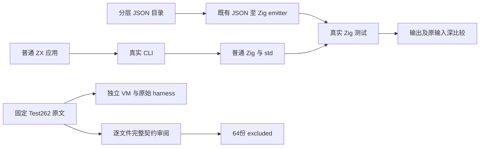
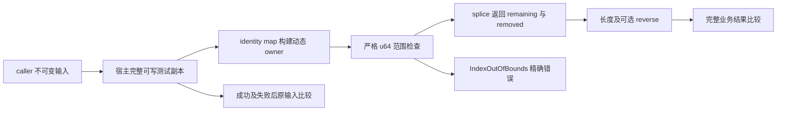

# 列表范围提取与上游审阅实施记录

## Intent：最终目标

补足任意长度输入的严格范围提取、替换与原输入保留证据；完成固定 Test262 Array.prototype.slice 家族剩余完整原文审阅。ZX 的静态列表契约与 JS 动态数组协议分别登记，不能靠删断言或硬编码结果提高上游适配数。

## Data：可用证据

首轮生产冻结 SHA 为 dc8d800b22c683c9ae1214bcd6b1717cdbbb8efb；15 份测试/目录/构建输入逐文件 SHA 位于输入清单.json。先精确核对前轮 21 份自有工作区输入，再只恢复其中的已跟踪构建文件并删除其自有未跟踪文件；干净工作区切到 dc8d800b。本轮测试使用独立 Debug、ReleaseSafe、相邻 Debug 本地缓存，日志记录每个实际运行叶子，缓存的生成依赖不冒充测试通过。

上游固定 tc39/test262 7ab7fafa0003f73fc85c1b95d88094d33f7eb8bd。slice 家族 71 份，既有 reviewed 7 份 excluded，本轮剩余 64 份由两个只读文件分析任务各全文读取 32 份；主代理检查逐文件摘要、契约和交接集合，并复读跨 realm、resizable buffer、可配置不可写属性等关键原文。前半审阅数据保留完整 source；原文三方核对.json 核对全部 64 份原文、固定索引与实际归档字节，64/64 一致。

## Edges：边界与限制

不增加 slice 方法、zxc 专用 runtime 或解释层；所有正式程序通过真实 CLI 生成普通 Zig，产物只导入 std。ZX start/count 是 u64 严格范围，JS slice start/end 则包含 ToInteger、负相对索引、边界夹取、动态 length、原型稀疏索引、species、属性 descriptor、Proxy、TypedArray 和 realm 机制。不能将 IndexOutOfBounds 代替原文 RangeError/TypeError，也不能以静态类型或固定标签替换对象身份观察。

本轮新增 64 份正式 excluded，cases=[]，逐文件描述真实设置、全部关键观察与差异。没有把普通 ZX 值测试关联成这些原文的 adapted/equivalent。全仓 Test262 尚未全部对齐，普通测试总行数也不是 Test262 整份通过数量。

## Answer：交付与成功标准

| 证据                   | 实际结果                                                                       |
| ---------------------- | ------------------------------------------------------------------------------ |
| ZX 新增运行目录        | 6 个，2037 个独立 JSON 用例                                                    |
| 严格越界运行用例       | 738 个，精确 IndexOutOfBounds                                                  |
| 前端类型目录           | 26 个，4 个合法、22 个拒绝                                                     |
| Debug                  | 58/58 步骤，2063/2063 实际通过，7 个运行叶子，0 个缓存测试步骤                 |
| ReleaseSafe            | 58/58 步骤，2063/2063 实际通过，7 个运行叶子，0 个缓存测试步骤                 |
| 相邻 pop/reverse Debug | 63/63 步骤，136/136 实际通过，8 个运行叶子，0 个缓存测试步骤                   |
| Test262 原始 JS        | 64 份 × 非严格/严格，128/128 通过                                              |
| 原文归档/索引/提取核对 | 64/64 完全一致                                                                 |
| 生成证据               | 首轮与最终各 24 份原始文本，共 48 份；每轮两种优化模式各 12 对相应文件字节一致 |

### 提交前最新生产复核

提交前同步新增 1b4cc783（局部聚合循环模块内联）与 d9aa512e（ZX 解析器生成类型源码顺序）。主工作区只做快进合并，并核对原有 11 份跟踪内容 SHA 全部未变。本轮运行输入与旧基线逐文件完全相同，另外复用第二工作区：先精确核对前轮字符串 14 份自有输入，再只恢复其跟踪路径和删除其未跟踪自有输入，干净切换 d9aa512e3c617720a454c3d66c649aee8b496fba。

最终输入清单.json 冻结最新 source/tree 与同一批 15 份输入。最终Debug、最终ReleaseSafe、最终相邻Debug 分别使用新的本地缓存；原始日志和实际终止记录保存为独立文件。首轮记录继续保留，不覆写为最新实现结果。最终 Debug 与 ReleaseSafe 各 58/58 步骤、2063/2063 实际通过，相邻 Debug 63/63 步骤、136/136 实际通过，所有测试叶子均未使用缓存。三个实际进程终止码均为 0，完整结果与输入 SHA 由门禁核对结果.json 复核。

### 运行期观察

integer 覆盖 i64 极值及重复元素；text 覆盖空字符串、中文、组合字符、emoji 与 NUL；products 含 tuple、optional、嵌套 children；tuples 含整数、布尔与字符串。输入长度涵盖 0、1、3、4、5/6、17；小列表逐个合法 start/count 组合，大列表验证整段、内部、尾部与空范围，replacement 有空、单个及多个元素。

所有普通程序用 identity map 创建 owned 外层列表，再执行 splice。输出同时观察 remaining、removed、原输入与两个业务长度；宿主通过普通 Python 区间和拼接计算期待值，程序不识别用例 ID。collections 支持器先复制完整输入到可写测试存储，执行后深比较整个输入，再验证值或准确异常，因此错误路径也验证输入不变。

composed 在 splice 后分别 reverse remaining 和 removed，观察组合操作与原输入同时保留。lazy 的 extract=false 在 map/splice 前返回，288 份跳过用例包含原本无效的范围，证明条件未进入严格检查；extract=true 保留同样完整范围矩阵。最大 u64 的 start/count 由原始 JSON 数字经 BigInt 读取、写入 Zig 原始整数，未经过不安全的 JS Number 舍入。

生成源码中的 start>length 与 count>length-start 使用短路 or，先报告 IndexOutOfBounds，再做 usize 转换、范围加法与新分配。最大 start 的实际错误用例证明未先发生无符号减法溢出。没有主动注入 OOM，本轮不声称证明分配失败所有权或零成本性能；测试使用应用 Arena 的生命周期，不声称结果独立于 caller Arena。

### 前端观察

4 份合法观察动态 u64、零范围、length 端点及最大 u64 字面量。22 份拒绝覆盖两个参数位置的布尔、字符串、浮点、负数、null、i64/f64/optional，replacement 元素不匹配及非列表、两个和四个参数、未知 slice、明确禁止 clone。期待类型诊断由完整 frontend 门禁实际验证，没有从文件名假设或动态修改期待值。

### 原始 JavaScript 宿主执行

原文核验.mjs 读取固定原文和原版 sta/assert/includes，使用每次独立 vm context，原文正文不改；flags 未声明的 64 份分别执行默认两种模式。唯一 host 接口为实际独立 vm realm 的 $262.createRealm().global，提供真正不同的 intrinsic 身份。Node v25.8.1 执行原版 resizableArrayBufferUtils 的完整 ctors 集合，不删 BigInt/Float16/子类，不拆掉连续 resize 状态。元数据、SHA、执行模式和真实结果分别保存，128 个唯一文件/模式组合全部通过。

原文观察中特意保留 A3_T3 正文的 length=-1；可配置不可写结果属性可以重新定义成功；两份 realm 分别忽略 foreign Array intrinsic 和接受 foreign 非 Array constructor；RAB 包括 fixed/tracking/offset、连续调用及旧结果留存。metadata description 不是执行断言，不能据名称猜错误。

### 架构与数据流

### 自我批判与后续边界

本轮完善了任意长度、复合元素、输入留存及条件跳过，相较既有固定长度 i64 splice 增加了独立观察；小范围矩阵包含重复机制，但每份用例有不同输入、范围或 replacement，并非为计数复制同一输入。没有把全部 JS 对象协议归因于缺失同名方法，也没有实现测试专用转换层。

旧设计文档 clone 描述陈旧，本轮按当前分析器与成熟正式拒绝测试选择 map；不在本次测试任务内改写设计文档。准备脚本的无关断言与错误缩进假设已纠正并单列记录，没有误报实现缺陷。实际 ZX 首轮与最终两种模式和相邻回归全部通过，没有向实现会话发送消息。

目录矩阵审计只验证登记和链接，不能证明全仓 82935 个 JSON 用例本轮全部执行。本轮累计 reviewed 为 2818（adapted752、equivalent103、excluded1963），仍有 50779 份未审阅；不会将整体目标标记完成。保留 11 份原有跟踪修改并核对内容 SHA。完成门禁及提交钩子复核后使用英文 Conventional Commit 提交、push，保持后续可接续。
