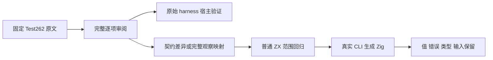
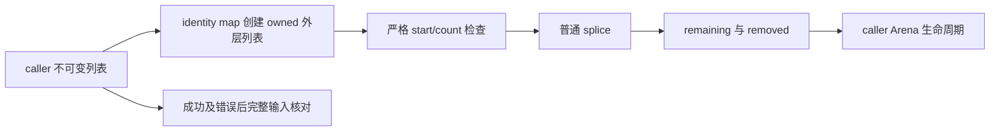

# 列表范围提取与上游审阅执行计划

## Intent：最终目标

完成固定 Test262 Array.prototype.slice 家族剩余 64 份原文的逐文件审阅，保留完整断言与差异记录。同时独立验证 ZX identity map+splice 范围提取、输入不变、复合元素、端点与错误顺序及静态类型。

## Data：可用证据

固定上游 7ab7fafa0003f73fc85c1b95d88094d33f7eb8bd，family71 中已有7份反射原文 reviewed；原文/archive/index 三方 SHA 待核对。首轮生产 dc8d800b；提交前快进至 d9aa512e，并在另一套冻结工作区复核本轮全部门禁。公开旧设计文档定义不可变列表与严格 splice 范围；当前 calls.zig 明确拒绝 clone 深拷贝，不能照旧设计调用 clone；生成源码有 start>length 短路，再检查 count>length-start。已有六个固定长度 i64 splice 目录；新范围输入不能继续靠固定长度重建替代动态 identity map 构建外层所有者。

## Edges：边界与限制

ZX 没有 slice 内置方法，不增加测试专用 slice 实现，不把 JS 相对索引/夹取/ToInteger/对象协议硬塞进严格 splice。原文若完整无法保留，逐文件 excluded 并给真实契约依据；不能只按文件名或删 getClass/undefined 后登记 adapted。普通 ZX 回归与整份上游审阅统计分开。正式改动仅为已授权测试和注册；只有实际生产缺陷才通知实现会话，不问用户。

## Answer：交付与成功标准

运行期用例按 built_ins/list/range_extract 的元素/观察职责分组，前端拒绝单独在 language/types/list_range；独立步骤执行真实 CLI 生成 Zig，Debug/ReleaseSafe 及过滤 frontend 实际验证。64 份原文的完整宿主 harness 执行按 flags/host 能力记录；不将环境不支持当作 zxc 缺陷。保存原文元数据、逐项观察、完整普通源码、原始日志、ABI/产物、SHA、IDEA与 Mermaid。完成一部分后英文 Conventional Commit 提交并 push。

## 步骤

1. 两个只读分析任务分别完整读取 32 份；主代理核对逐文件观察，并复读 realm、resize、属性描述符等关键原文，核对三方字节。
2. 区分可完整适配与明确契约差异，原始 metadata/harness 不改。
3. 真实普通 input.map(item => item)+splice 夹具使用动态 caller列表；宿主独立拼接/区间模型，不识别 case ID、不复制生成资格判定。
4. 写回正式 catalog/reviews/注册，隔离当前冻结输入，执行精确门禁与相邻回归。
5. 对照原需求与证据自我复核，保留其他修改，提交 push。

