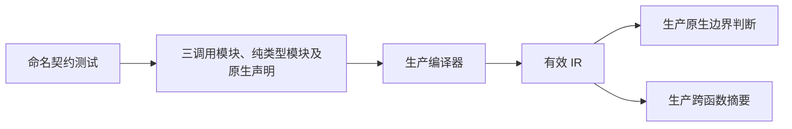
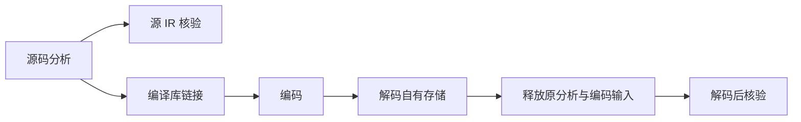

# 原生值调用边界回归

## IDEA

- Intent：验证 04dbf0b7 引入的借用原生输入与纯度分离，覆盖真实源码分析和编译库解码后的跨函数传播。
- Data：当前源码 ff894a53；packages/genz/src/zx/native_value.zig 与 value_call/analysis.zig；既有原生声明、编译库与 IR 检查测试。
- Edges：此次补充 zxc 特性测试，不增加 Test262 审阅计数，不把编译器分类检查宣称为应用运行时测试。IO、进程、对象引用和嵌套产品必须保留保守边界。原有修改保持字节不变。
- Answer：独立 test-native-value-boundary 构建目标、按职责分组的命名 Zig 测试、Debug 与 ReleaseSafe 实际运行日志、输入与产物哈希、英文 Conventional Commit 与 push。

## 执行步骤

1. 使用真实 ZX 声明与两层普通模块调用构造有效 IR；定位原生函数和普通函数，不固定函数编号。
2. 将实际 genz 源码作为测试构建输入，不复制算法到测试。
3. 对每种契约同时检查原生边界、跨两层普通函数的 pure/local/value 摘要。
4. 编译库编码解码，销毁原分析和编码字节后再次核验，检查所有权与标志保留。
5. 添加失败分配清理检查；冻结独立 worktree 输入并运行两种优化模式。
6. 复核本次 diff、生成草稿与执行记录，检查原有修改哈希，提交并 push。

## 架构图

## 数据流图

## 初始自我批判

函数分类无法单独证明运行时数值、调用顺序或缓冲性能，因此交付必须明确这一限制；后续还需要真实 native host 执行用例。不能根据目前源码的每个 switch 自动推导期望，应依据公开输入借用、显式 IO/进程及产品所有权契约给出正反例。
