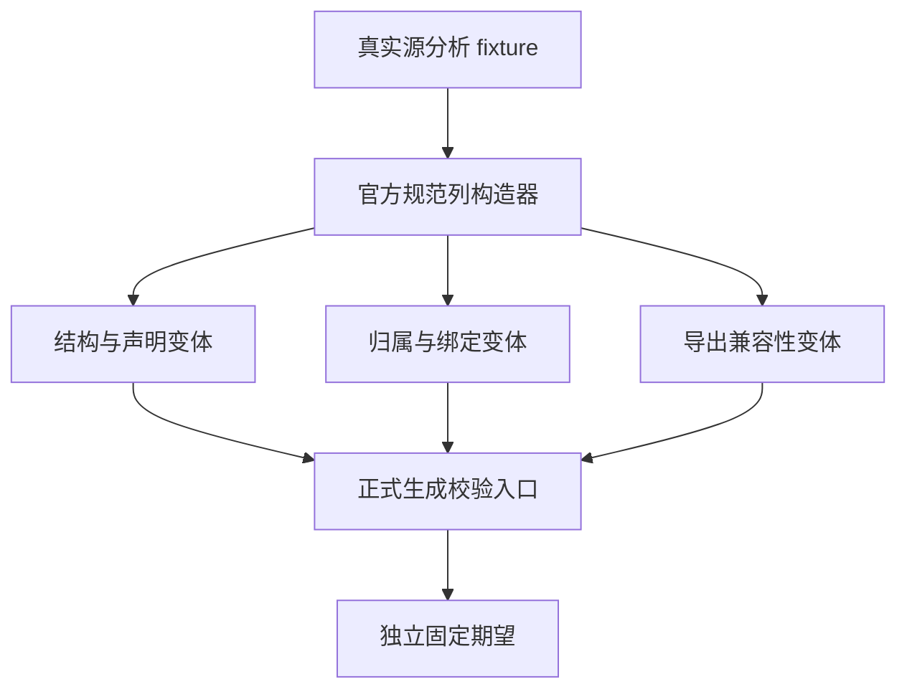

# 原生模块入口独立覆盖

## Intent：最终目标

直接执行正式生成的 native_modules.validate 与 validateExport，补足规范列迁移及 RX 编排修订后的独立边界检查。分类固定预期来自身份、绑定和导出契约，不调用 seed 算法作为 oracle。

## Data：可用证据

当前模块表为 specifiers、identities、import_names、type_namespaces、type_names、type_ids 六列。模块检查先拒绝结构错误，再处理声明、绑定及原生引用归属。导出检查比较同身份同导出名的签名、并发标志及错误集合，保留 null 与空集合区别；模块键为 identity ?? specifier，导出名为 export_name ?? member 最后一段。

成熟参考为 build/native_references.zig 及 references/ir/fixture.zig：测试缓存复制内部模块，沿用正式 frontend.import_table，基础 Program 来自真实源分析并通过完整 validateIr。Zig ast-grep 注册配置在当前检出缺失，使用 rg 与带行源码阅读定位。

## Edges：边界与限制

测试只增加测试包文件及根注册，不修改生产算法。编译时断言 generated_parser=true。正式两个入口内部使用零容量 allocator，本批广泛实际执行正负场景，不将静态审阅备用分配分支当作执行证明。

结构错误等是模块分类器单位输入；空表控制的最小 Program 不声称完整合法 IR。导出入口遵守正式调用方前置条件：函数列宽合法、索引存在、模块编号有效、成员非空。其签名变体用于导出兼容性谓词，不以局部通过推断完整类型、原生引用或调用合法性。

单个 ZX 源不超过当前规则的 240 行；本批复用已有短源 fixture，不引入大型生成源、运行库或动态层。先写本目录草稿，再按测试授权同步；执行期间冻结所有包输入。仅实际当前生产缺陷通知实现会话。

## Answer：交付格式与成功标准

交付独立结构、声明文本、绑定归属及导出兼容性测试，职责清晰的 fixture 与构建接线。Debug / ReleaseSafe 运行全部新命名检查，再复验原 native reference IR 与库门禁。保存实际源码、生成模块、测试二进制及原始结果，类型/目录统计与运行结果分别陈述。每完成部分使用英文 Conventional Commit 提交 push，发布核验返回 0 后才执行后续变更。

