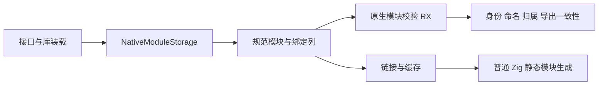
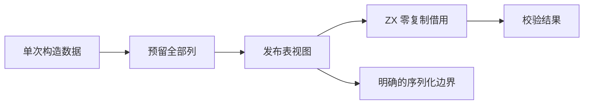

# 原生模块规范列与校验自举

## Intent：最终目标

把原生模块注册表改为唯一规范列存储，并将模块与原生导出一致性检查迁到 RX＋ZX。正式检查借用原始列，不为生成代码重新构造模块行数组或复制类型绑定。递归 NativeType 是独立表示边界，本轮按实际完成范围说明，不借原生语义代理宣称自举完成。

## Data：可用证据

基线 6edaad37。Program、模块 artifact、共享分析上下文、RX 与 link/cache 路径当前保存 `[]NativeModule`；每个 NativeModule.types 又是 `[]Export`。native_modules.zig 负责模块身份、命名、同身份绑定一致性、原生引用归属和导出错误集合一致性。FunctionTable 已具有原生属性列，可直接复用。

成熟存储样例为 ContractTable/Storage：列宽一致，append 先 reserve 全部列后提交；借用 view 不取得所有权，finish 移交拥有的列。Grit 的可用 language 列表不含 Zig，故采用限定文件和结构的程序化迁移，并逐项核对 mutation 与拥有边界，不能把配置文件的同名 native_modules 一起替换。

## Edges：边界与限制

模块表的六列为 specifiers、import_names、identities、type_namespaces、type_names 与 type_ids。后两列的每个单元直接借用该模块的绑定名字及编号切片，无须分配描述符或维护另一份 count；at 只构造临时 NativeBindings 视图与模块行，字符串、命名空间和内层列借用已有 owner。生产持久注册表仅保留规范列，不保留平行行数组。生成代码只借用，跨独立 owner 的复制仍需复制字符串及列。

所有列长先验证，再做语义读取。原身份 key 为 identity ?? specifier，保留 null 与空字符串的区别。同身份不同别名允许，同身份同别名禁止；同名类型绑定必须指向同一规范类型。原生引用必须有唯一身份和匹配声明名。错误成员命名复用 lint ZX 规则，UTF-8 有效性用通用字符原语，不能忽略无效字节。

库和语义缓存形状改变时提升 IR 版本并失效旧缓存；指纹必须按临时逻辑行读取，不能散列切片地址。用于外部构建工具的 JSON 行协议保持原形，不能把内部列布局泄漏为未经授权的协议变化。

不新增测试，不执行仓库全量测试，不改项目配置 native_modules 的独立结构，不用用例硬编码。完成既有 native/link/cache/library/RX 相关专项和生成物检查。

## Answer：交付格式与成功标准

交付规范表和存储、全部正式读写与链接路径迁移、RX／ZX 模块及导出检查、引导路径和必要版本变更。验证后归档源码指纹、日志和生成物，记录边界与自我批判，完成一个 feature 提交 push。





## 实施与接口边界

NativeModuleTable 六列成为 Program、Artifact、共享 Context、RX 编排和生成 Bundle 的唯一持久原生注册表。NativeBindings 只包含 names/type_ids 两个切片；从已加载导出构造绑定列时，分配的是一次性的规范列，不复制名字内容。跨 arena 的 native_context、artifact 提取和链接路径仍按原所有权要求复制字符串并映射类型编号。Bundle 保留原来的裁剪行为：只保留模块定位字段，清空 namespace 与 bindings。

Storage.append 先预留六列，再一起追加；finish 失败分别释放已转移列和未转移 Storage，已转移字符串及内层绑定仍归上层 arena。Project 先准备完 namespace、names、ids，随后发布三列更新。没有引入可变全局表或动态加载层。

库／缓存结构使用 IR 33，Program 默认版本同步；生成指纹为 v38。指纹通过 at 构造临时逻辑行，包含类型编号的绑定仍走既有规范类型身份散列。外部 native.json 明确调用 jsonRows 视图，保留之前的数组与字段格式；JSON codec 直接序列化规范列，不复用该外部协议视图。

Specifier 的 ZX 输入由 u8[] 改为 string，使注册表字符串可直接传入已有 classifier；宿主 Zig ABI 仍是 []const u8，循环仍按字节读取，没有字符解码、复制或额外 UTF-8 拒绝。模块名称与绑定名称的 UTF-8 合法性、非空和 NUL 禁止由新的 ZX text 规则检查。错误成员名直接引用 lint 的 ZX TypeDecl 规则，避免另一份命名实现。

## 生命周期与结构自审

公开 Artifact 链接与内存缓存恢复不能依赖 codec 已经检查。Builder.module 在读取模块行之前验证外层和绑定列宽；restoreChecked 同时检查旧模块与当前环境模块表；native_restore、artifact 根收集和 core native-reference owner 查询亦先检查新增结构维度。

Project 恢复的 Program 暂时带有增长前的借用 view，但依赖消费者只提取输入／输出类型、exports、type_only 与 Unit.function，不读取旧模块列。根 Program 在 load 完成后被最终 view 覆盖，随后才完整验证与返回。该调用关系已实际追踪，不依赖 arena 恰好保留旧数组；若未来新增独立持有者，应在那个边界明确 snapshot，不能把 view 当快照接口。

两个原生引用 mutation helper 保留全部已有模式与断言：缺失绑定、改名、同身份别名、不同身份 owner、原生输入与并发边界；只是修改对应列，追加后重新发布 view。未新增测试。

## 生成物自审

首次生成目录 `.zig-cache/o/ebc4a16c94724d0122ec08e9ae440f2b/` 中，native_modules 的四处 create（1217、1416、1568、1571）和 native_export 的一处 create（992）属于循环结束恢复借用对象的备用分支。初始 modules/context origin 均非空，循环只修改 index、valid、found、owner 等字段，保留整个 modules/context；因此有效调用不会进入这些 create 分支。未发现其它 alloc、dupe、append；正式两个宿主入口均使用零容量 FixedBufferAllocator。

ABI 六列逐字段与核心表同型，native_errors 保留 null 与空集合的区别。identity 和 export_name 都使用惰性回退，不把空字符串当缺失。生成入口返回 bool，栈上描述符与内层借用不会逃逸。

## 自我批判

本轮覆盖注册表存储和模块／导出校验，不代表所有 native 语义完成自举。递归 NativeType 校验仍位于 native_type.zig，算法保持原样；core 的对外 native-reference owner 查询仍是 Zig 实现，本轮仅适配规范列与新增结构门禁。完整编译器自举仍需继续收敛这些边界。

零复制结论只作用于校验入口借用规范列；列的首次构造、跨独立 owner 的复制以及实际 JSON 输出各有必要开销。生成物中的备用分配不可达是针对本次调用关系的审阅结论，不是任意未来状态字段更新都满足的通用证明。

## 验证结果

以下命令均已取得退出码 0，未新增测试，也未执行仓库全量测试：

| 范围                   | 命令                                                                                                                                                                        | 结果                                  |
| ---------------------- | --------------------------------------------------------------------------------------------------------------------------------------------------------------------------- | ------------------------------------- |
| 最终根构建             | `zig build -j3 --summary all`                                                                                                                                               | 35/35 步                              |
| compiler 包            | `zig build test -j3 --summary all`                                                                                                                                          | 28/28 步，372/372 测试                |
| 原生引用、链接与 codec | `zig build test-native-references-analysis test-native-references-ir test-native-references-library test-native-link test-library-codec test-cache-codec -j3 --summary all` | 69/69 步，166/166 测试                |
| 类型及 RX 边界         | `zig build test-type-validation test-type-merge test-module-artifacts test-rx-inference -j3 --summary all`                                                                  | 69/69 步，363/363 测试                |
| 原生运行               | `zig build test-native-runtime test-native-references-runtime -j3 --summary all`                                                                                            | 102/102 步；Zig Build 摘要 78/78 测试 |

原生运行日志还包含 28 次 Node 驱动的独立原生引用执行，子进程共 90 次 Zig 测试通过；该层计数不与 Zig Build 的 78 混为同一统计单位。覆盖原始、重链接与缓存原生 ABI，以及 source/library 两条原生引用路径；外部 native.json 行协议由实际消费脚本读取。

最终生成目录为 `.zig-cache/o/1c98e6fd9249be33856c66ecff2280ba/`，两模块及 ABI 四文件与审计版本逐字一致。源码、日志、生成物摘要见验证结果 JSON；压缩日志与生成物同步归档。

已阅读远端 289f6049 的函数效果入口独立覆盖记录；其中历史失败来自测试编译命名和未承诺的空结果零分配假设，最终记录未确认生产缺陷。它的旧基线结果不计作本轮验证。

## 规范表接口

以下为正式 packages/core/src/native_module_table/root.zig，供审阅列布局与无分配行视图：

```zig
const std = @import("std");
const ir = @import("../ir.zig");
const Self = @This();

identities: []const ?[]const u8 = &.{},
import_names: []const []const u8 = &.{},
specifiers: []const []const u8 = &.{},
type_ids: []const []const u32 = &.{},
type_names: []const []const []const u8 = &.{},
type_namespaces: []const []const []const u8 = &.{},
pub fn count(self: Self) usize {
    return self.specifiers.len;
}

pub fn at(self: Self, index: usize) ir.NativeModule {
    return .{
        .specifier = self.specifiers[index],
        .import_name = self.import_names[index],
        .identity = self.identities[index],
        .type_namespace = self.type_namespaces[index],
        .types = .{ .names = self.type_names[index], .type_ids = self.type_ids[index] },
    };
}

pub fn validStructure(self: Self) bool {
    if (self.count() > std.math.maxInt(u32)) return false;

    inline for (@typeInfo(Self).@"struct".field_names) |name| {
        if (@field(self, name).len != self.count()) return false;
    }

    for (self.type_names, self.type_ids) |names, ids| {
        if (names.len != ids.len or names.len > std.math.maxInt(u32)) return false;
    }

    return true;
}

pub fn fromValues(allocator: std.mem.Allocator, values: []const ir.NativeModule) std.mem.Allocator.Error!Self {
    var storage: @import("storage.zig") = .{};

    errdefer storage.deinit(allocator);

    for (values) |value| try storage.append(allocator, value);

    return storage.finish(allocator);
}

pub fn jsonRows(self: Self) @import("rows.zig") {
    return .{ .table = self };
}
```
