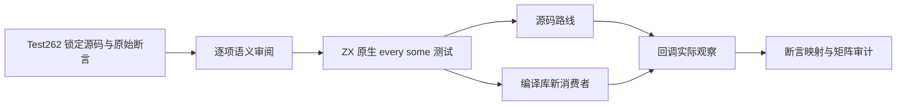
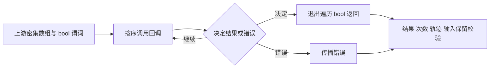

# 原生谓词上游审阅执行计划

## Intent：最终目标

将新实现的 every/some 原生短路与锁定 Test262 用例逐项对照，补充真正执行的返回值、调用顺序、次数与错误停止证据，推进完整对齐目标。

## Data：可用证据

基线为 `c938a523176dc178456b7a902d8e0e25a9f80e94`。上一部分已实现统一 Transform、单元素无捕获 bool 回调、普通 Zig 循环退出和真实源码/编译库消费者。Test262 锁定版本中 every 有 218 个文件、some 有 219 个文件，现有观察适配不能自动代表每个原始断言。

## Edges：边界与限制

保留上一部分冻结工作树以复现其证据。本部分另建当前基线的隔离工作树，先把草稿与审阅证据存入本目录；测试授权来自完整目标，正式测试只在验证后按精确路径同步。

不把源码的 API 名称相似当作等价；完整读取所选原始用例，明确哪些断言保留、哪些需要静态类型与原生观测适配。动态 this、prototype、稀疏属性和 truthiness 不以伪造代码掩盖，也不自动批量标记排除。没有确认生产缺陷时不向实现会话发送消息。

两名只读分析子代理分别查找 every/some 的直接可映射断言，主代理复核原文、生成独立期望并执行。正式源码保持最小范围；当前计划只扩展测试与上游映射，确需修复生产实现时记录证据后再决定最小改动。

## Answer：交付与成功标准

新增用例必须注册实际构建目标并在 Debug/ReleaseSafe 执行；调用观察同时经源码与真实编译库消费路线。上游样例保留完整 SHA、原始断言执行记录、映射和断言，审计无重复与悬空引用。进行自我批判，保护原有修改，英文 Conventional Commits，完成一部分后实际 push。

发布前合入远端 c938a523 的列表函数缓冲优化，自身 17 个文件没有交叉修改；旧基线证据保留在并行合入前目录，最终执行门禁重新基于合入后的版本运行。
