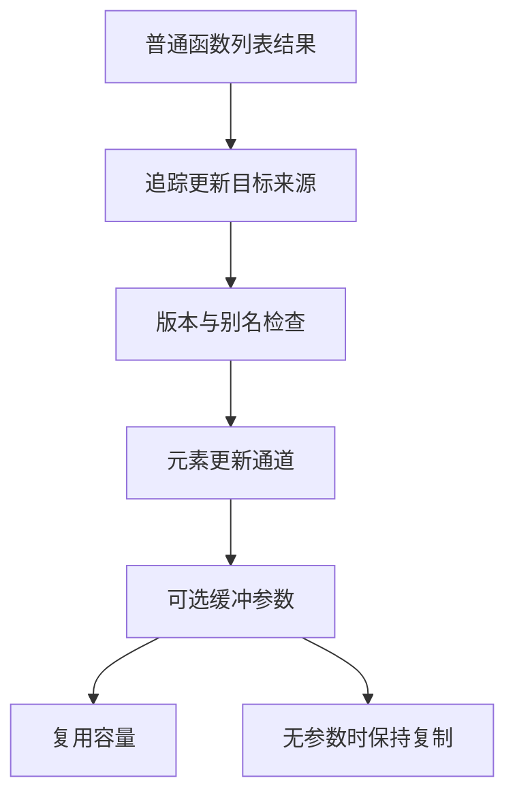

# 可变列表函数缓冲

## Intent：最终目标

让普通函数内的列表元素更新在已证明安全的调用链中复用调用者容量，并扩展到函数内部循环更新，消除所有权检查等普通 ZX 程序的跨调用状态复制。不得通过专用原生状态桥实现。

## Data：可用证据

现有函数摘要只有 append/pop/call，没有 list_update 通道；trace 遇到 list_update 返回空来源，audit 也拒绝候选列表被更新。即使循环内部可以复用状态，调用者仍无法把容量传给该函数。所有权草稿的 places、borrow、snapshots.apply/update 都存在这类边界。

## Edges：边界与限制

元素更新必须保持 target/index/value 的原求值顺序和越界行为。只有当前完整版本可复用，旧版本读取、重复输出别名、replacement 携带候选通道都应拒绝。缓冲参数为空时继续原复制语义；首次启用缓冲须先复制借用输入，不能修改调用者未转移的原数组。

函数内循环需要额外证明归纳关系：初值与每轮结果在同一路径承接唯一通道，条件不修改版本，外部旧来源不能在后续轮次重新被读。直接元素更新通道接通不代表该循环证明已完成。

## Answer：实施与验收

先扩展 Lane/Trace 的元素更新记录，在 buffered 函数中把这些更新绑定到已有 Capacity，并为可选缓冲槽增加惰性守卫。再扩展循环来源与版本证明，使用真实所有权入口观察是否接通修改列。每阶段记录实际边界；使用已有专项、无新增测试、无全量测试。

## 自我复核

函数摘要、调用点绑定、被调函数写入和退出所有权转移必须共同成立，不能仅凭生成了 buffered 函数便声称去除了复制。函数内循环和快照本身所需的数据复制仍需分别核验。

## 元素更新与循环接线

Lane 新增 updates 与 iterations。Trace 追踪 list_update.target；循环初值与循环体结果必须在同一字段路径回到相同输入来源。循环参数沿 initial 的相应路径回溯，避免递归追 body 形成环。audit 切换候选通道时安装其 selected iterations 并清空依赖证明缓存，不把上一通道的假设带入下一通道。

versions 使用现有 State 执行两轮符号分析和末尾条件检查，每次仅替换循环参数。初值及每轮结果都要求仅在指定路径保留当前通道；条件不能修改版本，外部捕获不升级为新版本。最后使用已有 join 合流初值与循环结果，保守包含零次执行路径。这是编译器内部安全条件检查，不是针对任意程序的外部形式化证明。

被调函数将 updates 接到既有 Capacity。source/index/value 先各求值一次，再检查边界，再依据可选槽决定使用共享容量还是复制；所有 optional unwrap 只在启用分支出现。无外部槽时，循环仍保留原局部容量，避免每轮回退成 dupe。外部与局部容量由固定槽条件互斥选择，退出仅转移已启动的局部容量，之后恢复外部 override 映射。

裸 list 返回函数以前不参与 value-function 摘要。现在纯内部 list 函数也可生成缓冲摘要，buffered 声明继续使用原切片返回 ABI；调用点直接使用切片，不能将它误当对象装箱。

## 实际结果与限制

所有权草稿的位置传播、位置查询、借用传播、快照恢复和快照更新均获得对应可变列摘要。完整主入口现有 14 份循环外容量：memory 三列、snapshot 六列、work 四列及 values。实际调用点包括 11 处位置传播、12 处借用传播、21 处快照恢复、3 处快照更新，以及位置查询，均已改走 buffered；原有工作栈 117 处 push 和 1 处 pop 保持缓冲调用。

合入短路谓词前的根构建 35/35 步骤成功；完整草稿无缓存生成并通过 ReleaseSafe build-obj。已有五项专项 319/319 步骤成功、566/566 测试通过，另有 1 个库重发布测试通过。未新增或修改测试，未运行全量测试。独立只读审查未发现明确的版本、裸列表 ABI 或 fallback 容量覆盖问题；该结论不替代上述构建和专项证据。

这些结果证明调用通道已经接通，不代表整个所有权检查器已零复制。快照的语义副本、初始借用输入的首次写入，以及循环退出的所有权转移成本仍需核对；完整所有权输入适配、诊断和行为等价也尚未接入正式路径。

## 合入短路谓词后的复核

远端提交 080af71f 新增 every/some 并将 IR 版本升至 25。本修复已合入该提交，缓存指纹使用 v28；所有权草稿的 TransformKind 同步两种谓词，求值后恢复状态并返回 Copy，不执行结果逃逸冻结。

集成后根构建再次通过 35/35 步骤；增加已有 test-list-predicates 后，六项专项 331/331 步骤成功、572/572 测试通过，另有四种原生谓词运行检查及库重发布检查通过。新的完整所有权入口无缓存生成并通过 ReleaseSafe build-obj，14 份容量及各状态辅助 buffered 调用保持不变。上述行为专项针对通用编译器能力，不是完整所有权草稿的输入输出等价验证。
