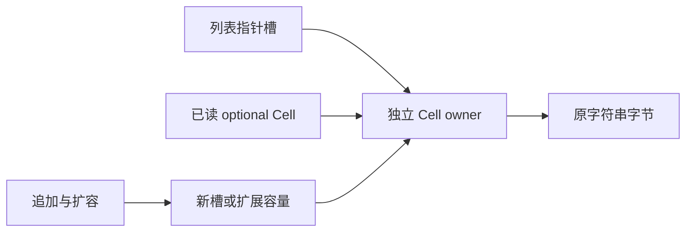

# 可选产品读取后的列表容量复用修复

## Intent：最终目标

修复独立回归报告的重复复制：纯 reader 返回仅含标量、字符串叶子的可选产品后，消费该结果不应被误认为继续借用列表指针槽。保持旧结果、输入 owner、真实 list/native 引用逃逸的安全边界。

## Data：可用证据

独立回归位于主工作区 `packages/test/tests/collections/detached_reader`，测试期待与预算保持原样。该回归报告 nested 两路增长失败，其余语言值、输入与跨调用留存、OOM 检查通过。

当前发行 CLI 编译同一 nested 源码，生成的 `function_1_value` 仍逐次 alloc(len+1) 并 memcpy 旧指针槽，没有 buffered 版本。`may.contains` 遇到 optional 产品沿 conditional/some/index 追踪整个列表；而 reader 资格已经递归判定该产品不携带列表存储，两处类型判断不一致。

## Edges：边界与限制

Cell owner 和 Cell.label 字节的借用不等于列表指针槽数组的借用。产品若含 list 或 native reference，仍按原保守路径分析。不能深复制返回产品、放宽预算、删除 nested 模式或按文件名设置生成器分支。

本次借用独立回归文件到当前 worktree 执行，记录输入哈希，不改变期待；验证后移除临时副本与登记，测试仍由原工作区维护。不运行全量测试。

## Answer：交付与成功标准

统一 reader 资格与结果传播的无列表存储产品判断，更新生成缓存版本。独立回归通过，并确认实际 nested 生成物保留循环外容量、传入 buffered step。保留所有权与错误回归，不把结构检查当作一般性证明。

## 执行与自我复核

基线实际运行 `test-detached-reader` ReleaseSafe：75/78 步骤通过、126/128 检查通过。仅 nested 的 source/library 两路增长预算失败；count=1024 时，两次调用累计分配 11,777,392 字节，原预算 2,198,528 字节。此处是原回归的双调用口径，不与独立单调用测量混用。

正式实现只修改三个文件：开放 `flow.detached` 给同职责分析使用；`may.contains` 在选择完投影类型后复用该判断；生成缓存指纹更新为 v17。保留裸 native reference 原有处理，不把含 native reference 的产品新增为 detached，不更改 reader 的 pure 条件或 native 调用输入审计。

自我复核：结果没有列表槽依赖，不代表产生结果的调用可以任意移动。尤其 bytes→string 可能借用输入字节；本次不改变逐列调用审计和常规迭代 pure 门槛。专项成功也只支持这些既有覆盖，不能作为所有别名路径的形式化证明。

类型解析值状态的源码草稿保持原样，本次只优先处理收到的回归缺口。ReleaseSafe 独立回归已经通过：78/78 步骤、128/128 检查；发行构建通过 35/35 步骤。nested 的源码与库生成物均产生 `function_1_buffered`，循环外持有一个指针槽 ArrayList，逐步传入容量，结束时转交最终 slice。生成器仍保留非复用调用版本和空 lane 分支，不能仅凭整个文件存在 alloc 就认定循环仍逐次复制。

原专项覆盖值和准确错误、调用者字节与指针槽保持、同一 arena 后续调用后旧结果保持，以及失败分配逐点释放。相关值返回与迭代专项通过 222/222 步骤、301/301 检查，另有 1 项库迁移与重发布消费者检查通过。没有运行全量测试，没有新增或修改回归用例。
