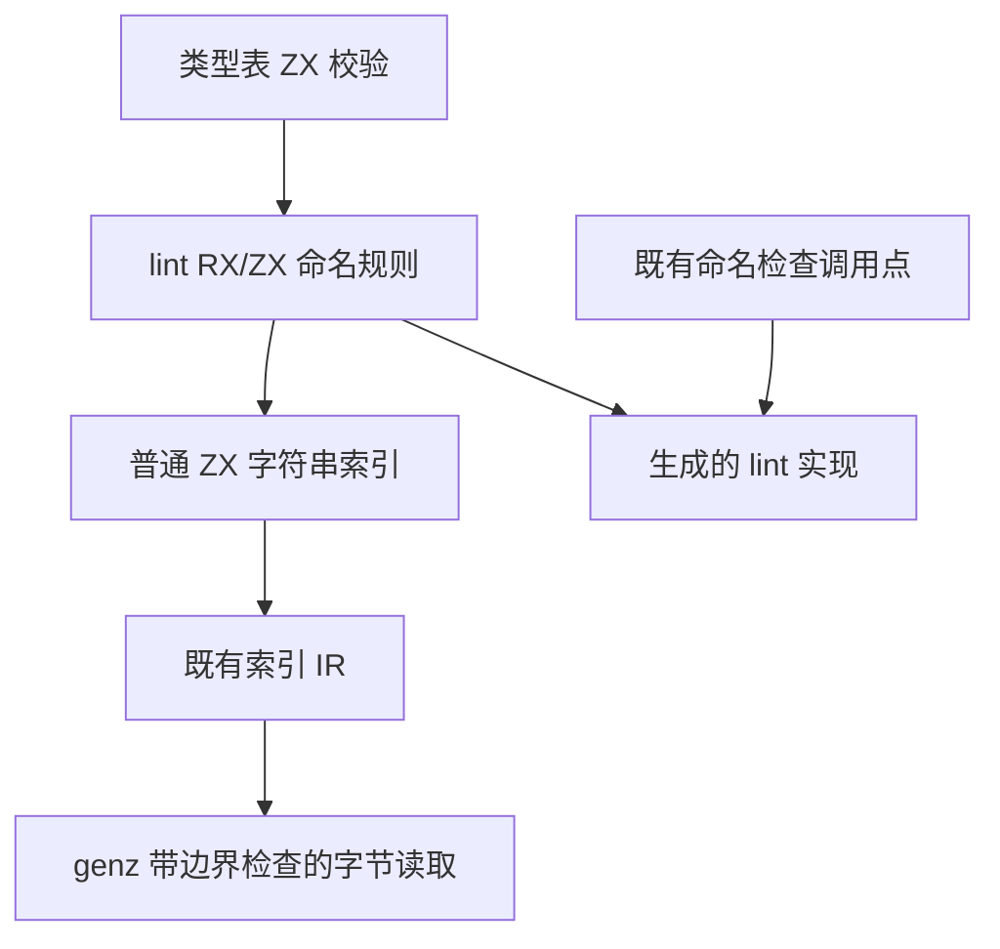
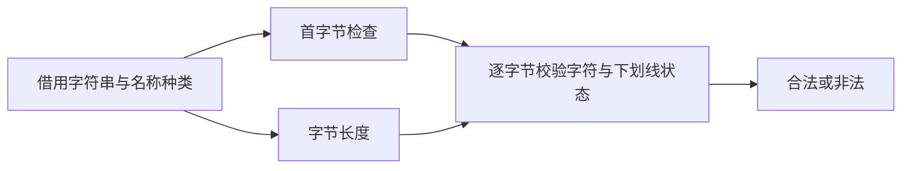
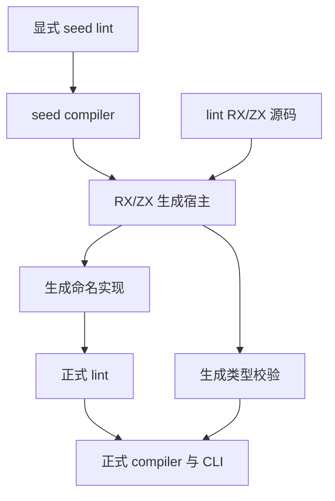

# 命名规则原生依赖移除

## IDEA

- **Intent**：移除类型表校验回调手写 Zig 命名规则的依赖；规则由 lint 包的 RX/ZX 源码维护，同时补齐普通 ZX 所需的字符串逐字节读取能力。
- **Data**：基线 5a2d6368；现有 string.length 为字节长度，IR.index 和 genz 索引生成已有边界检查，前端与独立 IR 校验目前只接受 list。type_names.validLabel/validMember 仍回调 lint.checkName，排序比较使用 std.mem.lessThan。
- **Edges**：不新增编译器专用原生桥，不把同一规则复制到两个正式实现；不改变命名规则，不新增测试用例，不运行全量测试。字符串保持不可变 UTF-8 存储，字节读取不等于 Unicode 字符读取。
- **Answer**：交付通用字符串字节索引、lint 命名规则 RX/ZX 与生成接线，移除 type_names 命名代理；以已有专项和真实生成构建验证。其他 Zig 状态模型继续列为未完成项。

## 通用能力

普通 `text[index]` 返回 `u8`，index 为 u64，与 `text.length` 的字节语义一致。复用既有索引 IR 与 `IndexOutOfBounds` 错误路径；不创建列表或复制字符串。不增加 Unicode 解码或可变字符串语义。

## 架构图

## 数据流图

## 验收与自我批判

命名算法来源必须是 RX/ZX，不能只将 Zig checkName 改名再调用。构建不能引入 compiler 与 lint 依赖环；seed 与正式生成路径必须分清。新增字节访问需要同时满足源分析、独立 IR 验证、错误集合和代码生成；不能只让某个命名样例能编译。

## 接线与移除范围

lint 包维护三类完整命名算法：Value、Callable、TypeDecl。`check.rx` 编排 `check.zx`；类型表校验通过普通 `lint/naming` 与 `lint/naming/model` 包映射复用源码。`ascending.zx` 使用同一字符串字节索引，实现严格字典序比较。

删除 semantic/native/type_names.zig 与对应声明，删除原生注册、模块接线以及 Names opaque 输入。类型校验直接借用已有 table.labels、field_names、names，没有名称副本，也没有把回调改名隐藏到另一个原生模块。

原有 Zig checkName 算法移入 lint/bootstrap/naming.zig，仅给显式 seed lint 使用。正式 checkName 静态调用 RX/ZX 生成实现；其余 lint AST 遍历和格式规则仍待迁移。compiler 负责生成构建编排，lint 自身不依赖 compiler。CLI 和已有配置格式检查使用 compiler 导出的正式 lint；缓存身份包括 lint/src 和 lint/bootstrap。

正式 lint 缺少 generated_name 时报告构建错误，不静默退回 seed。构建追踪外部 lint 源目录及 RX/ZX 文件；生成产物通过 LazyPath 传递，host 与 target 分别创建对应模块。

## RX 推导修正

字符串索引补齐后，未知容器不能立即固定为 list。新增待解析索引投影，在容器约束确定后绑定实际元素类型。只有剩余目标确实未知时才默认 list，保留原有列表输入推断。

尚未完成元素绑定的索引结果暂不独立物化，避免下游 ?u8 上界先把实际字符串字节结果推成 ?u8。绑定完成后解除保护，允许未注解列表元素继续从上下文推断。默认列表步骤位于对象构造最终校验之前，避免依赖索引结果的对象过早报错。

这增加的是编译期推导状态，不是生成产物的运行库或专用原生 API。后续自举仍须迁移该推导模块本身，不能将本轮通用能力补齐当作推导器已自举。

## 自我复核

原实现的命名检查不是 Unicode 标识符算法；新实现逐字节保留 ASCII 首字母、数字、大小写与下划线规则。严格字典序的相等名称返回 false，相同前缀按字节长度比较。

只读复核确认生成 naming 的 execute → function_0 使用栈状态及借用字符串，没有 create/alloc 或字符串复制。类型校验内的命名与字节比较也无分配；剩余整数转换原生依赖仍是后续迁移项。生成函数签名仍带 ArenaAllocator 和保守的 OutOfMemory 错误成员，不据此推断存在实际分配。

## 验证结果

- 最终 `zig build dist -Doptimize=ReleaseFast --summary all` 成功。
- 已有 test-type-validation、test-rx-inference、test-native-declarations 共 252/252 通过，包含名称及字节排序拒绝、类型结构、RX 推导和分配失败检查。
- 同次额外运行 test-semantic-lint：67 项中 34 通过、33 失败，组合构建命令因此返回 1。用本轮修改前的缓存 CLI 对相同 5 个现有测试文件复跑，失败名称集合完全一致；均在既有格式门禁处拒绝。保留双方日志及失败清单，不将这一专项报告为通过，也不扩大范围修改格式规则或断言。
- seed 生成宿主与最终正式 CLI 对 lint/check.rx 生成的命名实现逐字节一致，原始 SHA256 为 80207214df253a37283ef96bb462322f63c82bb55b73099daf44a6b6b1363e3c；提交格式化后的归档哈希另外记录。不是整个编译器的 stage 2/3 证明。
- 静态检查命名入口可达 2 个函数、类型校验可达 12 个函数，没有 create/alloc。实际检查通过零字节临时 arena 执行，名称数据仍为借用切片。

没有新增测试用例，字符串越界、不可变写入及新加入的延迟字符串约束组合没有新增专用运行用例；本轮依据既有索引生成与错误传播、源码复核及实际命名规则运行确认，不将其说成穷举证明。其余编译器自有状态与 lint 遍历仍是未完成自举项。
