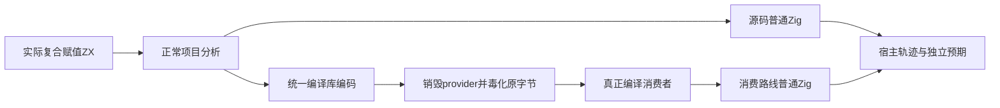

# 复合赋值宿主求值顺序执行计划

## Intent：最终目标

补齐减、乘、除、余数复合赋值的真实宿主求值顺序、异常优先级及最新状态观察，与现有普通赋值和加法使用同一回归粒度。继续审阅锁定 Test262 A7.* 动态属性协议原文，保持语义边界。

## Data：可用证据

最终基线 `bf80dc708c3101771f719af5436338068a9dd279`（起始基线 `b019d274aeb6352596d82a751013b2441223bae8`）。现有 function_updates 通过源码及 provider 销毁、编码字节毒化后真正编译消费者两条路线执行；宿主记录 source/container/index/value/after 及当前值。只读分析代理审阅44份上游原文，主agent完成测试与证据收集。

## Edges：边界与限制

整数索引调用一次不证明 JS ToPropertyKey。null/undefined 基和 toString 异常也不能换成 list bounds 后冒领兼容。整数运行顺序测试使用已定义的算术域；乘法长循环使用可表示范围，除数非零，另测零右值在更早错误或零轮次时不进入算术。溢出与除零进程失败单独推进，不伪造成可捕获异常。

## Answer：交付与成功标准

新增8套实际ZX操作（4种×平面/嵌套），保留2条消费路线。完善独立预期的重复更新和事件样本核对，并保留原4种模式回归。Debug/ReleaseSafe运行、实际二进制复跑、分配失败扫掠、类型/格式/源冻结及上游审计通过。存留完整草稿、日志、原文SHA与自我批判，英文规范commit和push。

发布前同步了上游文档提交 `bf80dc70`；前后 packages tree SHA 相同，仍在最新基线重跑本专项并重新收集实际二进制证据。发布保护在基线变更时停止过写入，未覆盖正式文件或原有修改。
