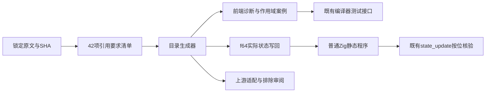
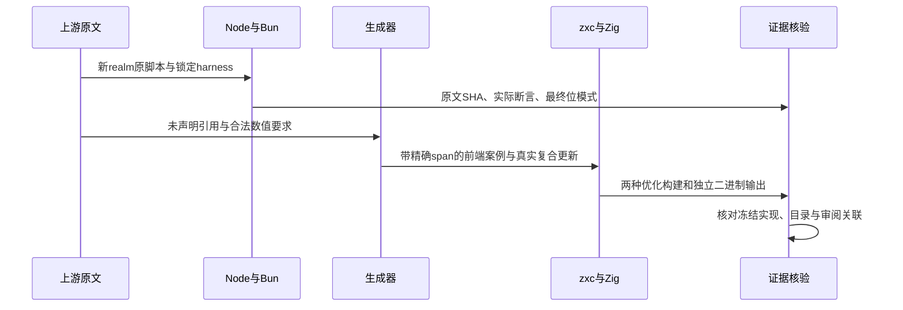

# 复合赋值引用解析执行计划

## Intent：最终目标

完整审阅锁定的42份复合赋值引用解析原文，验证未声明左值、未声明右值、合法绑定与真实写回，并扩展ZX作用域、声明顺序与只读绑定边界。完成本阶段后以英文Conventional Commits提交并推送。

## Data：可用证据

起始基线为201893ce80aa6819e748a082e30a27a8a5dacd9b。锁定语料为7ab7fafa0003f73fc85c1b95d88094d33f7eb8bd，42份原文逐项读取、SHA核对及保存。原文包括9份未解析左值assert.throws、11份合法值assert.sameValue、22份Sputnik try/catch失败检查。

成熟实现参照generate_state_updates.ts、state_updates/source.ts、tests/support/state_update.zig，复用既有按位浮点输出和输入不变性检查。分析器resolveValue在回调作用域边界前找到同名外部绑定时拒绝捕获；未知引用与声明前引用为name，更新非state引用为ownership。

## Edges：边界与限制

JS在运行时解析动态Reference、允许普通变量复合赋值和赋值表达式值；ZX当前只允许显式loop状态更新。编译阶段name/ownership边界不能声明为JS运行时异常等价。六种移位/按位复合操作未实现，完整读取后明确excluded，不用五种算术替代。

只覆盖本阶段引用解析要求与ZX作用域扩展，不宣称全Test262、所有生命周期或库消费路线完成。所有生产源码修改限制在test包，保留根目录原有修改；无新增运行库、解释器或动态层。

## Answer：交付格式与成功标准

1. 参考Node/Bun分别在新realm执行严格、非严格原脚本；委托锁定assert.js，分别计数SameValue和throws，Sputnik检查以原文成功执行记录，不能伪增断言数。
2. 五份合法算术原文真正执行f64状态字段、嵌套字段、列表元素更新，输入和三个输出位模式均检查。
3. 未声明引用、只读本地绑定、禁止捕获、声明前使用、合法同名遮蔽和重复声明，使用analyze与compile两阶段的具名前端案例和精确span。
4. 原文审阅与实际案例关联；unsupported登记excluded。代码草稿、原文、构建输出、二进制独立复跑、冻结SHA与目录审计统一保存在本目录。
5. Debug/ReleaseSafe真实执行后复核提交钩子输出，严格限定暂存范围，提交并push。

## 架构图

## 数据流图

## 自我复核约束

不得将运行时ReferenceError与静态name诊断混为等价。不得把原Sputnik try/catch检查计为assert调用。通过真实诊断位置和合法写回控制，防止测试仅证明任意拒绝。若失败，先区分测试构造错误和生产实现缺陷，只有后者验证后通知实现会话。
