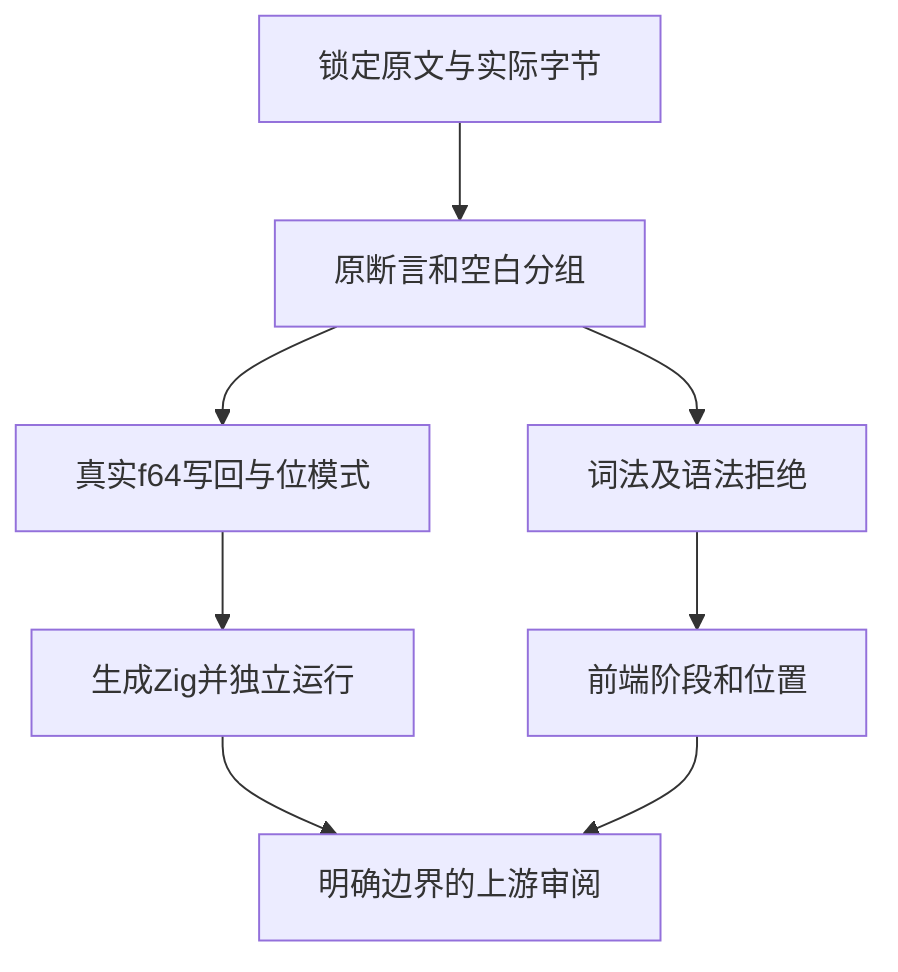
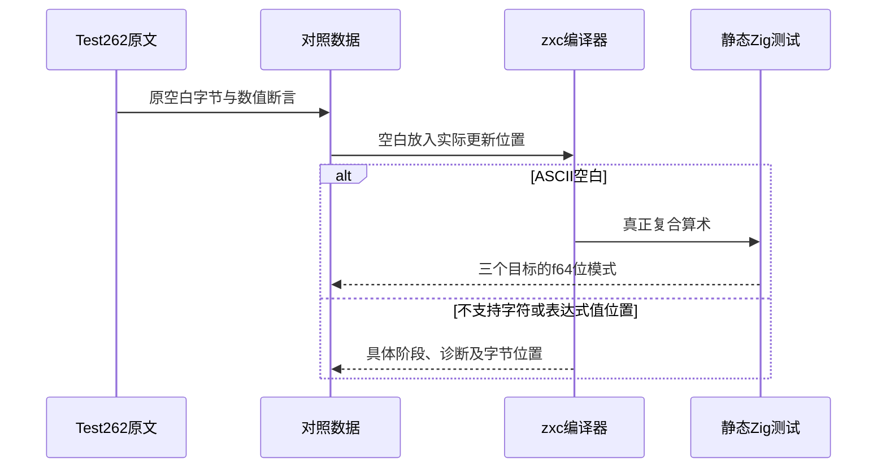

# 复合赋值空白原文对齐执行计划

## Intent：最终目标

对齐十一份锁定的compound-assignment whitespace原文，验证五种已支持算术的实际空白、三类目标与真实写回；明确Unicode空白和赋值表达式返回值的边界。

## Data：可用证据

起始基线为`93f4dd8dc7f75a21f5a0f60fc0f043b06ed82d26`。原文完整读取并匹配索引SHA；每份20个SameValue断言、10组实际空白字节。U+000D确为0d；组合串保持原字节次序，不能根据标签臆造字符。

## Edges：边界与限制

ASCII空白运行真实f64复合更新并检查位模式；非ASCII按当前词法契约拒绝，赋值表达式按状态更新语句契约拒绝。adapted明确记录这些差异，不声称原始JS语法等价。六种位移/按位复合操作登记excluded，不以简单算术替代。

## Answer：交付格式与成功标准

保存实际原文、断言数、字节、对照数据、生成器、分类目录与审阅。Debug和ReleaseSafe运行真正生成程序，负例检查阶段和字节位置；原文在参考引擎执行并保留20项SameValue计数。保留所有生成产物、二进制SHA和独立复跑证据，按英文Conventional Commits提交并推送。

