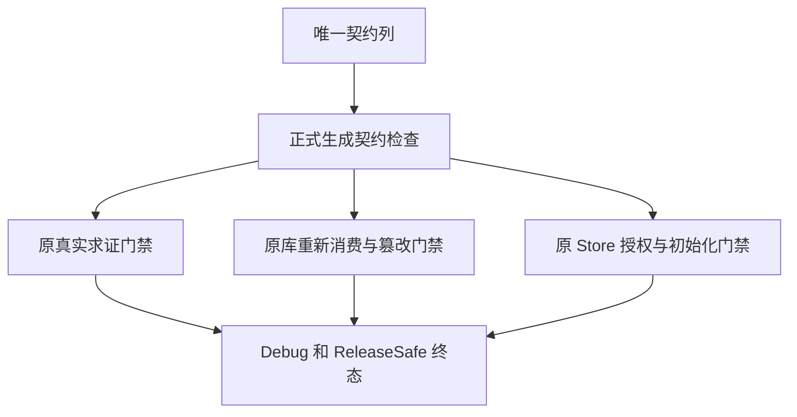

# 契约列原门禁独立复验

## Intent：最终目标

在 ContractTable 正式列迁移后的当前版本上独立执行原真实求证、库契约篡改及 Store 边界门禁，确认迁移保持原语言与授权断言，禁止用旧版本专项成功代替新版本证据。

## Data：可用证据

当前提交 `3130edab93253af00577b807a8a267a035ba4e71` 已包含生产 `6df3ec2f`：Program 与 Function 契约改用唯一 ContractTable，规范列为 expressions、kinds、predicates、span_end、span_start、symbols；Requires/Ensures 为规范枚举。生成 IR 版本 32、指纹 v37。正式 contract_artifact 辅助程序也已由实现会话同步到 kinds/Ensures，本部分不重复修改。

生产文档报告现有求证与库专项成功，仍需要独立执行当前正式源码。既有 test-verification 包括 CLI、公开模块和枚举，test-library-compiled-contract 实际重算恶意库摘要、重新消费并求证，test-library-rx-boundary 保留 Store 交易授权与必需初始化边界。使用明确指定的已有 Z3 5.1.0。

## Edges：边界与限制

不新增用例，不改原断言、辅助程序、超时或生产实现。两个优化模式运行同一原门禁集合；整个主检出包输入在真实终态前冻结。完整 Debug 会话 1804 与历史 Safe 17752 的固定检出独立保持原版本。进程等待结束不等于执行终态，不因观察超时重新启动。

## Answer：交付格式与成功标准

交付实际源码和工具链身份、原命令与会话定位、完整日志、每个原 Node 检查名称及真实终态、生成 CLI 身份、IDEA 执行记录与自我批判。原门禁出现失败时先区分辅助程序、资源超时与当前生产语义，只有后者经独立复验确认后才通知实现会话。完整本部分后以英文 Conventional Commit 提交 push。

