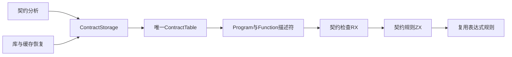

# 契约存储与检查自举

## Intent：最终目标

将持久IR契约对象数组改为唯一ContractTable列存储，使Program和Function契约可零数据复制地借给RX＋ZX。完整迁移契约顺序、参数、谓词与允许表达式检查，复用已迁移的表达式语义规则。

## Data：可用证据

基线029acd6f。ir.Contract内嵌SymbolTable和ExpressionTable，Program/Function保存[]const Contract，FunctionTable再保存契约数组列。生成ABI对象字段为指针，直接借用原内嵌对象布局不成立；在检查入口转换会创建第二份数据视图，因此从规范存储解决。

成熟实现采用core/function_table的列reserve→描述符分配→整行提交，以及失败回滚、view、finish和deinit。契约结构保留构造值Contract，持久数据由ContractTable负责。AST契约与语法ContractKind属于另一职责，不改其表示。

## Edges：边界与限制

kind、predicate、span_start/end、symbols/expressions描述符形成规范列；ContractStorage拥有列和两个描述符，借用底层表内容，不深复制。FunctionTable契约列借用稳定ContractTable描述符，其生命周期跟随既有表描述符规则。读取单行可以产生临时Contract，不持久保留镜像。

IR序列化形状变更必须提升版本，旧库与缓存按既有版本门禁拒绝。artifact复制必须逐契约映射类型和拥有字符串。契约限制表达式集合、requires先于ensures、输入输出命名及bool谓词不改变。无新增测试、不执行全量测试。

Grit当前--language支持列表不含Zig，故此批重构使用限定文件与明确旧文本的程序化替换，并按实际编译诊断及本次diff复核，不对AST契约做宽泛替换。

## Answer：交付与成功标准

交付ContractTable/Storage、全部IR生产与消费接线、RX＋ZX完整契约检查、版本边界、对应现有专项结果及生成物证据。宿主只借列，不循环执行语言规则，不引入自举专用运行库。关键节点记录实施、自审和日志，完成后提交push。




## 实施与接入

ContractTable规范列为expressions、kinds、predicates、span_end、span_start、symbols。kinds使用Requires/Ensures，与ZX枚举布局一致；at临时映射回既有语法kind。ContractStorage在所有列reserve后建立两个描述符再提交，finish/deinit释放自己的列和描述符，保留内层数据owner。FunctionStorage新增第四个契约表描述符，append回滚、finish失败、deinit、pop全部接入。

语义分析直接append列存储；artifact跨owner复制仍映射内部类型并复制拥有数据；roots与codec先检查外层ContractTable再解引用。IR32和Program默认version32同步，生成指纹v37按临时Contract行散列语义内容而非descriptor地址。AST契约数组保持独立。

新增contracts_check.rx与contract_tables_check.rx。前者校验顺序、参数与predicate，并逐表达式复用上一轮的规则；后者完整复用符号、表达式结构校验。宿主两个入口只借用规范列，均在零容量FixedBufferAllocator上执行。

现有契约IR变异测试改为两条临时记录→ContractTable构造，保留原mutation与断言；公开库契约篡改辅助器同步为FunctionTable/ContractTable列形状，仍篡改返回值、重算摘要，并要求库消费重新求证拒绝。没有添加测试用例。

## 生成物与零分配边界

生成语义检查5329行，共14处create备用分支，结构检查1524行，共1处create备用分支。逐控制流复核：来源descriptor在局部栈帧同步使用，loop只更新计数及valid，保留input/context/check/functions的origin；恢复分支因origin非空不可达。语义检查另有一次对空指针数组的dupe，长度0，不申请非零内存。没有alloc、append。

契约索引后的symbols/expressions被复制为栈上描述符，底层数据继续借用；所有地址在当前函数返回bool前同步消费，不向外逃逸。此结论仅针对当前生成物与有效结构，非任意未来修改的形式化证明。

## 自我复核

首次构建发现Task代码生成传入旧空slice，以及Program默认版本遗漏；随后发现共享floats源码需复用同一Build.Module，指纹必须新增ContractTable语义遍历。均从真实结构和编译证据修复，不改语义门禁。独立审阅覆盖规范列、四描述符失败回滚、跨owner复制、规则等价与生成物可达分配。

编译器包现有28/28步、372/372测试已通过。根最终构建和其它专项尚需终态收集，不把运行中检查写成成功。

## 正式接口代码

契约表布局与按值行接口如下，完整Storage实现在packages/core/src/contract_table/storage.zig：

```zig
const std = @import("std");
const ir = @import("../ir.zig");
const Self = @This();
pub const Kind = enum { Requires, Ensures };

expressions: []const *const ir.ExpressionTable = &.{},
kinds: []const Kind = &.{},
predicates: []const u32 = &.{},
span_end: []const u64 = &.{},
span_start: []const u64 = &.{},
symbols: []const *const ir.SymbolTable = &.{},
pub fn count(self: Self) usize {
    return self.kinds.len;
}

pub fn at(self: Self, index: usize) ir.Contract {
    return .{
        .kind = switch (self.kinds[index]) {
            .Requires => .requires,
            .Ensures => .ensures,
        },
        .symbols = self.symbols[index].*,
        .expressions = self.expressions[index].*,
        .predicate = @fromBackingInt(self.predicates[index]),
        .span = .{ .start = @intCast(self.span_start[index]), .end = @intCast(self.span_end[index]) },
    };
}

pub fn validStructure(self: Self) bool {
    if (self.count() > std.math.maxInt(u32)) return false;

    inline for (@typeInfo(Self).@"struct".field_names) |name| {
        if (@field(self, name).len != self.count()) return false;
    }

    for (self.span_start, self.span_end) |start, end| {
        if (start > std.math.maxInt(usize) or end > std.math.maxInt(usize)) return false;
    }

    return true;
}

pub fn fromValues(allocator: std.mem.Allocator, values: []const ir.Contract) std.mem.Allocator.Error!Self {
    var storage: @import("storage.zig") = .{};

    errdefer storage.deinit(allocator);

    for (values) |value| try storage.append(allocator, value);

    return storage.finish(allocator);
}
```

宿主完整实现位于packages/compiler/src/zx/ir/contracts.zig，RX语义入口为canonical/contracts_check.rx，结构入口为canonical/contract_tables_check.rx。输入指针由既有borrow.pointer递归检查字段、枚举和offset兼容性后转换，不绕过ABI检查。

## 求证专项

使用已存在的Z3 5.1.0二进制，显式设置ZXC_TEST_SOLVER，运行test-verification和test-library-compiled-contract。37/37构建步骤成功；CLI20场景、公开模块8项、枚举74项、库契约3项全部通过，失败0。包括实际求解器调用，不将type-only不调用solver的单一场景当作全部求证。

## 已通过检查与合并边界

最终根构建35/35步成功；契约分析与IR拒绝、验证资源、库codec、缓存codec、模块生成专项59/59步113/113项通过。所有通过的运行都使用正式generated_parser路径，并非只测试seed。未新增测试，未执行全量测试。

远端9f2979bf同步修复了公开库篡改辅助器的FunctionTable形状，本轮采用该实现，仅将内层契约改为ContractTable.kinds并检查Ensures。提交前针对该辅助器再次运行现有库契约专项，不把重复执行计为新增覆盖。

提交前仓库format脚本仅补齐五个Zig文件的语义空行；运行逻辑未变，源码指纹在格式化后采集。

最终库契约复核3/3通过，所有本轮运行均已收取退出0。验证结果.json记录格式化后源码与原始日志／生成物指纹，gzip保存完整证据。整体自举仍未完成，scopes和其它剩余原生职责继续另行推进。
