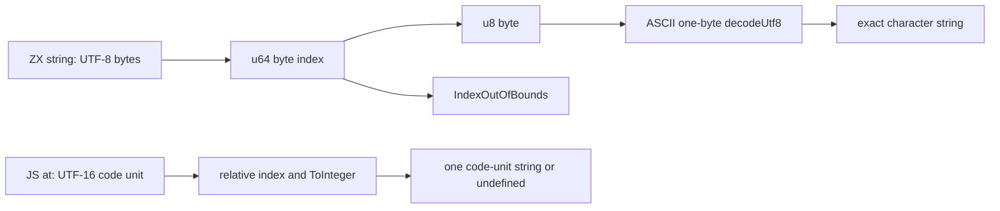

# 字符串索引上游审阅准备：入口与逐项观察

## IDEA

- **Intent：最终目标。** 为固定 Test262 revision 的字符串索引与字符读取准备逐文件证据，确认能保留的 ASCII 值观察和必须保留的协议边界。此文只提出后续审阅决策，不修改正式 review/catalog/tests。
- **Data：可用证据。** 分析时仓库 HEAD 为 `4693dd0d`。完整读取 `String.prototype.at` 11 份、String exotic 索引 14 份和 numeric-properties 1 份，共 26 个原文；26 个 SHA 均与 built-ins 索引一致，26 份均未审阅；26 个 archive member 与展开文件逐字节相同。另读取当前 ZX 分析器、Zig lowering、UTF-8 标准接口与现有普通夹具。
- **Edges：边界与限制。** 上限 40 个上游源文件，本轮实际 26 个；不扩大到 indexOf、charAt 或其他家族。没有执行原文、应用或门禁，也没有修改正式记录。`u8` 数字不能冒充 JS 单字符字符串；ASCII 值子集不等于整份原文适配。
- **Answer：交付与成功标准。** 本文和 `逐项观察草稿.json` 记录每个文件的固定路径、hash、完整核心观察、差异与 ASCII 值投影。主代理后续决定并执行原文；任何正式 adapted 记录都必须保留整份原文全部断言。当前完整 adapted 候选数量为 **0**。

## 原文入口与完整性

Archive：`/tmp/zxc-test262-reference/upstream.tar.gz`。

展开根：`/tmp/zxc-test262-reference/test262-7ab7fafa0003f73fc85c1b95d88094d33f7eb8bd/`。

锁定 revision：`7ab7fafa0003f73fc85c1b95d88094d33f7eb8bd`。

Archive SHA-256：`1d497a1e7430094a41d06f38db775df4a63db5d587b2a8b08aba6fad5de19585`，与 `packages/test/upstream/lock.json` 的 `archive_sha256` 一致。没有下载或重新获取上游。

校验使用仓库 `packages/test/upstream/index/built-ins.jsonl`；先汇总现有 `packages/test/upstream/reviews/**/*.jsonl` 排除已登记文件，再核对选定 26 份。JSON 草稿中的 `recommendation=exclude_whole_file` 是准备结论，不是正式 review 状态，原文未运行。

## 最新 ZX 真实契约

| 证据                                                                                 | 确认的行为                                                                                            |
| ------------------------------------------------------------------------------------ | ----------------------------------------------------------------------------------------------------- |
| `packages/compiler/src/zx/analysis/expressions.zig:58`                               | string 的 `.length` 分析为 `u64` 的 length 表达式。                                                   |
| 同文件 `:162` 至 `:182`                                                              | string 可直接索引；index 按 `u64` 分析，结果类型是 `u8`。                                             |
| `packages/genz/src/zx/types.zig:18`                                                  | string lowering 为 Zig `[]const u8`。                                                                 |
| `packages/genz/src/zx/lower.zig:269`                                                 | `.length` 生成 slice `.len`，因此是字节数。                                                           |
| `packages/genz/src/zx/intrinsics.zig:6`                                              | 读取索引前检查 `offset >= source.len`，越界返回 `IndexOutOfBounds`，随后读取单个字节。                |
| `packages/compiler/src/zx/analysis/calls.zig:72`                                     | 非 imported 成员调用要求 list；scalar string 的 `.at()` 不是公开入口。                                |
| `packages/compiler/standard/interfaces/encoding.d.zx` 与 `standard/src/encoding.zig` | `decodeUtf8(u8[]) -> string` 验证有效 UTF-8 后返回该字节切片；可把一个 ASCII 字节显式恢复成一个字符。 |
| `docs/zx_design_doc.md:185`                                                          | string 是 UTF-8 不可变字节切片；不是 UTF-16 的 String exotic object。                                 |

以上是当前源码事实，不是本轮新执行结果。`packages/test/tests/built_ins/string/values/cases.zx` 已使用 string.length 作为 bytes；`standard/encoding_crypto/values.zx` 已使用公开 decodeUtf8。`language/expressions/coalesce/values/string/index.zx` 实际索引的是 **string[] 列表**，不是 string 字节，不能当作直接字符索引测试。

## ASCII 值观察与整份原文边界

最清晰的是 `prototype/at/returns-item.js`：输入完整为 ASCII `12345`，索引 0..4 返回五个单字符字符串。数据读取语义可由普通字节索引加公开 UTF-8 解码表达，不能直接把 49..53 数字输出当作 `"1".."5"`。

下面仅是**未经编译或执行的适配构想代码**，保留实际输入读取，不是 case-id 分支或预制结果；未写入正式源码，也不能据此登记整份 adapted：

```zx
import encoding from "std:encoding"

export type Input = { text: string
 index: u64 }

export type Output = string

export default function (in: Input): Output {
  return encoding.decodeUtf8([in.text[in.index]])
}
```

| 完整输入 | index | ZX 实际读取字节 | 显式解码后精确字符 |
| -------- | ----: | --------------: | ------------------ |
| `12345`  |     0 |              49 | `1`                |
| `12345`  |     1 |              50 | `2`                |
| `12345`  |     2 |              51 | `3`                |
| `12345`  |     3 |              52 | `4`                |
| `12345`  |     4 |              53 | `5`                |

这份原文还独立断言 `typeof String.prototype.at === "function"`。ZX 当前没有该方法对象，不能删除第一项后把余下五项记为完整文件覆盖。现有普通夹具未发现“string 直接索引再输出精确单字符”的入口；上述输入是后续准备数据，并非已运行案例。

`numeric-properties.js` 的 `abc` 三项底层 ASCII 值也可如此表达，但完整原文的 receiver 是 `new String`，还验证三个 numeric own-property descriptor，均不能用普通 string 或 `u8` 不可变性替代。`returns-item-relative-index.js` 的 index=0 只是一个值投影，三项负索引不能预先转换为正值后冒充机制通过。

`returns-code-unit.js` 虽有四个 ASCII **输出**，完整输入是 `12\uD80034`，含孤立高代理。该输入无法作为相同有效 UTF-8 string 传入；不能删掉高代理后把 ASCII 子项当精确适配。

## 必须区分的错误与编码机制

- 直接 `s[-1]` 是负 property key，原文返回 undefined；`.at(-1)` 是末尾相对索引，原文返回最后一个字符。二者不是同一负索引规则。
- `hello world` 的长度是 11，`s[11]` 恰好越界。两个 7-3/7-4 文件的元数据写“greater than”，但实际源码是 **等于长度**；ZX 返回 IndexOutOfBounds，JS 返回 undefined。差异与 UTF 编码无关。
- `4294967295` 能由 u64 表达；3-5/3-8 的障碍是属性查找和越界结果，不是整数表示不足。
- 中字符的 UTF-8 字节长度为 3，JS UTF-16 length 为 1；一个 UTF-8 lead byte 不是一个完整中文字符，单字节 decodeUtf8 会失败。emoji 的 UTF-8 四字节与 UTF-16 两个代理单元同样不能混用。这些是契约示意，不新增上游文件或执行记录。
- `${byte}` 会生成十进制数字文本；49 插值为 `49`，不会成为字符 `1`。不能用模板转换逃过返回类型差异。
- optional/null、捕获 IndexOutOfBounds 或提前 bounds guard 都是另一个显式应用语义，不能自动算作原文 JS undefined 行为。



## 逐项原文观察

下列 path 都是固定 upstream 路径；全部状态为未审阅，建议为整份排除。建议由不同的具体断言支撑，不按 filename 或一条统一理由分类。

### 1. test/built-ins/String/15.5.5.5.2-1-1.js

SHA-256：`b0348d870502431c89059cd1247415712d7c8d657cbf522440352776823e205a`。Archive/展开/index 三方一致；未审阅；未执行。

完整核心观察：

- new String("hello world") 上设置 foo=1，然后 s["foo"]===1。

整份适配判断：String wrapper 的动态数据属性与字符串键查找。ZX string 是字节切片，不可增加 foo，索引要求 u64；不能用普通对象 foo 字段代替 String exotic receiver。

### 2. test/built-ins/String/15.5.5.5.2-1-2.js

SHA-256：`274719c9e208ee3bee67bb1755988491f82712e23488b435403463f24838db90`。Archive/展开/index 三方一致；未审阅；未执行。

完整核心观察：

- primitive String("hello world") 的 s["foo"]===undefined。

整份适配判断：非数字 property key 与 primitive 装箱后的缺失属性返回 undefined。ZX 不支持 string-key 索引，静态类型拒绝不是运行时 undefined。

### 3. test/built-ins/String/15.5.5.5.2-3-1.js

SHA-256：`eec5e75ee67639155c0443503c3ece6b4cbe79c428046b000f188f47ea7e9268`。Archive/展开/index 三方一致；未审阅；未执行。

完整核心观察：

- new String("hello world") 的缺失属性 s["foo"]===undefined。

整份适配判断：String wrapper、非数字属性键和缺失属性返回值；没有任何数值字符读取观察。

### 4. test/built-ins/String/15.5.5.5.2-3-2.js

SHA-256：`b15f569be78d1a10ea6325553d98aed83ebb757f2821ea7642a9d1609744493f`。Archive/展开/index 三方一致；未审阅；未执行。

完整核心观察：

- primitive String("hello world") 的 s["foo"]===undefined。

整份适配判断：String exotic 的非数字缺失属性读取，不能改成 u64 字节访问或一个 optional 对象字段。

### 5. test/built-ins/String/15.5.5.5.2-3-3.js

SHA-256：`97e94a03219d97312971df1c72560915ff1421bdf3ca7868d1a48d74b9cd3b42`。Archive/展开/index 三方一致；未审阅；未执行。

完整核心观察：

- new String("hello world") 的 s[NaN]===undefined。

整份适配判断：NaN 转 property key 后的 String exotic 缺失属性语义，加上 wrapper。ZX 索引为 u64，没有 NaN 或该 ToPropertyKey 机制。

### 6. test/built-ins/String/15.5.5.5.2-3-4.js

SHA-256：`f54d48a8ee20a3de45c8e81e6cfe29d0246cc4f085dd1cf3d2c63e1b27866197`。Archive/展开/index 三方一致；未审阅；未执行。

完整核心观察：

- new String("hello world") 的 s[Infinity]===undefined。

整份适配判断：Infinity property key 与 wrapper 的缺失属性语义；ZX u64 不含 Infinity，不能用编译拒绝充当 undefined。

### 7. test/built-ins/String/15.5.5.5.2-3-5.js

SHA-256：`57175139db334ff9330d07923480dfbae255e528d42820d13fdc17e51f1a9ec1`。Archive/展开/index 三方一致；未审阅；未执行。

完整核心观察：

- new String("hello world") 的 s[Math.pow(2,32)-1]===undefined，实际数值为 4294967295。

整份适配判断：数值可由 u64 表达，但 ZX 字节索引越界抛 IndexOutOfBounds，原文返回 undefined；还包含 String wrapper。不能将它归为仅不支持大整数。

### 8. test/built-ins/String/15.5.5.5.2-3-6.js

SHA-256：`325218c79c75635188d0186b062059be17ee08ee36afb9853b0608ebf8d4211a`。Archive/展开/index 三方一致；未审阅；未执行。

完整核心观察：

- primitive String("hello world") 的 s[NaN]===undefined。

整份适配判断：NaN 的 property-key 转换与 missing-property 返回；ZX u64 字节索引无此转换。

### 9. test/built-ins/String/15.5.5.5.2-3-7.js

SHA-256：`7c3693b5ae2bead3042cfbd70dccbea8c884db9914f3e853667ed2b92e0761f9`。Archive/展开/index 三方一致；未审阅；未执行。

完整核心观察：

- primitive String("hello world") 的 s[Infinity]===undefined。

整份适配判断：Infinity property-key 转换和缺失属性返回；ZX unsigned 整数索引无法保留。

### 10. test/built-ins/String/15.5.5.5.2-3-8.js

SHA-256：`f14bd65979ea49734cec01e99df1e94ddc6c19850aebf1c75df8d4269b63a6a7`。Archive/展开/index 三方一致；未审阅；未执行。

完整核心观察：

- primitive String("hello world") 的 s[Math.pow(2,32)-1]===undefined，实际数值为 4294967295。

整份适配判断：4294967295 可表达为 u64，障碍是越界返回 undefined 与 IndexOutOfBounds 不同，以及 JS property lookup 机制。

### 11. test/built-ins/String/15.5.5.5.2-7-1.js

SHA-256：`1d6591c1561d6d54ef2d697e273457e3067bf43aaf3a2d814a2cdec46ccd556f`。Archive/展开/index 三方一致；未审阅；未执行。

完整核心观察：

- new String("hello world") 的 s[-1]===undefined。

整份适配判断：直接括号索引的 -1 是 property key，不是 at 的倒数索引。ZX 不接收负 u64 索引，也没有 wrapper 缺失属性返回。

### 12. test/built-ins/String/15.5.5.5.2-7-2.js

SHA-256：`d757792cdfe6a624ac30ba883db6cb83d18ad50f20a13f71f774eb0d1cee614a`。Archive/展开/index 三方一致；未审阅；未执行。

完整核心观察：

- primitive String("hello world") 的 s[-1]===undefined。

整份适配判断：负 property key 的缺失属性返回；不能把 -1 改成末尾索引，那会错误地引入 at 相对索引语义。

### 13. test/built-ins/String/15.5.5.5.2-7-3.js

SHA-256：`7191ac3d6ba5cacfdd76f1f6292388c11bb0c87802a5bc34b504227f30ba93a3`。Archive/展开/index 三方一致；未审阅；未执行。

完整核心观察：

- new String("hello world") 的 s[11]===undefined；原字符串长度恰为 11。

整份适配判断：这是 index==length 边界，尽管元数据写 greater than。ZX index 11 会抛 IndexOutOfBounds，加上 wrapper 差异，不能将错误归为字符编码。

### 14. test/built-ins/String/15.5.5.5.2-7-4.js

SHA-256：`6f7a071e446d6dcec5a8c6d0140565a2406d84cd37a88e7cc50728ae1cada48c`。Archive/展开/index 三方一致；未审阅；未执行。

完整核心观察：

- primitive String("hello world") 的 s[11]===undefined；长度恰为 11。

整份适配判断：相同 ASCII 长度边界，JS 返回 undefined，ZX 抛 IndexOutOfBounds；非 UTF-16/UTF-8 差异。

### 15. test/built-ins/String/numeric-properties.js

SHA-256：`6a6a4dff7e029df4ec3872bec6e2a75d1848d1f002023b6321e5c45c28fc381c`。Archive/展开/index 三方一致；未审阅；未执行。

完整核心观察：

- str=new String("abc")。
- str[0]==="a"，其属性 writable=false、enumerable=true、configurable=false。
- str[1]==="b"，其属性三个标志同上。
- str[2]==="c"，其属性三个标志同上。

整份适配判断：三个底层 ASCII 字符值可用字节索引加 decodeUtf8 表达，但原文同时要求 wrapper 的 numeric own-property descriptor。ZX 的不可变字节不是 JS 属性描述符；不能删掉三组 verifyProperty。

仅可表达的 ASCII 值投影（不能代替整份登记）：

- text=`abc`，index=0，字节=97，显式 decodeUtf8 后为 `a`。
- text=`abc`，index=1，字节=98，显式 decodeUtf8 后为 `b`。
- text=`abc`，index=2，字节=99，显式 decodeUtf8 后为 `c`。

### 16. test/built-ins/String/prototype/at/index-argument-tointeger.js

SHA-256：`563b86b614bb22f0bdc35ab51d67bf1ea68395e71bb22699f92ab48eed02337f`。Archive/展开/index 三方一致；未审阅；未执行。

完整核心观察：

- typeof String.prototype.at==="function"。
- s="01"，index 对象的 valueOf 返回 1，s.at(index)==="1"。
- valueOfCallCount===1。

整份适配判断：索引对象的 valueOf/ToInteger 与恰好调用一次是核心，另有方法反射。不能预先提供 u64=1 后把 ASCII 结果子集算完整。

### 17. test/built-ins/String/prototype/at/index-non-numeric-argument-tointeger-invalid.js

SHA-256：`40f3f86ec5d2337f1c25fd0699589c15486b897077fdce53fb884380b5442135`。Archive/展开/index 三方一致；未审阅；未执行。

完整核心观察：

- typeof String.prototype.at==="function"。
- "01".at(Symbol()) 抛 TypeError。

整份适配判断：Symbol 转索引时的 TypeError 与方法反射。ZX 不提供 at 或 Symbol 动态 ToInteger，静态参数类型拒绝不等价。

### 18. test/built-ins/String/prototype/at/index-non-numeric-argument-tointeger.js

SHA-256：`37a09110b92218ff022e8e84abee3259c6083d880f193fc679f1bbfb803de03e`。Archive/展开/index 三方一致；未审阅；未执行。

完整核心观察：

- typeof String.prototype.at==="function"。
- 对 "01"，false/null/undefined/空字符串/function() {}/[] 六种索引均得到 "0"。
- true 与字符串 "1" 两种索引均得到 "1"。

整份适配判断：八种不同 ToInteger 输入，含 null/undefined/function/array。ZX typed u64 不实施这些转换；不能按结果硬编码为 0/1。

### 19. test/built-ins/String/prototype/at/length.js

SHA-256：`6deec5fb10036c20d1d0fc20f0c6fdba65dce728993041fe086d722d49bb06fa`。Archive/展开/index 三方一致；未审阅；未执行。

完整核心观察：

- typeof String.prototype.at==="function"。
- at.length 的 value=1、writable=false、enumerable=false、configurable=true。

整份适配判断：函数对象 length 与 descriptor，不是被索引字符串的长度；不能拿 string.length 或静态 callable 类型代替。

### 20. test/built-ins/String/prototype/at/name.js

SHA-256：`6173636983f106f5cde1dd263908c13ec9b67af828490f395a636a2b431dd311`。Archive/展开/index 三方一致；未审阅；未执行。

完整核心观察：

- typeof String.prototype.at==="function"。
- String.prototype.at.name==="at"。
- name 属性 enumerable=false、writable=false、configurable=true。

整份适配判断：JS 方法名和属性描述符反射。ZX 不存在可反射的 String.prototype.at 函数对象。

### 21. test/built-ins/String/prototype/at/prop-desc.js

SHA-256：`0dda6580709740d9ee00b9e90296adfaecfe104f658c18fd7c647e72b3262155`。Archive/展开/index 三方一致；未审阅；未执行。

完整核心观察：

- 原文两次独立检查 typeof String.prototype.at==="function"。
- String.prototype 上 at 属性 enumerable=false、writable=true、configurable=true。

整份适配判断：两个 typeof 检查及 prototype 方法属性 descriptor 均必须保留，不能只检查 ZX 支持字符串索引。

### 22. test/built-ins/String/prototype/at/return-abrupt-from-this.js

SHA-256：`040e88575f07f143a860498fb21dccc461c8ac99b84604233c69bd4b49df502b`。Archive/展开/index 三方一致；未审阅；未执行。

完整核心观察：

- typeof String.prototype.at==="function"。
- String.prototype.at.call(undefined) 抛 TypeError。
- String.prototype.at.call(null) 抛 TypeError。

整份适配判断：RequireObjectCoercible、generic this 以及方法反射。ZX string typed input 没有 null/undefined receiver 或 JS call 协议。

### 23. test/built-ins/String/prototype/at/returns-code-unit.js

SHA-256：`a67ce4e6a1595fbce73142d091b580507b617361454cc016de68695ec1d13661`。Archive/展开/index 三方一致；未审阅；未执行。

完整核心观察：

- typeof String.prototype.at==="function"。
- 完整输入 s="12\uD80034"。
- at(0/1/2/3/4) 分别为 "1"/"2"/单独高代理 D800/"3"/"4"。

整份适配判断：整个输入含孤立 UTF-16 高代理，不能作为相同有效 UTF-8 string 传入；index 2 的孤立代理结果也不可表示。其余四项虽为 ASCII 输出，不能换掉完整输入后截取登记；还需 typeof at。

### 24. test/built-ins/String/prototype/at/returns-item-relative-index.js

SHA-256：`a4be170547d99a5eed0dd4e86710ed8b4ae2b22246212f98eacd44f357744bae`。Archive/展开/index 三方一致；未审阅；未执行。

完整核心观察：

- typeof String.prototype.at==="function"。
- s="12345"；at(0)==="1"、at(-1)==="5"、at(-3)==="3"、at(-4)==="2"。

整份适配判断：只有 index 0 的 ASCII 值投影符合 unsigned 字节读取；三项负相对索引和方法反射都未支持。预先将负数换成正索引会删除原文核心。

仅可表达的 ASCII 值投影（不能代替整份登记）：

- text=`12345`，index=0，字节=49，显式 decodeUtf8 后为 `1`。

### 25. test/built-ins/String/prototype/at/returns-item.js

SHA-256：`c15c0d8635a9255f3ea7a82a57974a5973352be043c6834be296080e4324aa23`。Archive/展开/index 三方一致；未审阅；未执行。

完整核心观察：

- typeof String.prototype.at==="function"。
- 完整 ASCII 输入 s="12345"；at(0..4) 分别返回字符串 "1".."5"。

整份适配判断：五个非负、范围内 ASCII 字符观察可以经字节索引加 decodeUtf8 保留精确字符串值；直接 u8 或数字模板不能替代字符。但整份仍含 typeof String.prototype.at，当前没有 at 方法对象，不能丢掉这项标为 adapted。

仅可表达的 ASCII 值投影（不能代替整份登记）：

- text=`12345`，index=0，字节=49，显式 decodeUtf8 后为 `1`。
- text=`12345`，index=1，字节=50，显式 decodeUtf8 后为 `2`。
- text=`12345`，index=2，字节=51，显式 decodeUtf8 后为 `3`。
- text=`12345`，index=3，字节=52，显式 decodeUtf8 后为 `4`。
- text=`12345`，index=4，字节=53，显式 decodeUtf8 后为 `5`。

### 26. test/built-ins/String/prototype/at/returns-undefined-for-out-of-range-index.js

SHA-256：`ec8106380287ef3f7a15adfc6fd1a351191078bff47102574be2500d3c2ced8a`。Archive/展开/index 三方一致；未审阅；未执行。

完整核心观察：

- typeof String.prototype.at==="function"。
- s=""；at(-2)、at(0)、at(1) 均返回 undefined。

整份适配判断：原文将负索引与零长度越界都返回 undefined；ZX u64 不接收 -2，index 0/1 抛 IndexOutOfBounds。改为 optional/null 或捕获错误改变返回与失败机制。

## 执行边界与自我复核

本轮仅核对源文与源码契约，未执行 26 份上游原文、未构建适配构想、未运行任何门禁、未提交。下一步由主代理先执行未修改原文并记录每个允许模式的宿主结果，再决定正式审阅；宿主失败不自动归为 zxc 缺陷。

复核时没有把 returns-item 的五项 ASCII 值截为整份通过，没有把 numeric-properties 的不可写性等同 descriptor，没有把带孤立代理输入的 ASCII 输出当作相同 UTF-8 输入，也没有把 4294967295 判成不可表达整数。所有 26 份的完整不可保留项均逐项记录。准备材料不修改已有 review。
