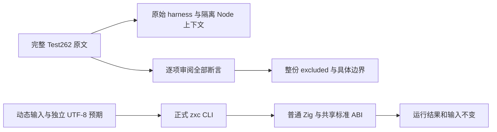
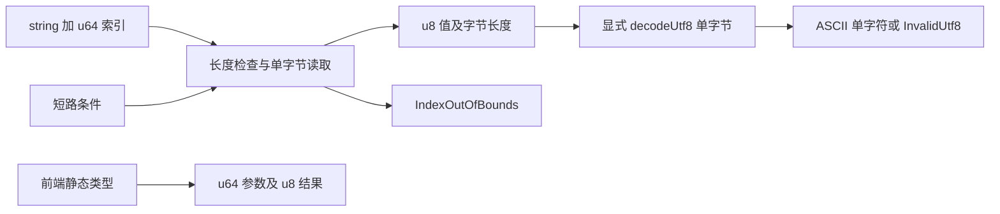

# 字符串索引执行与上游审阅计划

## IDEA

- Intent：完成固定 Test262 字符串索引/at 的 26 份完整原文审阅，同时补齐 zxc 实际 UTF-8 字节索引的类型、运行与错误契约；不以局部 ASCII 值冒充整份适配。
- Data：冻结 689dda7cb39ffc4895348b4c96586c3ceb88b2dd；锁定 revision 7ab7fafa0003f73fc85c1b95d88094d33f7eb8bd；完整原文、archive/index/展开三方 SHA、正式 string 索引和 encoding.decodeUtf8。
- Edges：ZX string 为不可变 UTF-8 字节，u64 索引返回 u8，越界抛 IndexOutOfBounds。整份原文还要求 JS 动态属性/反射/ToInteger/undefined 或孤立代理，按具体断言登记 excluded。ASCII 的九项核心值仅作普通字符回归，不关联为整份 adapted。没有新增生产实现或专用运行库。
- Answer：26 份原文允许模式宿主运行证据、逐项正式 review、分类 JSON 用例与普通 ZX 源码、两模式真实 CLI 生成执行、目录审计与输入/输出 SHA、IDEA、Mermaid 和自我批判；完成后英文 Conventional Commit 提交 push。

## 架构图

## 数据流图

## 步骤与成功标准

1. 主代理已完整读取准备的 26 份原文，再核对 archive/index/展开字节与未审阅状态。准备代理没有执行或登记结果，本轮独立完成。
2. 使用每份 metadata 的 includes 和允许模式，原文不替换、不断言截取；宿主失败不能自动视为 zxc 缺陷。
3. 写入 docs 草稿，正式测试目录按 bytes、decoded、composed、logical_and、logical_or、types 分组。预期源自明确 UTF-8 字节表及边界规则，生产代码只读取真实输入。
4. 复用本会话基线工作区，先核对并保存类型查询九输入，只恢复/删除这些已发布输入后冻结新 HEAD。旧查询基线实时核验需要恢复 4693dd0d 与其九输入，历史证据保留；后续为复验 c949379a 也复用同步工作区；旧查询两版本实时核验均需恢复历史 HEAD/输入，历史日志保留。
5. 冷缓存 Debug/ReleaseSafe 通过真实 CLI 生成普通 Zig，前端类型专项过滤执行；检查动态可写输入成功/失败不变。核验实际叶节点与完整 catalog/review 注册。
6. 如发现真正生产缺陷才通知实现会话；只提交本轮测试/正式审阅与文档，保留十一份已有修改。

## 自我批判

整份排除必须对应不成立的正式语言契约，不能只因为适配麻烦。字符解码的 ASCII 子集可用于普通回归，但不能删除 typeof at 或 descriptor 后宣称原文通过；非 ASCII 单字节读取与 Unicode 字符读取不同。大量数据行也不能替代类型阶段、短路与错误边界。本轮不实现 JS String 对象或伪造 JS undefined。

## 已核对的进展

- 26 份原文在允许的两个模式下共 52 次，全部通过；完整源文未修改，正式登记整份 excluded，不增加 adapted。
- 首次 Debug 在 689dda7c 实际通过 247/247，六个叶节点为 19、100、66、30、16、16。
- 远端 c949379a 引入普通内联循环列表。主工作区 fast-forward，同一十四输入逐字节一致；最终在隔离工作区以两个新 local cache 复验。正式工具链 archive 已匹配 CLI 固定 SHA。
