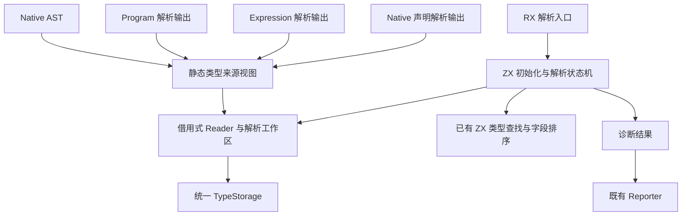

# 完整类型解析自举

## IDEA

- **Intent**：把类型声明初始化、名称解析和类型 AST 解析迁移至 RX/ZX，保持 Native AST 与三种索引式解析器入口。迁移对象为解析规则，而不是仅把 Zig 调用包在 RX 中。
- **Data**：基线为 `6575f015`；证据来自 `analysis/types/resolve.zig`、`analysis/types.zig`、Native/Indexed 类型视图、program/expression/native 解析输出与现有语义表自举模块。
- **Edges**：不新增运行库、函数指针调度、AST 镜像或指针整数编码；不执行全量测试，不新增测试用例，不操作其他会话工作区。数据存储与分配使用显式静态 Zig 原生模块，语义决策由 ZX 实现。显式工作栈会新增分配失败点，不承诺分配次数等价。
- **Answer**：交付 RX 编排、ZX 解析状态机、借用式读取层、原生工作区及构建接线；正式入口替换完成、针对性构建和已有专项通过后才认定本特性完成并提交推送。当前仍处于实施阶段。

## 第一性问题

类型解析的输入不是统一结构：原生 AST 持有指针，program、expression、native 三种生成输出分别拥有不同 Zig 类型身份。相同字段不构成可强转的 ABI。

读取层只统一访问，不统一底层布局。它持有有限分支的借用式视图，原生引用保留指针，索引引用保留节点或枚举声明索引。ZX 决定名称优先级、递归检查、容器规则和驻留；原生层只执行读取、分配、哈希表及数组操作。

## 架构图

## 数据流图

## 实施顺序

1. 固定借用式 Reader 的四种输入，保存草稿，并核对每个方法与现有视图的同等行为。
2. 提供原生工作区：源引用、解析栈、子类型缓冲区、枚举名称缓冲区、类型表和哈希表借用。它不得导入 Types、Analyzer 或 frontend。
3. 实现 ZX 初始化、名称、节点和容器收尾；通过 RX 入口编排。
4. 接入生成构建、共享静态视图模块和正式解析入口；seed 保留生成所需原始实现，正式入口不得回退到 seed。
5. 复用已有专项，检查本次 diff、原生边界和生成输出；保存准确证据和源码草稿，完成后提交推送。

## 必须保留的顺序

### 初始化

先记录原类型表行数。空表才追加全部 scalar。随后依次检查 imported aliases：内建名覆盖、与此前 alias 重复、与任一本地声明冲突。所有 alias 检查完成后，逐个检查本地声明：内建名覆盖、与此前声明重复。所有名字通过后，按声明顺序解析，最后执行共享类型联结。

### 名称

优先级固定为 builtin、resolved、imported alias、visiting、256 层限制、查找声明、unknown。

256 是同时解析中的命名声明数，不是工作栈帧数。builtin、已解析名称和导入 alias 在深度达到上限时仍可使用。达到 256 时未知名称先报深度错误。

只在发现声明后加入 visiting。解析成功但 resolved.put 失败也必须撤销本次 visiting；不得清空调用之前已存在的条目。每个 FinishName 在成功写入 resolved 后移除对应 visiting；失败清理检查本次尚未完成的名字。

### 原生引用和枚举

只有 native_interface 中声明的直接 named opaque 生成 native_reference。普通 named opaque 和间接容器内 opaque 不触发该规则。

枚举只有声明路径能生成；匿名枚举节点必须拒绝。空枚举在分配之前拒绝。成员按照原顺序检查重复后复制，最后复制枚举名称并追加。枚举不做结构驻留，同一声明通过 resolved 缓存复用。

### 容器

- application 先核对 Array，其他应用立即拒绝，不能先解析参数。
- tuple 先分配完整子类型缓冲区并逐个解析，全部成功后检查 task，再查找和追加。
- object 先分配 names 再分配 types；逐字段先检查此前重复、再解析类型、再检查 void、再复制名字。全部字段完成后检查 task、排序、查找、追加。
- optional/list 在子类型完成后检查 task；list 再检查 void，然后查找和追加。optional<void> 保留合法性。

## Reader 约束

草稿：`草稿/reader.zig`。它以四个已有视图类型作为编译期参数，静态 union 分支分派，没有函数指针或堆内 AST 副本。

- `Ref` 为原生指针、节点索引、枚举声明索引的显式 union。
- 名称与 span 从原视图读取；最终类型表和诊断不得保留 Ref。
- 字段和 tuple 用 position + 1 表示有效位置，0 表示结束；indexed 直接沿 Order 的 forward links 前进，Native 沿数组下标前进。
- 字段值用 atPosition 读取，禁止每次从 head 重走到第 i 个字段。
- expression 没有声明和枚举成员，相关分支在编译期排除存储字段访问。
- Reader 借用的源码、解析输出、原生 AST 与 Order 必须覆盖一次完整 execute。
- 草稿返回 Zig 小值供工作区使用；ZX 原生接口需通过工作区槽位读取，不能把每次返回 Name/Ref 转成带 arena 分配的生成 aggregate。

## 工作栈

建议帧种类为 ResolveName、FinishName、ResolveNode、FinishWrap、TupleNext、ObjectNext。每次只调度一个子类型，结果保存在工作区槽中。枚举扫描可使用普通 loop，无需每个成员建立帧。

帧保存源引用、当前位置、缓冲区和收尾状态。ZX 控制 push/pop 和转换，原生方法只保存数据。不要在原生 appendContainer 方法中调用 Types.wrap/tuple/object，否则语义仍然留在 Zig。

类型查找继续复用 ZX types/find，字段排序继续复用既有 ordering。读取可变 TypeStorage 的列时借用当前切片，不复制整表；扩容之后重新获取视图，禁止保存失效切片。

## 诊断位置

| 条件                                   | 位置         |
| -------------------------------------- | ------------ |
| imported builtin 或 imported duplicate | 零 span      |
| local 与 imported 冲突、本地重复或覆盖 | 声明名称     |
| 递归、深度、未知名称                   | 当前引用名称 |
| 重复对象字段、字段 void                | 字段名称     |
| 空枚举                                 | 声明名称     |
| 重复枚举成员                           | 当前成员     |
| 容器 task、list void、匿名枚举         | 零 span      |

消息文本与诊断分类逐项取自基线，不为新状态机改写公开诊断。

## 验证和自我批判

已有候选专项包括语言类型与正向语义、native 声明与拒绝用例、type_merge/artifact 和 signature 路径。运行前先核对专项入口，避免间接触发全量。

直接覆盖 256 层与 visiting 分配失败清理的现有独立专项尚未确认。其他专项通过不能证明这些边界；没有证据时必须明确保留验证限制。

本次设计增加显式栈的内存成本，收益是 ZX 能表达递归解析控制。不能把无 AST 镜像宣传为零分配，也不能把静态链接等同于迁移完成。验收需要查阅正式入口和生成结果，确认语义规则不再由原生回调代做。

## 实施记录：读取层草稿

已完成四分支 Reader 草稿，并以现有实际生成的 program、expression、native 输出实例化全部公开读取方法，`zig build-obj -fno-emit-bin` 返回 0。输入哈希保存于 `验证结果.json`。`草稿/instantiate.zig` 仅用于强制编译方法体，不包含测试输入、不执行 Reader。

此证据确认不同 Zig 类型身份可通过静态分支适配，不证明运行时索引正确或解析语义保持不变。生成文件来自既有构建缓存，接入正式模块时仍需当前构建生成与已有专项验证。

读取层草稿阶段尚未修改正式源码。当时还没有实现工作区、ZX 状态机和构建接线，因此没有将该阶段提交为已完成特性。

## 实施记录：正式状态机接线

正式入口 `types/resolve.zig` 已调用生成模块，原始实现保存为 `resolve_seed.zig`，仅在 `generated_parser = false` 的 seed 构建中使用。Native AST 与三种索引视图均进入同一生成解析器。

`types/view.zig` 提供独立的共享静态视图模块。frontend 和 resolution 工作区导入同一模块实例，三种生成解析输出也共享构建实例；不以相似布局强转不同 Zig 类型。超过五个文件的导入替换先尝试了 grit 的 Zig 模式，工具拒绝该语言模式后，使用限定路径与精确文本替换。

ZX 按 initialize、name、node、enumeration、wrap、tuple、object、intern、step、run、execute 划分规则。RX 调用 execute，execute 负责初始化和声明顺序；run 调度显式帧。Types 原有 wrap/tuple/object 仍服务其他既有调用点，但新解析器不回调这些 Zig 语义方法。

### 诊断枚举边界

最初把字符串文案传给原生 fail 方法，生成器因字符串参数可能逃逸而保守地分配部分状态对象。没有放宽通用原生字符串逃逸规则，而是把诊断协议改为 Message 枚举。

ZX 选择 Message、类别和 span；原生 diagnostics 仅把固定枚举映射回原有十八条文案并提交 Reporter。条件判断、优先级和位置决定仍在 ZX。只读审阅逐条对照了十八条文案、类别和 span。

### 显式可变状态

第一版工作区把帧栈与结果直接放在 opaque 视图本体，原生适配使用 constCast 修改。运行日志观察到原生 pop 内结果为 10/5，调用者随后读取本地字段却为 0；添加打印还会改变后续实际回读。仅从这个观测不能断言具体 Zig 优化器内部原因。

最终工作区改为只读视图持有 `state: *State`，帧栈和结果放在调用者显式持有的 State 中，所有写入通过该指针完成；原生 access 返回 `*const View`，不再 constCast。State 覆盖同步 execute 与 defer 清理的完整生命周期。

这一边界修正后，无调试日志的正式编译器可编译 builtin.zx 和完整 resolve.rx。修正前后的失败记录不计为通过证据。

### 生成证据

适配后的调用链可用零字节临时分配器执行。这里的零字节只约束生成控制流程，不约束显式原生类型表、名称缓冲区和帧数组分配。

草稿生成文件仍包含未被入口调用的旧堆版本辅助函数；必须分析 execute 的实际直接调用图，不能仅以文件内存在 create 推断入口必然分配。初次分析为 105 个可达函数，无可达 create/alloc；最终生成文件需重新记录哈希与调用图。

使用 seed 阶段可用的旧 CLI 与 State 修正后的 CLI 生成同一完整解析模块，Zig 源码与 ABI 文件的 SHA-256 均相同。这只证明本模块生成结果的一致性，不代表整个编译器已经完成自举。

### 专项范围

- 复用 `packages/test` 中 test-native-declarations、test-native-references-analysis、test-type-merge。
- `验证/build.zig` 只筛选现有 compiler tests/root.zig 中 `types:` 和 `positive analyze:` 用例，没有新增测试用例。
- 运行结果以 `验证结果.json` 为准；不运行全量测试。

## 本阶段验收

正式发行构建通过；语言类型与正向语义 20/20，原生声明、原生引用和类型合并专项 107/107。最终 CLI 可生成完整解析模块，输出 Zig 及 ABI 与 seed 阶段工具逐字节哈希一致。生成入口的直接调用图没有可达 create/alloc，实际执行保留零字节临时分配器。

验收只覆盖完整类型解析迁移这一阶段。Expression 视图的独立类型注解运行专项、256 层精确边界与预存 visiting 清理未新增专门用例；保留源码对照审阅及已有专项的证据边界。未运行全量测试。整个 zxc 自举仍有后续工作。

提交前同步了测试会话的三笔提交，合入基线为 `24921a0b`；这些提交只新增测试及其文档，没有编译器实现冲突。提交钩子只调整源码空白。归档生成源码的格式化后 SHA-256 与原始生成 SHA-256 分别记录，不混用两者。

同步后的 test-type-merge 专项通过 94/94，包含新加入的批量映射、名义身份、所有权和资源失败用例。它与先前 107 项专项有重叠，不将两次结果累加成独立用例总数。
