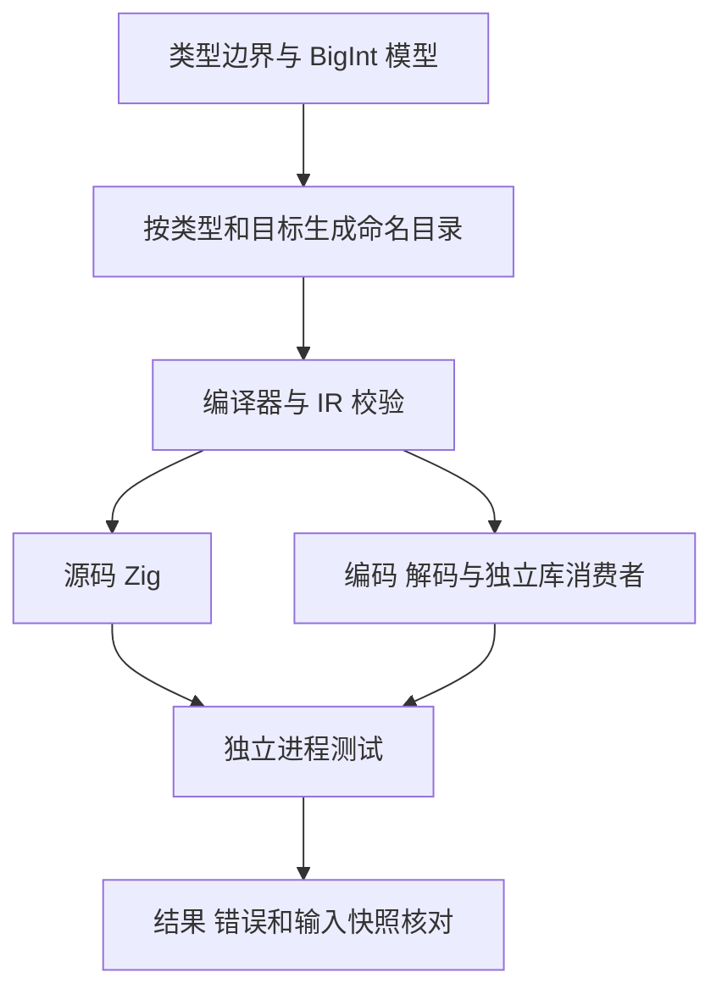

# 定宽整数复合目标执行计划

## Intent：最终目标

补齐 u8/u16/u32/u64/i32/i64 的普通字段、嵌套字段和列表元素复合更新。验证五种算术在有效边界、溢出/下溢、除零、多轮写回、被跳过循环和列表边界时的结果与输入所有权。

## Data：可用证据

起始基线为 `6851e4ccf4b644d9ecda9dce8abf214f8295e9e0`。前一部分已验证 i64 宿主平面/嵌套列表更新的求值顺序；现有目录的浮点 state update 和普通整数 expression 均不足以证明这些整数目标的写回。

## Edges：边界与限制

预期使用 BigInt，输入与报告以精确十进制字符串保存。安全失败作为独立进程 panic；应用边界错误另行核对，不混为同一种结果。Debug 与 ReleaseSafe 为本轮安全契约，不能套用到关闭 runtime safety 的构建。

只覆盖明确支持的六种整数类型和三类目标，不声称所有类型、所有 Store/RX 生命周期已完成。固定宽度整数不同于 Test262 Number，不能登记为 IEEE Number 等价实现。

## Answer：交付格式与成功标准

新目录 `tests/runtime/safety/compound_integer/<类型>/<目标>` 分类保存 ZX fixture 与命名 JSONL 用例；生成器与独立模型集中于 `src/compound_integer`。接入现有 safety 注册、总测试及生成一致性校验。源码与销毁 provider 后的编译库消费者均运行两种安全优化，并保存全部实际进程输出、二进制 SHA、生成产物与可复制草稿。每个完成部分使用英文 Conventional Commits 提交并推送。



```mermaid
sequenceDiagram
    participant Case as 参数用例
    participant Loop as 生成的状态循环
    participant Target as 字段或列表目标
    participant Driver as 独立进程驱动
    Case->>Loop: 精确整数与轮次
    loop 每个实际轮次
        Loop->>Target: 读取当前目标并复合算术
        Target-->>Loop: 写回 或原生安全失败
    end
    Loop-->>Driver: 输出结果或失败
    Driver->>Driver: 比较 BigInt 预期与原始输入
```

## 实施步骤

1. 冻结当前 clean worktree 基线，保护根目录原有修改。
2. 草稿实现纯整数模型、三类目标源码生成器与独立进程驱动。
3. 正式接入既有 safety、生成一致性与目录审计。
4. 两种安全优化执行及独立复跑，调查任何实际失败，确认是生产问题后通知实现会话。
5. 复核范围、原始字节和格式化 hook，记录自我批判，提交并推送。
