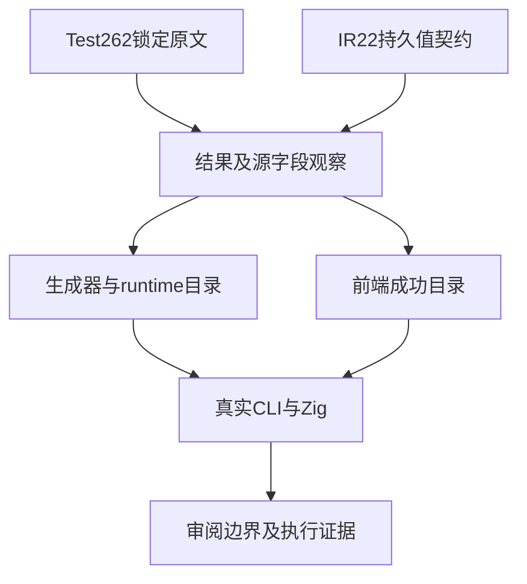
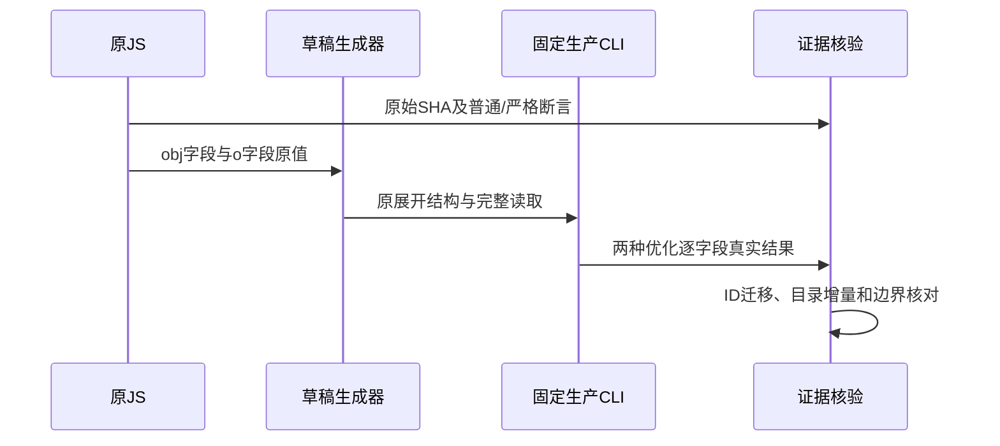

# 对象展开源值保留实施计划

## Intent：最终目标

恢复Test262对象展开适配中原本要求的源对象字段保留语义。现行IR22普通对象为持久值；展开之后旧绑定仍可读取，不能继续把这项原文断言记成ownership拒绝。

## Data：可用证据

固定原文两份：spread-obj-mult-spread.js检查合并后a/b/c/d，spread-obj-overrides-prev-properties.js同时检查结果obj.a/obj.b与原源o.a/o.b。两份SHA已对齐锁定索引并保存原字节。当前生成器删掉两个o字段的runtime观察，另登记consumed前端拒绝；首轮完整根前端实际失败这两项。

同职责成熟实现generate_object_fields.ts使用已有writeOutput/writeCatalog及control驱动。沿用现行结构；不新增runtime，不重构其他对象行为。生成器后半部分六种原生probe顺序矩阵与18份原输出均先冻结。

## Edges：边界与限制

只恢复原字段观察，不扩大为Function.apply、IIFE、callCount、Object.keys、动态键或引用身份全部等价。两份审阅仍为adapted，明确保留未移植边界。

补回两个原文源字段的真实runtime案例，保留六个既有runtime ID/值；两项前端从旧consumed错误分类改为source_preservation成功分类，同时同步中央suites注册，避免旧名表达相反含义。旧两项ID退役、新两项ID登记，前端数量不变；总目录净增两个runtime案例。

正在运行的三个完整检出保持固定版本，不能修改它们。草稿输出先单独生成；用37d53431真实CLI编译merge/override及两份原前端源，Debug和ReleaseSafe执行既有control驱动并核对字段值。成功编译证明这些精确源通过真实解析/分析；不能描述为运行完整frontend聚合门禁。

## Answer：交付格式与成功标准

交付最小正式生成器、override来源/目录、重命名的两项前端目录、两份审阅与suites注册；完整草稿、原/最终SHA、原文普通/严格执行、两种优化真实Zig结果和生成物。两份原文原断言通过、全部十个来源观察/编译执行每种优化通过、未改的14份生成输出SHA相等、--check与全矩阵审计通过，才以英文Conventional Commits提交push。完整根目标保持未完成。

## 架构图

## 数据流图

## 自我批判

把旧ownership诊断改为null只能证明前端接受，不能证明值保留，因此必须补回原文runtime观察。不能用恒定return绕过展开或删除未用array；前端源与旧源只改分类，实际还要执行其返回值。

不把审阅元数据或目录条数当执行通过；两份旧审阅的语义映射修正不计新增上游审阅。全量根尚有生产问题，专项成功不外推为生产级目标完成。
