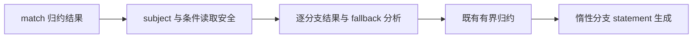
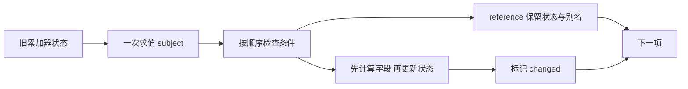

# 对象归约 match 分支修复

## Intent：最终目标

让对象归约对通用 match 结果分支使用既有有界状态更新路径，保留惰性分支、旧累加器读取、借用字段和原始别名语义，不更改测试容量要求或针对夹具写特例。

## Data：可用证据

独立测试会话在冻结 c5085a97 的 Debug 与 ReleaseSafe 中均确认原聚合专项 188/192 用例通过，四项 nested source/library 容量检查失败。原测试要求增长到 128、2048、16384 项时仍满足 4096 字节、最多 4 次分配；首次 128 项已失败，后续规模不能外推。已直接查看其生成源码，for 内两个更新分支确实分别 allocator.create State。

正式 object_reduce/analysis 已在读取安全性分析中处理 match，但 result 与 argument 只支持条件表达式；root.statements 同样缺少 match。结果是合法 match 累加器分支未进入既有有界优化。append 专用分析存在相同分支缺口。

## Edges：边界与限制

match 的 subject 只求值一次，匹配条件按源码顺序惰性求值；分支和 fallback 必须逐一满足原有安全规则。保留累加器的 reference 分支不得设置 changed，避免全零输入丢失原始别名。调用、字段增长和逃逸判定沿用既有规则，不能用文件名、类型名、输入规模或字段名来启用优化。

不新增测试、不放宽现有断言、不运行仓库全量测试，也不改动另一会话冻结检出的源码及缓存。

## Answer：交付格式与成功标准

补齐通用结果、参数、字段追加分析与 statement 生成；运行原 test-object-reduce test-rx-store-io 两种优化专项，检查生成循环中不再逐项分配 State，原容量及分配失败检查通过。完成后提交 push，保留实际日志及源码指纹。





实现保留原条件分支语义，并扩展到任意数量 match 分支：

```zig
if (selection.subject) |subject| {
    if (!self.safe[@backingInt(subject)]) return false;
}

for (0..selection.arms.len) |index| {
    const arm = selection.arms.at(index);

    if (!self.safe[@backingInt(arm.condition)] or !self.result(arm.result)) return false;
}

return self.result(selection.fallback);
```

## 实施与验证

正式修改仅涉及四个文件：通用归约分析、追加归约分析、归约 statement 生成以及 Zig 生成指纹。指纹从 v33 升至 v34，避免继续读取缺少 match 优化的旧缓存产物。没有改动测试源码或断言。

原专项在 `packages/test` 下执行：

| 配置        | 命令                                                                                                                            | 结果                       |
| ----------- | ------------------------------------------------------------------------------------------------------------------------------- | -------------------------- |
| Debug       | `zig build test-object-reduce test-rx-store-io -Doptimize=Debug -j2 --cache-dir /tmp/zxc-reduce-match-debug --summary all`      | 105/105 步骤，192/192 用例 |
| ReleaseSafe | `zig build test-object-reduce test-rx-store-io -Doptimize=ReleaseSafe -j2 --cache-dir /tmp/zxc-reduce-match-safe --summary all` | 105/105 步骤，192/192 用例 |

已亲读 nested source 生成结果：第 66 至 103 行的循环仅更新按值状态，第 105 行之后才执行输出构造，循环中没有 allocator.create。原有 128、2048、16384 项的容量检查全部通过，未调整 4096 字节及最多 4 次分配约束。

## 自我复核与证据边界

复核集中于本次 diff：所有 match 结果分支及 fallback 均经过既有安全判定，reference 分支不写 changed；subject 的临时缓存按既有 match lowering 的方式恢复，运行期条件保持从前到后惰性选择。没有引入运行库、夹具识别或按输入规模启用优化。

nested 专项使用无 subject 的 match；带 subject 路径已与现有 match 生成实现逐段静态核对，但本次没有新增用例单独验证该路径。通过专项不等于仓库全量回归通过，也不代表整个自举目标完成。

追加归约专项：`zig build test-object-append test-multiple-append -j2 --summary all`，在 `packages/test` 执行，结果为 143/143 steps succeeded; 366/366 tests passed。日志与 source/library 生成结果已压缩归档，`验证结果.json` 记录本次源码、日志及生成源码 SHA256。
