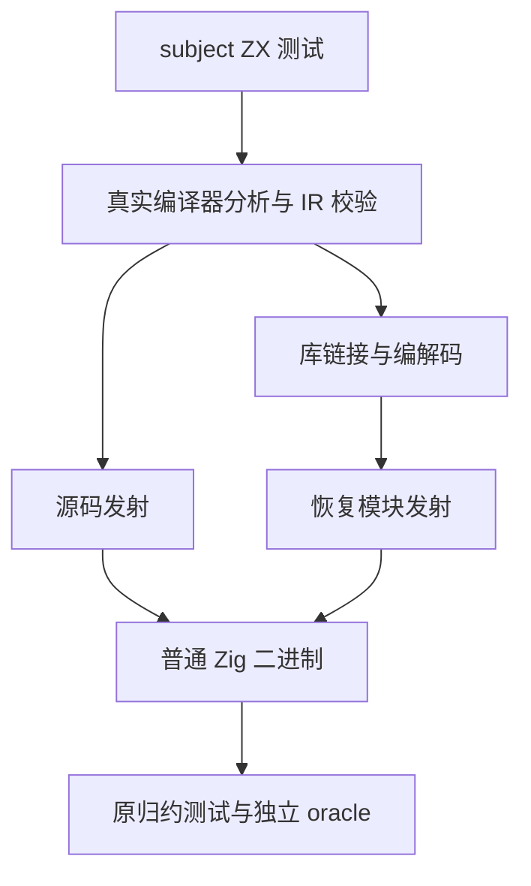
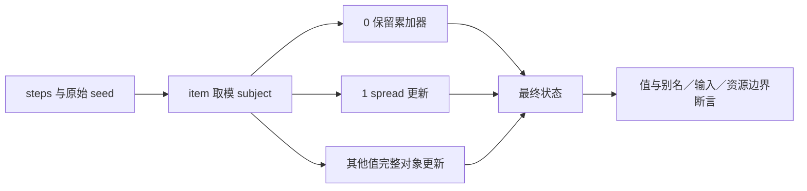

# 对象归约 subject 分支覆盖计划

## Intent：最终目标

补齐有界对象归约带 subject 的 match 分支，验证真实分支区别、累加器旧值读取、保持状态分支和源码／恢复库两条路线。

## Data：可用证据

现有 nested 用例只有无 subject 条件匹配；已有十模式门禁同时验证值、借用字段、输入不变、分配失败与有界容量。沿用其成熟组织和独立逐项 oracle。

## Edges：边界与限制

只新增测试及其构建接入，不修改编译器。纯数值 subject 的动态输出不能证明副作用调用次数；另从实际生成物核对 subject 绑定和复用，不宣称覆盖副作用 subject。恢复库提供方仍在内存，不能宣称 detached 消费。

三个全根回归继续使用原句柄和固定检出，本专项不代替完整生产级别目标。

## Answer：交付格式与成功标准

草稿先写本目录，经已有无人值守测试授权同步四个正式文件。完整 test-object-reduce 在 Debug 与 ReleaseSafe 执行，新增模式在两路线各保留十项检查；容量规模128／2048／16384、4096字节和四次分配限制不变。归档实际日志、输入指纹和生成物，逐部分英文 Conventional Commit 并 push。

## 执行步骤

1. 保存开始版本和外部工作文件指纹，生成四个正式文件的完整草稿。
2. 同步草稿并格式检查；冻结所有包文件身份。
3. 同时执行两个优化模式的完整对象归约门禁；终态前不修改执行源。
4. 采集真实结果，核对所有实际消费者和生成 subject 绑定；如有现行生产故障才通知实现会话。
5. 复核本次 diff、自我批判并核对精确暂存范围，提交 push。
