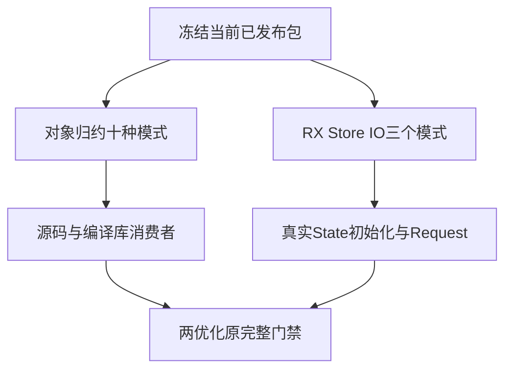
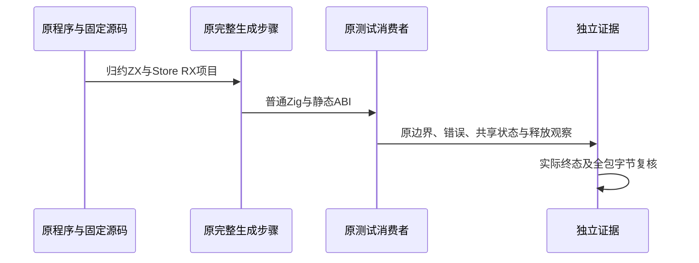

# 对象归约与 Store IO 完整复验计划

## Intent：最终目标

按原完整 test-object-reduce 与 test-rx-store-io，在当前冻结版本独立复验旧 b6 完整根尚未闭环的两个范围：对象归约增长与禁止原地 resize 时的分配边界，以及三种 RX Store IO 项目的真实初始化和请求生命周期。

## Data：可用证据

旧 b6 根实际退出 1；对象归约两个消费者各两项 capacity 测试失败，RX Store IO 三个编译生成步骤因 InvalidInitializer 失败。该旧版本的 source、完整日志与真实终态已保存于规范表达式列全量回归。当前版本包含新的能力槽、初始化与函数列实现，不能直接沿用旧失败为当前生产缺陷。

原对象归约聚合覆盖十种实际程序模式及源码/编译库两条路径，所有业务值、不可变输入、指针身份、全部分配失败和有界要求仍由原消费者观察。三个 Store IO 模式为 write/service/readonly，原消费者涵盖初始化、请求结束后的输出与借用存活、错误前后发布、恢复、显式宿主 IO、分配失败和释放。

## Edges：边界与限制

不改任何正式源码、测试、期望、4096 字节及四次分配边界或构建注册；运行中主检出包字节冻结，不能因远端并行推进而混入新版本。全部跟踪包文件 SHA 保存并在终态复核。另三完整根继续保持其原固定检出。

Store 只表示应用生命周期共享内存，不负责自动落盘或恢复；原 IO 是应用显式使用文件 API。不得把通用共享 Store 的有界回收需求扩大为本门禁已实现的结论。

原 Zig 构建器统计、Node 子测试、Node 内 Zig 检查分别记录。实际缓存如实披露；若缓存跳过所需执行，使用对应原生二进制直接重跑补证，不能只凭目录或 cached 状态宣称真实运行。

## Answer：交付格式与成功标准

执行原完整两个聚合步骤，Debug 与 ReleaseSafe 均 -j1、verbose、summary all。保留真实终态、完整日志、实际编译程序与 ABI/options、运行二进制指纹、源码字节一致性和当前故障分类。全部通过则按原范围闭环；若仍失败先辨别测试接口漂移与生产行为，并只向实现会话报告已核实的当前生产问题。完成一个部分以英文 Conventional Commits 提交 push。

## 架构图

## 数据流图

## 自我批判

先前 Process Store 常量初始化通过，只能证明其原应用范围，不能替代 Store IO 三种不同项目。旧版本独立对象归约通过也不能覆盖后续核心列迁移；恢复这两个原完整聚合门禁以消除该证据缺口。
