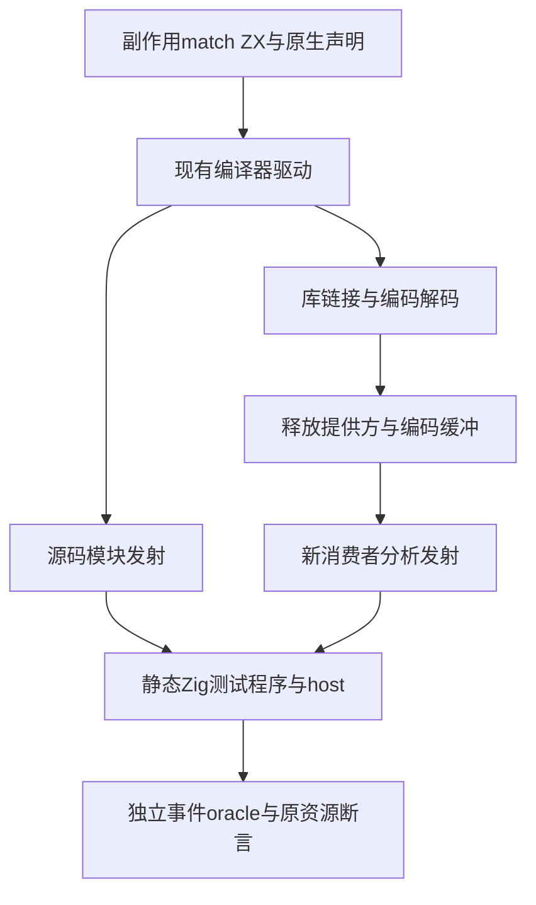
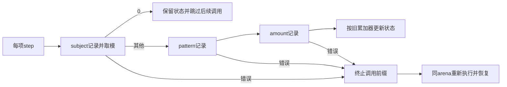

# 对象归约副作用 match 覆盖计划

## Intent：最终目标

动态证明每项subject只求值一次，首个分支命中后不计算后续pattern或更新值，错误在正确调用处停止，并可在同一arena内恢复；保持有界对象归约与零专用运行库约束。

## Data：可用证据

上一轮纯数值subject已通过424项检查，但没有副作用调用次数和错误传播的动态证据。复用现有predicates编译器驱动与原生接口模块发射机制，其库路线实际释放提供方、破坏编码缓冲后构建新消费者。原生host只记录调用并按指定阶段和次数抛错，独立oracle构造预期事件序列。

## Edges：边界与限制

新增自有测试，不宣称对应某个Test262原断言。不引入生产运行层；观测host为测试显式静态原生模块。全根原句柄持续运行，不能修改它们的固定检出。先写完整草稿，再依已有无人值守测试授权同步正式测试。

## Answer：交付格式与成功标准

source与真实恢复库消费者均执行Debug和ReleaseSafe。核对完整事件顺序、值与错误前缀，每个可达失败位置都恢复执行。保留128／2048／16384、4096字节、四次分配与禁止resize要求；运行完整对象归约门禁。归档实际源、日志、二进制与生成模块后英文Conventional Commit提交push。发现现行生产缺陷才通知实现会话。

## 执行步骤

1. 保存外部工作文件和起始版本；先落完整草稿。
2. 同步并检查格式与TypeScript类型；冻结所有包输入。
3. 两优化模式运行完整门禁；终态前不改执行源。
4. 从真实Node子进程结果采集原生检查、调用路径及实际二进制，判断测试错误或生产错误。
5. 记录自我批判，精确核验提交范围、英文commit并push。
